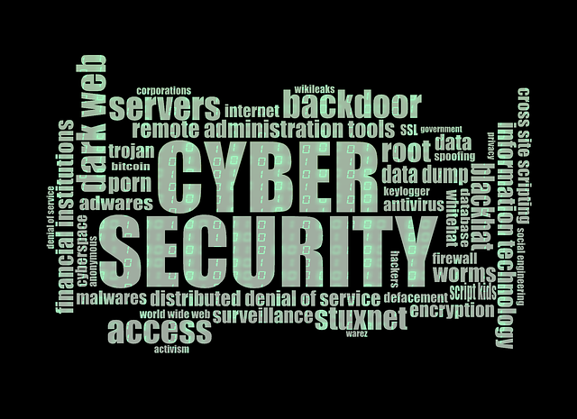

# Bienvenue !

Passionné en CyberSécurité, mon objectif est de partager mes connaissances acquises lors de mes lectures, travaux, challenges et CTF.

Ces quelques pages me servent surtout de pense-bête ou de mémo, en effet, j'ai tendance à "oublier" ce que je n'écris pas. Le fait de s'approprier certaines connaissances en les expliquant/écrivant d'une manière différente me permet de mieux m'en souvenir et de mieux les maîtriser, ou à défaut, de pouvoir les consulter facilement ici :sweat\_smile: .

Si vous avez des questions ou que vous apercevez des erreurs (qu'elles soient techniques ou de français) n'hésitez pas que cela soit directement par mail sh4rpf0rc3\<AT>gmail.com ou sur Twitter [https://twitter.com/Sh4rpF0rc3](https://twitter.com/Sh4rpF0rc3).&#x20;

