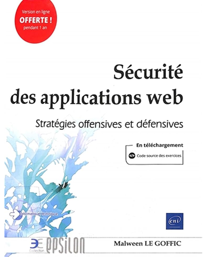

# 🏠 Home

[les-injections-css-scroll-to-text-fragment.md](mes-articles/2022/decembre/les-injections-css-scroll-to-text-fragment.md "mention")

Cette exploitation d'une injection CSS va permettre à l'attaquant de savoir si l'occurrence d'un mot est présent ou non sur la page ciblée. Cela peut être utile afin d'identifier par exemple, si la victime est connectée en tant qu'administrateur ou non.

:date: 16 Déc 2022 :open\_file\_folder:[CSS Injection](mon-blog/categories.md#css-injection)

<figure><figcaption></figcaption></figure>

[les-injections-css-regle-import.md](mes-articles/2022/decembre/les-injections-css-regle-import.md "mention")

On continue sur le sujet des injections CSS avec cette fois l'utilisation de la règle @import. L'objectif est toujours de récupérer des informations contenues dans les attributs HTML, mais cette fois, sans avoir besoin d'iframer la page vulnérable.

:date: 15 Déc 2022 :open\_file\_folder:[CSS Injection](mon-blog/categories.md#css-injection)

<figure><figcaption></figcaption></figure>

[les-injections-css-regle-font-face-et-descripteur-unicode.md](mes-articles/2022/novembre/les-injections-css-regle-font-face-et-descripteur-unicode.md "mention")

Dans cet article, l'exploitation de l'injection CSS ne va plus cibler le contenu des attributs HTML, mais le contenu des éléments HTML, avec certaines limitations toutefois.

:date: 20 Nov 2022 :open\_file\_folder:[CSS Injection](mon-blog/categories.md#css-injection)

<figure><figcaption></figcaption></figure>

[les-injections-css-attribute-selector.md](mes-articles/2022/novembre/les-injections-css-attribute-selector.md "mention")

Les injections CSS ne sont pas les vulnérabilités les plus connues, mais permettent tout de même certaines exploitations. Pour illustrer cela, nous commençons par la récupération de valeurs d'attributs HTML grâce aux sélecteurs d'attributs CSS.

:date: 06 Nov 2022 :open\_file\_folder:[CSS Injection](mon-blog/categories.md#css-injection)

<figure><figcaption></figcaption></figure>

[xss-exploitation-tool-v0.4.0.md](mes-articles/2022/octobre/xss-exploitation-tool-v0.4.0.md "mention")

La version 0.4.0 vient XET (XSS Exploitation Tool) est maintenant disponible : [https://github.com/Sharpforce/XSS-Exploitation-Tool/tree/v0.4.0](https://github.com/Sharpforce/XSS-Exploitation-Tool/tree/v0.4.0)

:date: 26 Oct 2022 :open\_file\_folder:[XSS](mon-blog/categories.md#xss)

<figure><figcaption></figcaption></figure>

[cross-site-scripting-xss-et-schema-duri-javascript.md](mes-articles/2022/septembre/cross-site-scripting-xss-et-schema-duri-javascript.md "mention")

Dans cet article, nous allons examiner quelques exemples d'injections XSS possibles lorsque les données entrées par l'utilisateur sont réfléchies au sein d'un attribut HTML représentant une URL, tel que `href`, `src`, ou `url`.

:date: 17 Sep 2022 :open\_file\_folder:[XSS](mon-blog/categories.md#xss)

<figure><figcaption></figcaption></figure>

[practical-web-penetration-testing.md](livres/2018/practical-web-penetration-testing.md "mention")

Ma critique du livre "Practical Web Penetration Testing" de Gus Khawaja, paru en 2018.

:date: 20 Août 2022 :open\_file\_folder:[Books](mon-blog/categories.md#books)

<figure><figcaption></figcaption></figure>

[xss-vulnerability-challenges](walkthroughs/damn-vulnerable-web-application/xss-vulnerability-challenges/ "mention")

Mon writeup de l'application PHP "xss\_vulnerability\_challenges" qui propose une série de 8 challenges sur la thématique de la vulnérabilité XSS.

:date: 02 Août 2022 :open\_file\_folder:[XSS](mon-blog/categories.md#xss)

<figure><figcaption></figcaption></figure>

[est-il-possible-de-contourner-la-fonction-php-htmlspecialchars.md](mes-articles/2022/juillet/est-il-possible-de-contourner-la-fonction-php-htmlspecialchars.md "mention")

La fonction `htmlspecialchars()` est fréquemment utilisée pour nettoyer les entrées utilisateur dans les applications PHP natives (comprendre sans utilisation de framework). Est-elle suffisante pour couvrir tous les cas d'utilisation ? C'est ce que nous allons tenter de découvrir dans cet article.

:date: 29 Juil 2022 :open\_file\_folder:[XSS](mon-blog/categories.md#xss)

<figure><figcaption></figcaption></figure>

[sast-php-codesniffer-oriente-securite-dans-visual-studio-sous-debian.md](mes-articles/2022/juillet/sast-php-codesniffer-oriente-securite-dans-visual-studio-sous-debian.md "mention")

**PHP Code Sniffer** est un outil qui permet d'analyser le code source PHP d'une application pour détecter des mauvaises pratiques de développement en se basant sur un ensemble de règles. Ces règles concernent principalement la qualité du code, mais il est également possible d'en ajouter pour détecter des failles de sécurité.

:date: 18 Juil 2022 :open\_file\_folder:[SAST](mon-blog/categories.md#sast)

<figure><figcaption></figcaption></figure>

[sast-php-codesniffer-oriente-securite-dans-visual-studio-sous-windows.md](mes-articles/2022/juillet/sast-php-codesniffer-oriente-securite-dans-visual-studio-sous-windows.md "mention")

**PHP Code Sniffer** est un outil qui permet d'analyser le code source PHP d'une application pour détecter des mauvaises pratiques de développement en se basant sur un ensemble de règles. Ces règles concernent principalement la qualité du code, mais il est également possible d'en ajouter pour détecter des failles de sécurité.

:date: 12 Juil 2022 :open\_file\_folder:[SAST](mon-blog/categories.md#sast)

<figure><figcaption></figcaption></figure>

[web-hacking-101-how-to-make-money-hacking-ethically.md](livres/web-hacking-101-how-to-make-money-hacking-ethically.md "mention")

Ma critique du livre "Web Hacking 101: How to make Money Hacking Ethically" de Peter Yaworski, paru en 2018.

:date: 01 Juil 2022 :open\_file\_folder:[Books](mon-blog/categories.md#books)

<figure><figcaption></figcaption></figure>

[cve-2022-33910.md](cve/2022/cve-2022-33910.md "mention")

Je vous propose mon analyse de la **CVE-2022-33910**, qui est une vulnérabilité de type Cross-Site Scripting (XSS) dans l'application de suivi de bogues MantisBT.

:date: 01 Juil 2022 :open\_file\_folder:[XSS](mon-blog/categories.md#xss) :open\_file\_folder:[CVE](mon-blog/categories.md#cve)

<figure><figcaption></figcaption></figure>

[cve-2022-32444.md](cve/2022/cve-2022-32444.md "mention")

Je vous propose mon analyse de la **CVE-2022-32444**, qui est une vulnérabilité de type Open Redirect dans le système de gestion de contenu (CMS) nommé u5CMS.

:date: 23 Juin 2022 :open\_file\_folder:[Open Redirect](mon-blog/categories.md#open-redirect) :open\_file\_folder:[CVE](mon-blog/categories.md#cve)

<figure><figcaption></figcaption></figure>

[cve-2022-32442.md](cve/2022/cve-2022-32442.md "mention")

Je vous propose mon analyse de la **CVE-2022-32442**, qui est une vulnérabilité de type Cross-Site Scripting (XSS) dans le système de gestion de contenu (CMS) nommé u5CMS.

:date: 22 Juin 2022 :open\_file\_folder:[XSS](mon-blog/categories.md#xss) :open\_file\_folder:[CVE](mon-blog/categories.md#cve)
