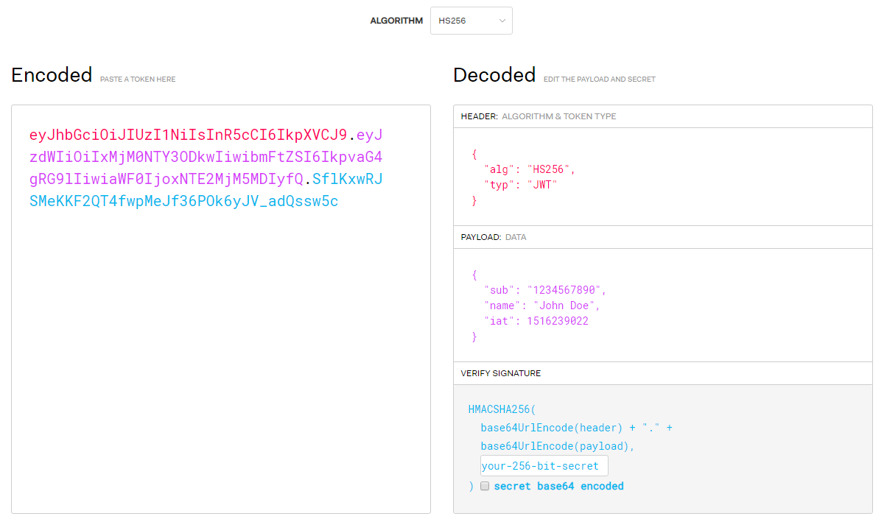

# Outils

Quelques outils identifiés lors de mes recherches :

## JWT.io debugger

Cet outil en ligne permet de décoder un jeton JWT qu'il soit signé par un secret partagé ou une clé privée :

## JWT-tool

Outil disponible sur GitHub qui permet de forger et de cracker les jetons JWT afin d'identifier des vulnérabilités : 

* Alg none attack
* RS256 as HS 256 attack
* Brute force dictionary attack



## C-JWT-cracker

Outil d'attaque par brute force \(écrit en C\) afin de retrouver le secret ayant signé le jeton. 



## 

