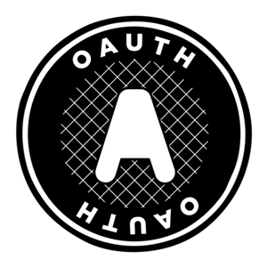

# OAuth 2.0

## Introduction

OAuth est un protocole libre permettant la délégation d’autorisation \(à ne pas confondre avec la délégation d’authentification\). Il permet d’autoriser une application/site web \(appelé « consommateur »\) à utiliser un service tiers \(appelé « fournisseur »\) pour le compte d’un utilisateur \(appelé « utilisateur final »\). Un exemple peut être une application d’édition de photos \(« consommateur »\) voulant éditer les photos stockées sur le compte Facebook \(« fournisseur »\) de l’utilisateur \(« utilisateur final »\).

La version actuelle du protocole OAuth est la version 2.0. Voici les différentes versions existantes :

* Octobre 2007 : version OAuth Core 1.0
* Juin 2009 : OAuth Core 1.0a \(correction d’une faille de sécurité\)
* Avril 2010 : Standardisation d’OAuth 1.0a \(RFC 5849\)
* Octobre 2010 : Standardisation d’OAuth 2.0 \(RFC 6749 et 6750\)

## Sources

* [http://www.bubblecode.net/fr/2016/01/22/comprendre-oauth2/](http://www.bubblecode.net/fr/2016/01/22/comprendre-oauth2/) [https://auth0.com/](https://auth0.com/)
* [https://www.oauth.com/oauth2-servers/background/](https://www.oauth.com/oauth2-servers/background/) [https://tools.ietf.org/html/rfc6749](https://tools.ietf.org/html/rfc6749)
* [https://tools.ietf.org/html/rfc7662](https://tools.ietf.org/html/rfc7662) [https://tools.ietf.org/html/draft-ietf-oauth-native-apps](https://tools.ietf.org/html/draft-ietf-oauth-native-apps)
* [https://tools.ietf.org/html/rfc7636](https://tools.ietf.org/html/rfc7636) [https://tools.ietf.org/html/draft-ietf-oauth-device-flow](https://tools.ietf.org/html/draft-ietf-oauth-device-flow)
* [https://tools.ietf.org/html/rfc7591](https://tools.ietf.org/html/rfc7591)

