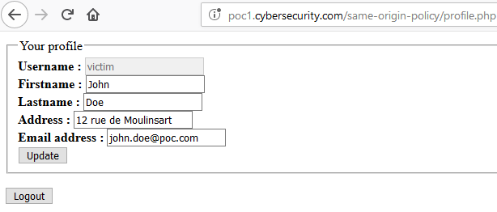
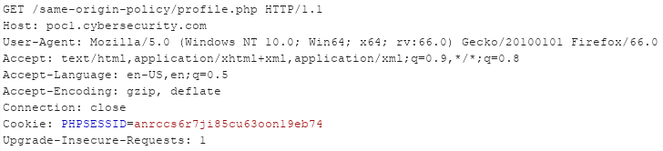
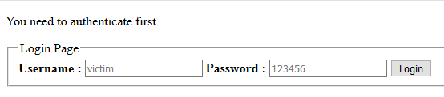

# Types de requêtes

Les interactions cross-origin sont séparées en trois types ou catégories : lecture, écriture et embarqué. Chacun de ces types est soumis à la politique SOP de façons différentes.

Afin d'illustrer les prochains exemples, nous allons nous baser sur le cas suivant. Imaginons un utilisateur authentifié sur son site préféré \(donc qui possède une session valide représentée par le cookie de session **PHPSESSID**\), et que ce site possède des informations privées le concernant \(nom, prénom, adresse et adresse e-mail renseignées lors de son inscription par exemple\) :

Comme visible sur l'impression écran, le site est hébergé à l'adresse `poc1.cybersecurity.com` et la page du profil de l'utilisateur à l'URL `http://poc1.cybersecurity.com/same-origin-policy/profile.php`. La requête effectuée par le navigateur quand l'utilisateur accède à cette page est la suivante :

Cette requête est tout à fait légitime, il en résulte donc un **`200 OK`** de la part du serveur. L'utilisateur obtient la page demandée affichant ses informations :

A noter que si l'utilisateur n'était pas connecté \(ne possédait pas de cookie valide\) il serait alors automatiquement redirigé vers la mire d'authentification :


Les impressions écrans utilisées dans cet article contiennent le jeton **`PHPSESSID`** de l'utilisateur qui ne possède pas forcément la même valeur. Il s'agit juste d'un effet de bord de mes multiples tests et corrections, il ne faut donc pas en tenir compte lors de la lecture de cet article \(il s'agit donc bien du même utilisateur légitime qui est connecté à son profil\).



Les tests qui suivent sont effectués ici en modifiant le domaine ou le sous-domaine du site effectuant la requête. Mais conformément au tableau de la définition d'une origine, le résultat sera le même si le changement avait été opéré au niveau du schéma ou du numéro de port \(sauf pour l'exception concernant IE\)


