# Interactions de type écriture

Dans notre exemple, l'utilisateur peut légitiment modifier ses informations en les validant grâce au bouton `Update` disponible en bas du formulaire \(le champ `username` n'est pas modifiable ici\) :

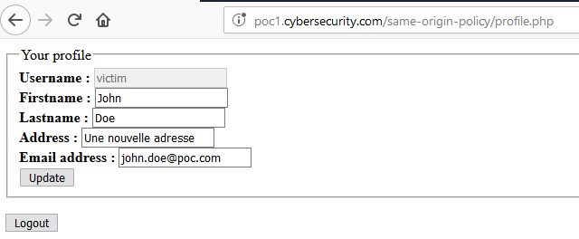

La requête de mise à jour est de type **`POST`** :

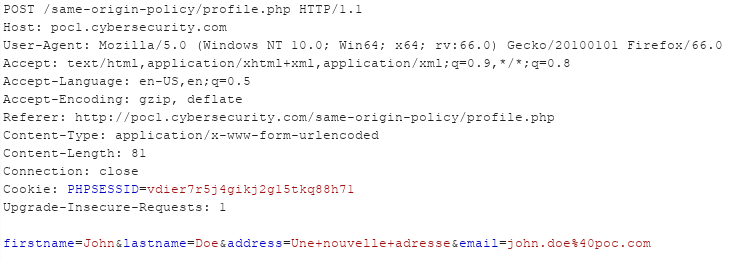

La page est ensuite rechargée et le formulaire contient les nouvelles informations \(ici la réponse HTTP du serveur\) :

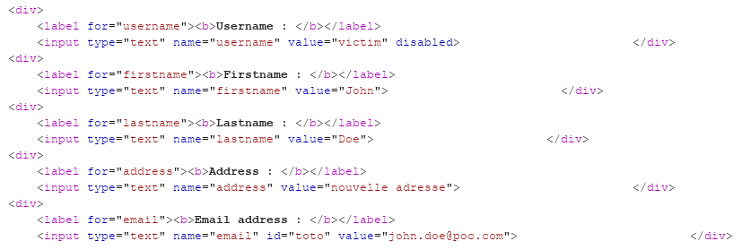

## Requête same-origin

L'application peut _forcer_ une mise à jour des informations de l'utilisateur en hébergeant le script suivant sur une page d'une même origine \(ici `http://poc1.cybersecurity.com/same-origin-policy/ecriture_same_origin_ajax.php`\) :

```markup
<!-- POST XHR -->
<script>
            var xhr = new XMLHttpRequest();
            xhr.open("POST", 'http://poc1.cybersecurity.com/same-origin-policy/profile.php', true);
            xhr.setRequestHeader("Content-Type", "application/x-www-form-urlencoded");
            xhr.withCredentials = true;

            xhr.onreadystatechange = function() {
                if (this.readyState === XMLHttpRequest.DONE && this.status === 200) {
                    console.log(xhr.response);
                }
            }

            xhr.send("email=new_email@poc.com");
        </script>
```

Lors de la visite de cette page, la requête tente de mettre à jour l'adresse email de l'utilisateur avec la valeur `new_email@poc.com`, le navigateur n'affiche aucun warning et la console affiche la réponse de la requête :

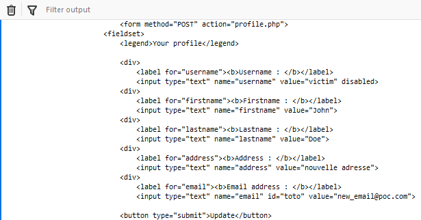

Quand l'utilisateur visite à nouveau la page de son profil, il affiche bien la nouvelle adresse e-mail :

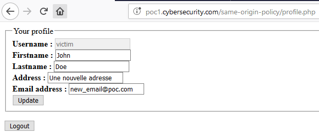

Une requête same-origin de type écriture est donc bien légitime selon SOP.

## Requête cross-origin

### Requête provenant d'un autre sous-domaine

Admettons maintenant que la requête ne provienne plus de l'adresse `http://poc1.cybersecurity.com/same-origin-policy/ecriture_same_origin_ajax.php` mais de l'adresse `http://poc2.cybersecurity.com/same-origin-policy/ecriture_subdomain_ajax.php`. La requête XHR est la suivante :

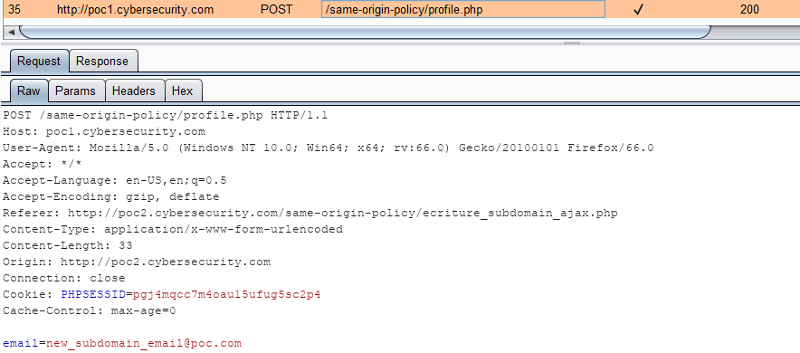

Le serveur renvoi bien un **`200 OK`**, l'entête `Origin` est bien ajouté \(signifiant une requête cross-domain\) et la nouvelle valeur de l'adresse e-mail est bien envoyé, ici `new_subdomain_email@poc.com`.

Par contre, dans la console du navigateur de l'utilisateur, un message de warning apparaît :

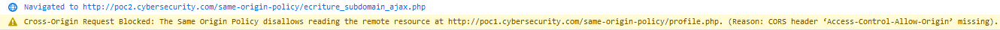

Mais comme le spécifie bien le message, SOP interdit la lecture de la réponse à la requête, qu'en est-il de l'écriture ? Il suffit que l'utilisateur visite à nouveau sa page de profile pour s'apercevoir que son adresse e-mail a été modifiée par la requête XHR : 

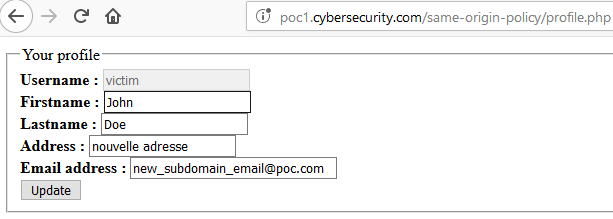

SOP n'interdit donc pas les interactions de type écriture entre deux sous-domaines différents \(pourtant l'origine est différente, une requête cross-origin est donc acceptée par SOP\).

### Requête provenant d'un domaine différent

Qu'en est-il maintenant si la requête n'est plus effectuée par `http://poc2.cybersecurity.com/same-origin-policy/ecriture_subdomain_ajax.php` mais par `http://poc1.malicious.com/same-origin-policy/ecriture_cross-origin_ajax.php`. La requête XHR est la suivante :

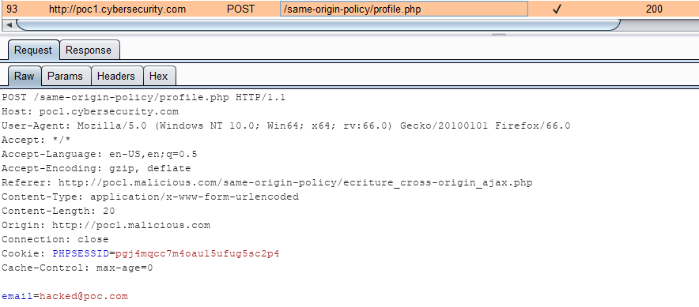

Le serveur renvoi bien un **`200 OK`**, l'entête `Origin` est bien ajouté \(signifiant une requête cross-domain\) et la nouvelle valeur de l'adresse e-mail est bien envoyé, ici `hacked@poc.com`.

Comme dans le cas d'une requête vers un sous-domaine différent, un message de warning apparaît dans la console du navigateur de l'utilisateur :

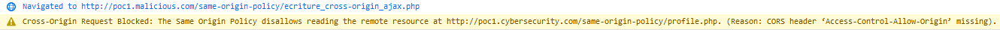

Mais comme le spécifie bien le message, SOP interdit la lecture de la réponse à la requête, qu'en est-il cette fois de l'écriture pour une requête provenant d'un domaine différent ? Il suffit que l'utilisateur visite à nouveau sa page de profile pour s'apercevoir que son adresse e-mail a été modifiée par la requête XHR : 

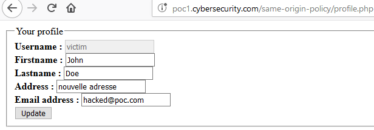

SOP n'interdit donc pas les interactions de type écriture entre deux domaines différents \(pourtant l'origine est différente, une requête cross-origin est donc acceptée par SOP\).

## Alternative à XHR

Il existe des alternatives aux requêtes XHR pour effectuer, par exemple, des requêtes de type écriture. Ces requêtes sont également soumises à SOP de la même façon. Ci-dessous un formulaire HTML avec un auto-submit\(\) en Javascript :

```markup
<!-- POST HTML form JS auto-submit() -->
<iframe name="hiddenFrame" width="0" height="0" border="0" style="display: none;"></iframe>

<form method="POST" action="http://poc1.cybersecurity.com/same-origin-policy/profile.php" name="HTMLform" target="hiddenFrame">
  <input type="hidden" name="email" value="hacked_by_autosubmit_JS@poc.com">
</form>

<script>
  document.HTMLform.submit();
</script>
```

Il est possible de se passer de l'iframe mais la victime sera alors redirigé vers la page de son profil \(la requête sera donc facilement visible aux yeux de l'utilisateur\) :

```markup
<!-- POST HTML form JS auto-submit() -->
<form method="POST" action="http://poc1.cybersecurity.com/same-origin-policy/profile.php" name="HTMLform">
  <input type="hidden" name="email" value="hacked_by_autosubmit_JS@poc.com">
</form>

<script>
  document.HTMLform.submit();
</script>  
```

Ces techniques \(avec ou sans iframe\) ont pour avantage de ne pas afficher de warning dans la console du navigateur \(car il n'y a aucune tentative de lecture de la part du site malicieux\) :


Mais le profil de l'utilisateur a bien été mis à jour :

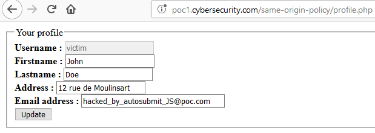

## Ecriture en GET

Bien que cela ne soit pas conseillé, il est possible qu'une requête en **`GET`** soit une requête en écriture \(plus exactement, une requête **`GET`** doit être idempotent\), par exemple en utilisant les _query parameters_. Admettons que la requête de l'application permettant de mettre à jour les informations de l'utilisateur est maintenant la suivante :

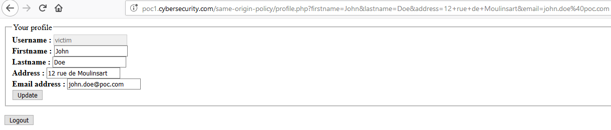

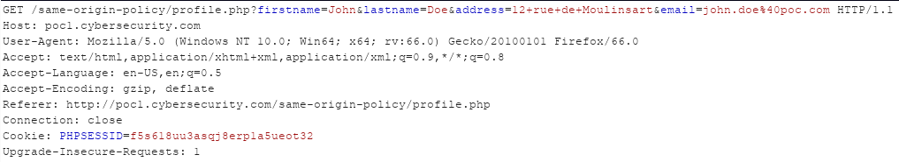

Le script effectuant la requête XHR \(par exemple sur `http://poc1.malicious.com/same-origin-policy/ecriture_cross-origin_ajax.php`\) devient alors :

```markup
<!-- POST XHR -->
<script>
  var xhr = new XMLHttpRequest();
  xhr.open("GET", 'http://poc1.cybersecurity.com/same-origin-policy/profile.php?email=hacked_by_get_request@poc.com', true);
  xhr.withCredentials = true;

  xhr.onreadystatechange = function() {
    if (this.readyState === XMLHttpRequest.DONE && this.status === 200) {
      console.log(xhr.response);
    }
  }

  xhr.send();
</script>
```

A l'instar d'une requête **`POST`**, lorsque l'utilisateur visite la page exécutant le script, son profil est mis à jour :


## Faille Cross-Site Request Forgery \(CSRF\)

Bien qu'il ne s'agit pas de l'objectif de cet article, un petit mot sur les requêtes en écriture cross-origin. Ces requêtes bien que légitimes, ouvre la voix à une vulnérabilité web bien connue : la faille [CSRF](https://www.owasp.org/index.php/Cross-Site_Request_Forgery_%28CSRF%29).

Cette vulnérabilité permet d'effectuer une requête \(en écriture donc, c'est à dire pouvant modifier l'état de l'application au sens général du terme\) à l'insu de la victime. Quand la victime visite le site malveillant `http://poc1.malicious.com` il ne souhaite pas que ce site modifie son adresse e-mail sur une autre application \(par exemple ici `http://poc1.cybersecurity.com`\) auquel il est connecté. Mais étant donné que le navigateur envoi automatiquement le jeton de session \(ici dans le cookie **`PHPSESSID`**\) à l'application vulnérable \(`http://poc1.cybersecurity.com`\), alors le compte de l'utilisateur s'en trouve modifier. Le pirate pourra par exemple ensuite utiliser la fonction "Reset password" de l'application vulnérable, et ainsi récupérer un accès total au compte de la victime \(l'e-mail du "Reset Password" sera envoyé au pirate et non plus à la victime\).

La principale méthode de s'en protéger est que l'application vulnérable implémente une protection à base de jeton anti-CSRF \(plus de détails sur le site de l'[OWASP](https://github.com/OWASP/CheatSheetSeries/blob/master/cheatsheets/Cross-Site_Request_Forgery_Prevention_Cheat_Sheet.md#token-based-mitigation)\). Il est également possible de s'orienter vers les cookies dits [**`same-site`**](https://github.com/OWASP/CheatSheetSeries/blob/master/cheatsheets/Cross-Site_Request_Forgery_Prevention_Cheat_Sheet.md#samesite-cookie-attribute), mais cette protection est relativement récente et pas encore implémentée par tous les navigateurs \(et également encore en mode [draft](https://tools.ietf.org/html/draft-ietf-httpbis-rfc6265bis-02#section-5.3.7)\).


Une piste de cette vulnérabilité était donnée en assignant l'adresse e-mail de l'utilisateur à la valeur `hacked@poc.com` dans le cas d'exemple d'une requête provenant d'un domaine différent😉 .



 

