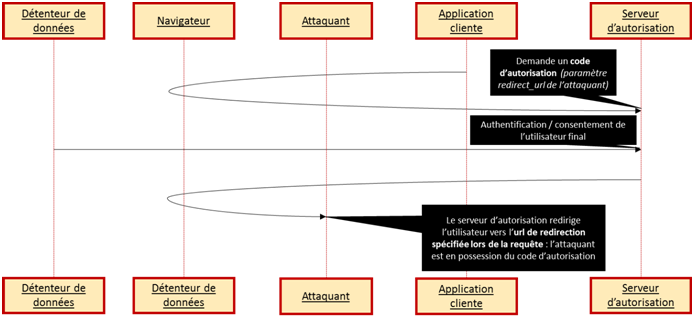

# Recommandations de sécurité

## HTTPS

OAuth 2.0 nécessite l’utilisation du protocole **HTTPS** pour sécuriser les communications réseaux. En effet, des informations sensibles peuvent transiter entre les différentes parties \(jeton d’accès et de rafraîchissement, login / mot de passe de l’utilisateur etc\).

Les URLs de redirection spécifiées par le client lors de l’enregistrement doivent être de type **HTTPS** afin d’éviter tout vol de données par écoute du réseau.

De plus, l’utilisation de **TLS** permet au client de valider le certificat du serveur d’autorisation et de ses endpoints réduisant ainsi les attaques par **homme du milieu** \(man-in-the-middle\).

## URLs de redirection

Les APIs/serveurs d’autorisation implémentant OAuth 2.0 doivent rediriger les utilisateurs seulement sur les URLs enregistrées par le client \(le consommateur\) lors de son inscription auprès du serveur d’autorisation. Cette vérification est obligatoire pour les clients de type **public** et vivement recommandé pour les clients de type **confidential**. 

Si cela est mal implémenté, alors il est possible à un utilisateur malicieux d’effectuer des attaques par redirections.

Cela permettra par exemple de récupérer un code d’autorisation ou jeton d’accès :



## Code d'autorisation \(authorization code\)

Le code d’autorisation \(qui permet d’obtenir un jeton d’accès\) est une donnée sensible et doit être transmis seulement sur un canal sécurisé par l’utilisation par exemple, de **TLS**. Le code d’autorisation doit être à usage unique et doit posséder une durée de vie très courte. Si de multiples requêtes de jeton d’accès sont effectuées avec le même code d’autorisation, le serveur d’autorisation doit alors révoquer tous les jetons d’accès obtenus grâce à ce code.

## Jeton d'accès \(access token\)

Le jeton d’accès est une information permettant l’accès à des ressources protégées. Ce jeton doit rester confidentiel que cela soit en transit ou en stockage et ne doit être connu que par le serveur d’autorisation, le client et le serveur de ressources. De plus, il doit être transmit seulement sur un transport sécurisé avec le serveur d’autorisation en utilisant **TLS** par exemple.

Une exception est le type d’autorisation dit **implicit grant flow** où le jeton est présent dans le fragment de l’URL, et donc potentiellement à des entités non désirées. Par défaut, le serveur d’autorisation doit délivrer le jeton d’accès ayant le périmètre \(**scope**\) le plus restreint possible \(sauf si le **scope** est spécifié par le client\).

## Jeton de rafraîchissement \(refresh token\)

Le jeton de rafraîchissement est une information permettant l’accès à des ressources protégées \(via l’obtention d’un jeton d’accès\). Ce jeton doit rester confidentiel que cela soit en transit ou en stockage et ne doit être connu que par le serveur d’autorisation ainsi que le client.

## Jeton anti-CSRF \(state\)

Le paramètre **state** renseigné lors de différentes requêtes et également renvoyé par le serveur d’autorisation peut servir de jeton anti-CSRF \(Cross-Site Request Forgery\). Il suffit au client de lui renseigner une chaîne de caractère aléatoire et de comparer celle envoyée lors de la requête et celle reçue lors de la réponse du serveur d’autorisation.

## Attaque par clickjacking

Une telle attaque est possible si un attaquant développe son propre site internet et invoque l’endpoint d’autorisation du serveur d’autorisation dans une iframe transparente. Cette iframe est placée au-dessus d’un bouton du site malicieux. Quand la victime cliquera sur ce bouton son clic sera en fait détourner par l’iframe qui pourra alors effectuer une action à l'insu de la victime. Pour plus d’info sur cette attaque : [https://fr.wikipedia.org/wiki/Détournement\_de\_clic](https://fr.wikipedia.org/wiki/Détournement_de_clic)

Afin de se protéger d’une telle attaque il est conseillé aux applications natives d’utiliser un navigateur externe et non intégré. Les navigateurs récents peuvent aussi utiliser un entête HTTP spécifique nommé « X-Frame-Options » \(ou équivalent CSP\). Cet entête peut prendre deux valeurs : « deny » et « sameorigin » ce qui permettra de bloquer l’ouverture d’iframe d’un contenu du site A sur un site B \(c'est-à-dire ayant une origine différente\).


Le header peut en fait prendre deux autres valeurs afin d'accepter une origine distante spécifique \(une origine tierce de confiance\) ou toutes les origines \(dans ce dernier cas l'application se rend vulnérable au clickjacking\)


## Cache du serveur d'autorisation

Le serveur d’autorisation doit renseigner l’entête HTTP « Cache-Control » à la valeur « no-store » lors des réponses si elles contiennent des données sensibles \(identifiants, jeton d’accès ou de rafraîchissement, etc\). L’entête « Pragma » doit également être renseigné à la valeur « no-store ».

Exemple d’une réponse du serveur d’autorisation :

```text
HTTP/1.1 200 OK
Content-Type: application/json;charset=UTF-8
Cache-Control: no-store
Pragma: no-cache

{
  "access_token":"2YotnFZFEjr1zCsicMWpAA",
  "token_type":"example",
  "expires_in":3600,
  "refresh_token":"tGzv3JOkF0XG5Qx2TlKWIA",
   "example_parameter":"example_value"
}
```

