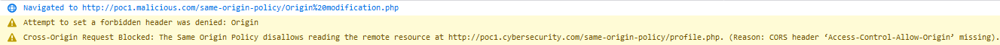
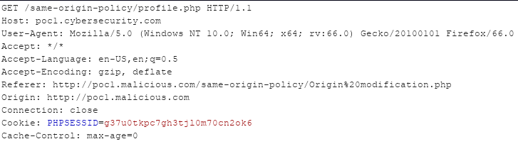
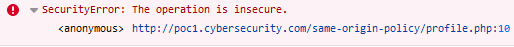
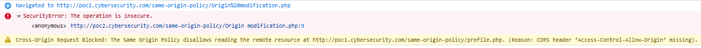
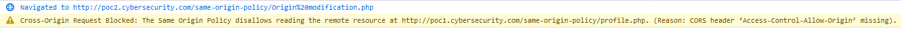
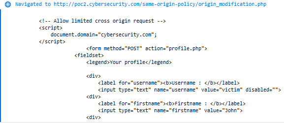
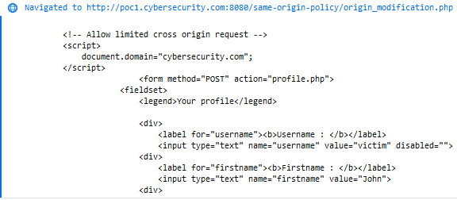
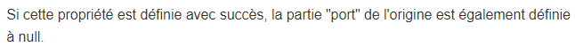
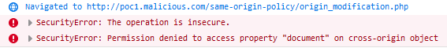

# Modification de l'origine

Il y a plusieurs moyens de modifier l'origine d'une requête mais cela ne fonctionne pas forcément. En effet, si un domaine B pouvait se faire passer pour un domaine A ça serait un peu trop facile 🙂 

## Modification de l'entête Origin via XHR

Il est possible d'utiliser la méthode `setRequestHeader` afin de \(tenter de\) modifier l'entête `Origin` au niveau de la requête XHR :

```markup
<!-- GET Ajax with Origin header -->
<script>
  var xhr = new XMLHttpRequest();
  xhr.open("GET", 'http://poc1.cybersecurity.com/same-origin-policy/profile.php', true);
  xhr.setRequestHeader("Origin", "http://poc1.cybersecurity.com");
  xhr.withCredentials = true;

  xhr.onreadystatechange = function() {
    if (this.readyState === XMLHttpRequest.DONE && this.status === 200) {
      console.log(xhr.response);
    }
  }

  xhr.send();
</script>
```

Lorsque l'utilisateur visite le site `http://poc1.malicious.com` qui héberge le script, le navigateur émet un warning dans la console :



La requête est tout de même effectuée, mais la valeur de l'entête `Origin` reste inchangée :



## Modification de l'Origin via document.domain

Il est possible de modifier l'origine d'un document grâce à `document.domain` mais non sans respecter certaines conditions.

Le code permettant de modifier l'origine d'un document est assez simple :

```markup
<script>
  document.domain="domain.com";
</script>
```

De plus, pour que cela fonctionne, il faut que ce script soit présent au niveau de la page qui exécute la requête et également au niveau de la ressource chargée. Par exemple dans la page qui affiche le profile l'utilisateur :

```markup
<script>
  document.domain="domain.com";
</script>

<form method="POST" action="">
  <div>
    <label for="username"><b>Username : </b></label>
    <?php 
      echo '<input type="text" name="username" value="' . htmlspecialchars($username) . '" disabled>';
    ?>
  </div>
  <div>
    <label for="firstname"><b>Firstname : </b></label>
    <?php 
      echo '<input type="text" name="firstname" value="' . htmlspecialchars($_SESSION['firstname']) . '">';
    ?>
  </div> 
  <!--
    ...
  -->
  <button type="submit">Update</button>
</form>
```

Puis de la page qui effectue la requête :

```markup
<script>
  document.domain="domain.com";
</script>

<script>
  var xhr = new XMLHttpRequest();
  xhr.open("GET", 'http://domain.com/profile.php', true);
  xhr.withCredentials = true;

  xhr.onreadystatechange = function() {
    if (this.readyState === XMLHttpRequest.DONE && this.status === 200) {
      console.log(xhr.response);
    }
  }

  xhr.send();
</script>
```

### Définition d'un super-domaine

Une limitation de cette technique est que la valeur spécifiée est limitée par le domaine de base. Par exemple, pour un domaine `domain.com` il ne sera pas possible de spécifier l'origine à la valeur `com` :

```markup
<script>
  document.domain="com";
</script> 
```

Ce script déclenche une erreur dans la console du navigateur lorsque l'utilisateur visite la page en question :



### Requête provenant d'un autre sous-domaine

Admettons que la ressource soit disponible à l'URL `http://poc1.cybersecurity.com/same-origin-policy/profile.php` et qu'une requête de type lecture \(i.e en **`GET`**\) soit effectuée depuis l'URL `http://poc2.cybersecurity.com/same-origin-policy/origin_modification.php`. Ces deux pages incluent également le script suivant :

```markup
<script>
  document.domain="poc1.cybersecurity.com";
</script>
```

Lorsque l'utilisateur visite la page effectuant la requête, alors le navigateur indique une erreur :



En effet ce n'est pas la bonne façon d'utiliser cette directive. Pour cela il faut attribuer aux deux pages la valeur du super-domaine, soit :

```markup
<script>
  document.domain="cybersecurity.com";
</script>
```

C'est à dire que les origines `http://poc1.cybersecurit.com` et `http://poc2.cybersecurity.com` seront vu comme ayant l'origine commune `http://cybersecurity.com`. En faisant cela, il n'y a plus d'erreur dans la console du navigateur mais la requête ne fonctionne toujours pas :



La raison est que cette technique ne fonctionne pas avec les requêtes XHR, mais il est possible d'utiliser par exemple une iframe afin de lire son contenu. Voici le contenu de la page effectuant la lecture \(la ressource contient toujours le script modifiant le domaine\) :

```markup
<script>
  document.domain="cybersecurity.com";
</script>
        
<iframe id="myIFrame" src="http://poc1.cybersecurity.com/same-origin-policy/profile.php"></iframe>

<script>
  setTimeout(function() {
    var doc = document.getElementById("myIFrame").contentWindow.document.body.innerHTML;
    console.log(doc);
  }, 500); 
</script>
```


La fonction `setTimeout()` permet d'attendre un certain temps avant d'exécuter la fonction permettant de récupérer le contenu de l'iframe. Cela est nécessaire afin de laisser le temps au navigateur de charger l'iframe.


Cette fois, plus d'erreur dans la console mais le contenu de l'iframe qui s'affiche :



### Requête provenant d'un autre port

Qu'en est-il maintenant si la lecture de l'iframe s'effectue depuis une origine ayant pour seul différence le numéro de port \(soit `http://poc1.cybersecurity.com:8080/same-origin-policy/origin_modification.php`\) :



Cela fonctionne. En effet, comme l'indique la documentation de [Mozilla](https://developer.mozilla.org/fr/docs/Web/API/Document/domain), si la directive se termine en succès \(la modification s'effectue bien\), alors le port est définie à la valeur **`null`** :



### Requête provenant d'un domaine différent

Assigner la valeur `cybersecurity.com` à une site d'une origine différente \(ici `http://poc1.malicious.com`\) ne fonctionne car le domaine de base n'est pas le même :

```markup
<script>
  document.domain="cybersecurity.com";
</script>

<iframe id="myIFrame" src="http://poc1.cybersecurity.com/same-origin-policy/profile.php"></iframe>

<script>
  setTimeout(function() {
    var doc = document.getElementById("myIFrame").contentWindow.document.body.innerHTML;
    console.log(doc);
  }, 500); 
</script>
```

Et au niveau du navigateur :



