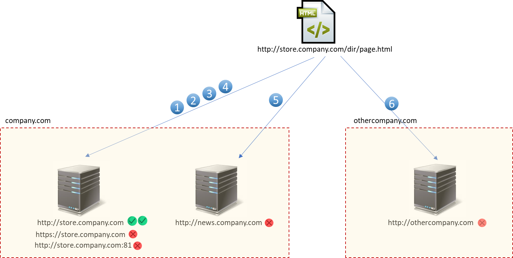
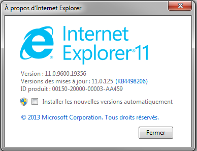
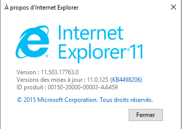
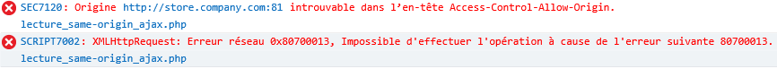
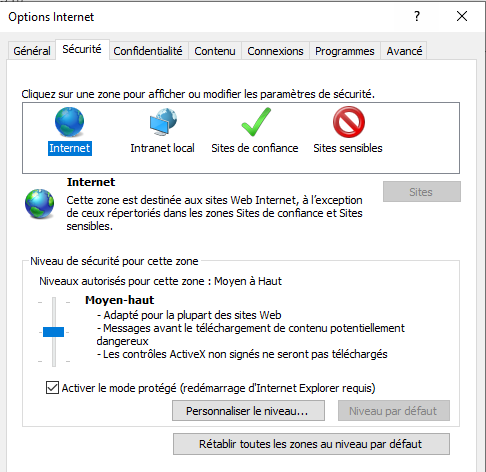
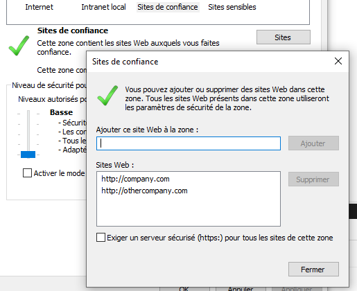
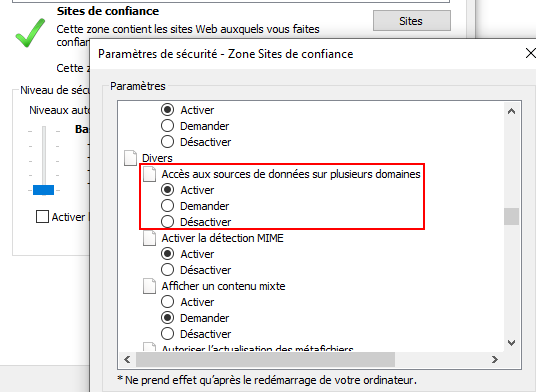

# Qu'est ce qu'une origine

## Définition d'une origine

Afin de déterminer le comportent d'une page ayant une interaction avec une ressource d'une autre origine, il est important de définir qu'est ce qu'une origine selon SOP.

L'origine est la somme des items suivants :

`Origine = protocole + hote + numéro de port`

Un tableau récapitulatif \(merci [Mozilla](https://developer.mozilla.org/fr/docs/Web/Security/Same_origin_policy_for_JavaScript)\) permet de mieux cerner les différents cas possibles. Admettons que le document chargé est accessible à l'adresse `http://store.company.com/dir/page.html` et tente d’interagir avec les ressources suivantes :

| N° | URL | Résultat | Motif |
| :--- | :--- | :--- | :--- |
| 1 | http://store.company.com/dir2/other.html | Succès |  |
| 2 | http://store.company.com/dir/inner/another.html | Succès |  |
| 3 | https://store.company.com/secure.html | Échec | Protocole différent |
| 4 | http://store.company.com:81/dir/etc.html | Échec | Port différent |
| 5 | http://news.company.com/dir/other.html | Échec | Hôte différent |
| 6 | http://othercompany.com/other.html | Échec | Hôte différent |

Ou alors en image :

## Spécificité d'Internet Explorer

### Prise en compte du numéro de port

Par défaut Internet Explorer ne tient pas compte du port dans le calcul de l'origine. Si l'on reprend le tableau précédent, cela signifie qu'une requête partant de `http://store.company.com` aura le comportement suivant :

| ° | URL | Résultat | Motif |
| :--- | :--- | :--- | :--- |
| 1 | http://store.company.com/dir2/other.html | Succès |  |
| 2 | http://store.company.com/dir/inner/another.html | Succès |  |
| 3 | https://store.company.com/secure.html | Échec | Protocole différent |
| 4 | http://store.company.com:81/dir/etc.html | **Succès** | **Port différent mais requête acceptée par Internet Explorer** |
| 5 | http://news.company.com/dir/other.html | Échec | Hôte différent |
| 6 | http://othercompany.com/other.html | Échec | Hôte différent |

Une requête provenant de la page `http://store.company.com:81/same-origin-policy/lecture_same-origin_ajax.php` effectuant une lecture \(requête XHR en **`GET`**\) vers la page `http://store.company.com/same-origin-policy/profile.php` sera bien autorisée par Internet Explorer \(pour preuve, la console affiche bien la réponse de la requête XHR\) :

Le test effectué ci-dessus a été fait sur une plateforme Windows 7 avec la version Internet Explorer suivante :


Attention, ce fonctionnement n'est pas reproductible sur les dernières versions d'Internet Explorer 11


Il m'a par contre été impossible de reproduire ce comportement sur une plateforme Windows 10 et Internet Explorer en version :

En effet, cette fois, Internet Explorer indique une erreur visible dans la console :

Un patch a donc dû modifier le comportement de calcul d'origine entre ces deux versions \(mais impossible de trouver lequel exactement\).

### Notion de zones

Internet Explorer introduit la notion de zone \(Paramètres -&gt; Options Internet -&gt; Sécurité\) qui peut influencer sur le fonctionnement des requêtes cross-origin :

Si deux sites sont présents dans la zone de confiance "Sites de confiance" avec un niveau de sécurité "Basse" \(_highly trusted zone_\), alors les requêtes cross-origin sont possibles \(l'entête Origin n'est pas envoyé dans la requête\) :

Cela vient du fait que la sécurité "Basse" autorise implicitement \(visible via la fenêtre "Personnaliser le niveau"\) les requêtes cross-origin :

