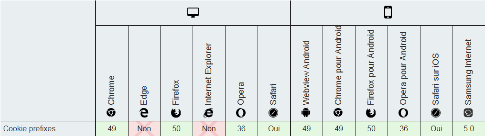

# Cookies prefixes

Les [**cookies prefixes**](https://tools.ietf.org/html/draft-ietf-httpbis-cookie-prefixes-00) sont des cookies dont le nom commencent par `__Secure-` ou `__Host-` et qui permet au client \(un navigateur par exemple\) de s'assurer que le cookie possède certaines propriétés de sécurité sous peine de se voir rejeté.

Voici le [tableau de compatibilité](https://developer.mozilla.org/fr/docs/Web/HTTP/Headers/Set-Cookie) avec les différents navigateurs :



## Le préfixe \_\_Secure-

Le préfixe `__Secure-` impose que le serveur mettant en place le cookie lui assigne l'attribut **secure** et que l'URL du serveur soit considérée comme sécurisé \(par exemple`https://`\). 

Par exemple \(tiré du draft de l'ietf\) , ce cookie `__Secure-` sera rejeté par le client car il ne possède pas l'attribut **secure** :

```text
Set-Cookie: __Secure-SID=12345; Domain=example.com
```

Tandis que celui-ci sera accepté car il possède bien l'attribut **secure** \(et on admet que l'URL du serveur est de type `https://`\) :

```text
Set-Cookie: __Secure-SID=12345; Secure; Domain=example.com
```

## Le préfixe \_\_Host-

Le préfixe `__Host-` est plus strict que le premier préfixe. En effet, en plus de devoir posséder l'attribut **secure** et que l'URL soit de type `https://`, il est nécessaire que le cookie soit de type **Host-only cookie**. Pour rappel, cela signifie que le cookie ne sera valable seulement que pour le domaine principal et non pour ses sous-domaines \(en d'autres termes, l'attribut **domain** devra être vide\).

De plus, il faudra également que l'attribut **path** possède la valeur `"/"`. Cela signifie que le cookie sera envoyé pour toutes les requêtes vers cet hôte.

Voici quelques exemples de cookies non valides \(toujours tirés du draft de l'ietf\) :

```text
Set-Cookie: __Host-SID=12345                                     
Set-Cookie: __Host-SID=12345; Secure                             
Set-Cookie: __Host-SID=12345; Domain=example.com
Set-Cookie: __Host-SID=12345; Domain=example.com; Path=/
Set-Cookie: __Host-SID=12345; Secure; Domain=example.com; Path=/
```

Un cookie valide sera le suivant :

```text
Set-Cookie: __Host-SID=12345; Secure; Path=/
```


