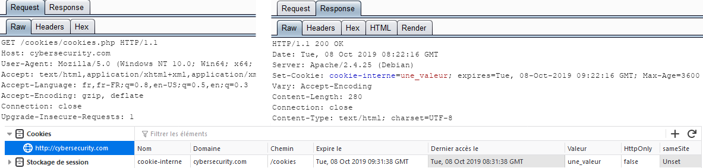
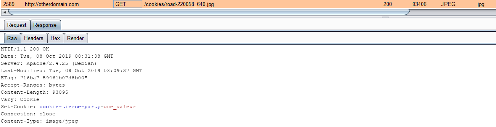
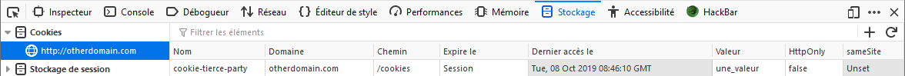

# Cookies tierces parties

Un **cookie tiers** \(_third-party cookie_\) survient lorsque le `site A` charge \(embarque\) des ressources d'un autre domaine, par exemple `site B`. Ce type de cookie est principalement utilisé à des fins commerciaux/publicitaires et de tracking.


Un cookie dont le domaine est le même que celui de la page visité par l'utilisateur se nomme un **cookie interne** \(_first-party cookie_\).



Dans l'exemple suivant, le site `cybersecurity.com` met en place un premier cookie lors de la visite de l'utilisateur sur le site :


```php
<?php
    setcookie("cookie-interne", "une_valeur", time()+3600);
?>
```


Il embarque également une image provenant du site `otherdomain.com` :


```markup
<p>
  
</p>
```


Soit le résultat suivant :


Voici la requête/réponse HTTP \(dont le **Set-Cookie**\) ainsi que l'enregistrement du cookie dans le navigateur :



Une seconde requête est effectuée afin de charger l'image \(pour rappel, l'image est hébergée sur un autre domaine\) :



En réponse HTTP un second cookie est mis en place, mais cette fois sur le domaine `otherdomain.com` il s'agit d'un cookie tiers :



De cette façon, le domaine `otherdomain.com` est capable de savoir que le visiteur a déjà visité \(ou du moins accédé à une des ressources qu'il héberge\). Ici la valeur du cookie n'est pas pertinente mais il est possible d'imaginer une valeur indiquant un centre d’intérêt. Par exemple, si l'image était représentait une voiture, le cookie permettra de cibler les centres d’intérêts du visiteur et de constituer un profil le concernant.

