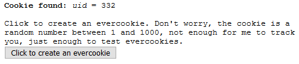
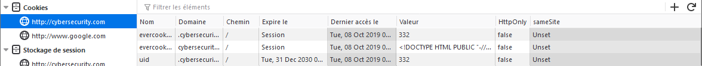
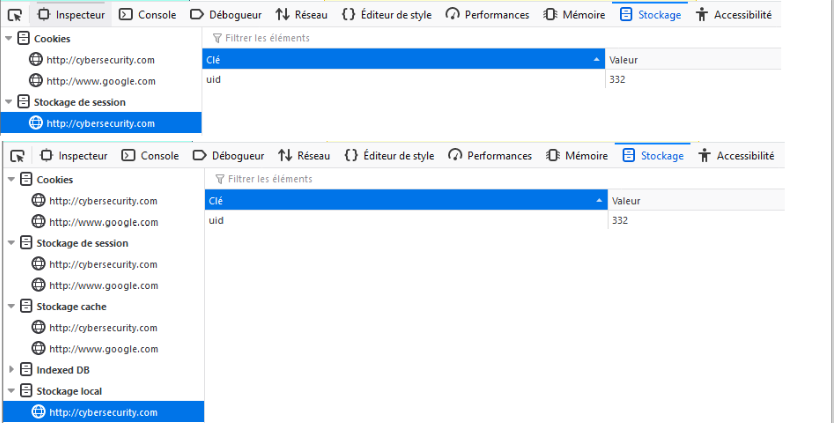
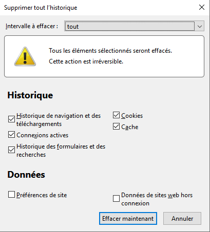
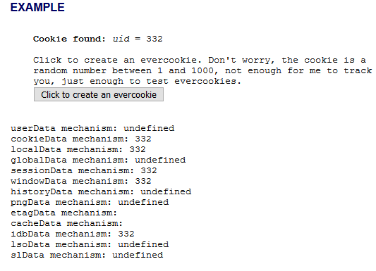

# Cookies Zombie et Evercookies

## Cookie Zombie

Un **cookie Zombie** est un cookie difficilement supprimable car même après son effacement le cookie sera régénéré de façon automatique. Techniquement, le cookie \(du moins ce qui permet de le régénérer\) est stocké en dehors de la zone traditionnel de stockage de cookies.

Selon [Wikipedia](https://en.wikipedia.org/wiki/Zombie_cookie), voici la liste où un **cookie Zombie** peut se cacher :

* Cookie HTTP standard
* Storing cookies in and reading out web history
* Storing cookies in HTTP ETags
* Internet Explorer userData storage \(starting IE9, userData is no longer supported\)
* HTML5 Session Storage
* HTML5 Local Storage
* HTML5 Global Storage
* HTML5 Database Storage via SQLite
* Storing cookies in RGB values of auto-generated, force-cached PNGs using HTML5 Canvas tag to read pixels \(cookies\) back out
* Local shared objects \(Flash cookies\)
* Silverlight Isolated Storage
* Cookie syncing scripts that function as a cache cookie and respawn the MUID cookie[\[5\]](https://en.wikipedia.org/wiki/Zombie_cookie#cite_note-mayer-5)
* TCP Fast Open
* TLS's Session ID

## Evercookie

Comme l'indique [Wikipedia](https://en.wikipedia.org/wiki/Zombie_cookie), chaque site peut utiliser sa propre implémentation du **cookie Zombie** mais il existe une implémentation open-source \(implémentation en Javascript créée par Samy Kamkar\) nommée [**Evercookie**](https://samy.pl/evercookie/). Un exemple d'utilisation du **Evercookie** est donné ci-dessous.

Le domaine `cybersecurity.com` intègre le code source du **Evercookie** récupéré sur son [GitHub](https://github.com/samyk/evercookie) :

Lors de la visite, un bouton permet de générer un **Evercookie** possédant une valeur aléatoire comprise entre 1 et 1000 :

Côté navigateur \(Firefox\), le cookie est bien présent :

La valeur du cookie est aussi sauvegardé à plusieurs emplacements, par exemple ici dans le stockage de session ou le stockage local \(mais pas seulement, comme montré après\) :

Afin de tester la persistance du cookie, un effacement des données de navigation est effectué :

De retour sur le site `cybersecurity.com` afin de voir si le cookie est toujours présent, en tout cas que la valeur 332 est récupérable d'une façon ou d'une autre par le site. C'est bien le cas :

Le site `cybersecurity.com` est capable de récupérer la valeur qui a été affectée au cookie même après une suppression des données de navigation. Le script indique même les emplacements stockant cette valeur et permettant au site de la récupérer.


Comme indiqué sur son GitHub, si des mécanismes tels que Flash, Silverlight ou Java sont disponibles sur la machine cliente, l'**Evercookie** peut même se propager à travers les différents navigateurs de l'utilisateur.


