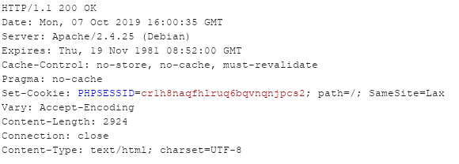

# Utilisation et attributs

## Côté serveur

Un cookie est envoyé au client grâce à un entête HTTP nommé **Set-Cookie**. Le cookie possède plusieurs attributs dont, à minima, un nom et une valeur. Par exemple ici un cookie nommé `PHPSESSID` associé à la valeur `hfr69aoi4csmg6od9uahvd4k2` :

## Côté client

Un client désirant envoyer un cookie au serveur utilisera également un entête HTTP nommé cette fois **Cookie**. Par exemple, afin de maintenir la session précédemment établie par le serveur, le user-agent envoi avec chaque requête \(vers ce même serveur\) le cookie nommé `PHPSESSID` :

De cette façon, le serveur peut retrouver la session de l'utilisateur et retenir/connaitre son identité, ses préférences de site, le contenu de son panier etc.

## Attributs

Il existe plusieurs attributs optionnels liés au cookie \(selon la [RFC](https://tools.ietf.org/html/rfc6265#page-8), un cookie peut à minima ne posséder que le couple **nom=valeur**\) :

### Expire

Cet attribut représente la durée de vie du cookie spécifiée par une date de fin. Passé cette date, le client doit supprimer ce cookie et ne plus l'envoyer en entête dans les requêtes \(en fait comme l'indique la RFC, rien ne l'oblige de le faire\) :

### Max-Age

L'attribut **Max-Age** est semblable à l'attribut **Expire** à la différence qu'il exprime non pas la date de fin mais une durée de validité \(en seconde\) :

Si les deux attributs sont présents, l'attribut **Expire** prévaut sur son homologue. Il se peut qu'aucun de ces attributs soient présent, le cookie est alors un **cookie de session** car le navigateur effacera le cookie à la fermeture du programme. Cependant, la plupart des navigateurs proposent la fonctionnalité de restauration de session impliquant que les **cookies de session** deviennent permanents.

### Domain

L'attribut **Domain** spécifie vers quel\(s\) domaine\(s\) le cookie doit être envoyé. Ici, deux cas peuvent survenir :

#### Domain-Cookie

Le **Domain-Cookie** est un cookie qui est valide \(entendre par là que le navigateur va le joindre aux requêtes effectuées\) sur le domaine de plus haut niveau ainsi que ses sous domaines. Un tel cookie peut être, par exemple, le cookie suivant qui possède un attribut **Domain** à la valeur `cybersecurity.com` \(la valeur peut aussi être `.cybersecurity.com` ou `*.cybersecurity.com`\) :

Il sera donc envoyé pour des requêtes effectuées vers `example.cybersecurity.com` , `www.cybersecurity.com` ou encore vers `cybersecurity.com`.

#### Host-only Cookie

Le **Host-only Cookie**  est valide seulement sur le domaine actuel \(et donc pas pour ses sous-domaines\). Pour un tel cookie il suffit de laisser la valeur de l'attribut **Domain** vide.


Bien sûr, un navigateur n'autorisera pas l'utilisation d'un cookie émis par un `domaine A` mais ayant pour valeur de l'attribut **Domain** `domaine B` et ceci pour des raisons évidentes de sécurité


### Path

Cet attribut permet d'indiquer pour quel\(s\) chemin\(s\) le cookie est valide. Par défaut, la valeur est `path=/` c'est à dire toute l'arborescence du site. Dans l'exemple ci-dessous le cookie est valide seulement pour le répertoire`/admin` ainsi que ses sous-répertoires :


Il faut bien comprendre que cet attribue signifie "valide pour ce chemin et tous ses sous-répertoires"


### Secure

L'attribut **Secure** permet d'indiquer au client de joindre le cookie aux requêtes seulement et seulement si la connexion est de type HTTPS \(plus précisément sur un canal sécurisé, cette définition étant définit par le client\) :

Il s'agit donc d'une protection permettant de répondre à une problématique de confidentialité.

### HttpOnly

Cet attribut restreint l'accès au contenu du cookie seulement aux requêtes HTTP. En d'autres termes, il indique au navigateur d’interdire l'accès au contenu du cookie aux méthodes non-HTTP, par exemple en passant par des appels API du navigateur :

Typiquement, il s'agit d'interdire la lecture du cookie par du code tel que du script Javascript, technique utilisée lors de l'exploitation de failles XSS.

### SameSite

L'attribut **SameSite** \([mise à jour](https://tools.ietf.org/html/draft-west-first-party-cookies-07) de la RFC 6265\) est un attribut récent supporté par les principaux navigateurs \(Chrome, Firefox et Opéra\) depuis 2017. Il permet d'offrir une protection complémentaire contre les attaques de type XSSI et CSRF en empêchant le navigateur de joindre le cookie lors de l'exécution d'une requête Cross-Origin. Cet attribut possède deux valeurs : **Strict** et **Lax**.

#### Strict

La valeur **Strict** empêche toute envoi de cookie lors d'une requête Cross-Origin.

Admettons que vous êtes authentifié sur un `site A`. Vous naviguez sur un `site B` qui possède un lien cliquable vers le `site A` en question. En temps normal, si vous cliquez sur ce lien, vous serez dirigé vers le `site A` tout en étant authentifié \(car vous l'étiez déjà auparavant\). Par contre, si le cookie du `site A` possède la valeur **SameSite=Strict** alors il faudra vous ré-authentifier sur le site, car le cookie n'aura pas été envoyé par le navigateur.

#### Lax

La valeur **Lax** permet un compromis entre sécurité et facilité d'usage. Le cookie sera transmis par le navigateur lors des requêtes Cross-Origin mais seulement si elles sont de type **`GET`**. De plus, il faut que ces requêtes **`GET`** soient des requêtes **top-level** \(c'est à dire que la requête va modifier la barre d'adresse du navigateur, cela permet d'exclure les requêtes faites par l'utilisation d'une ressource \(image, script ou encore iframe\) mais d'autoriser l'envoi pour une balise de type lien \(et quelques autres\).

Comme l'indique la documentation de Mozilla, Les cookies **SameSite** sont encore expérimentaux et ne sont pas encore supportés par tous les navigateurs.

