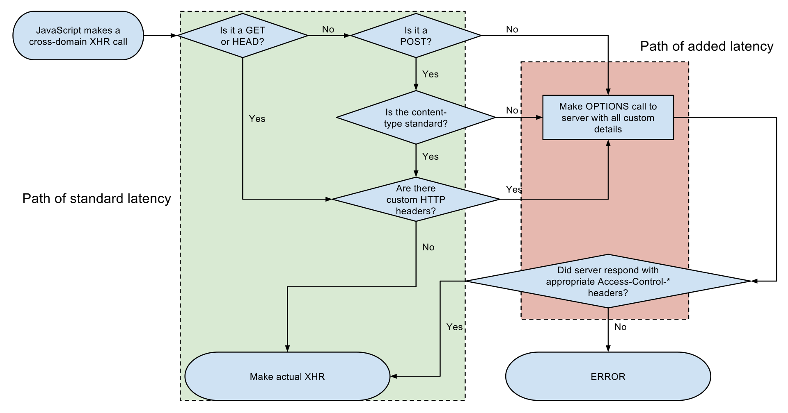

# Introduction à CORS

Toutes les autres requêtes \(non simples\) sont considérées comme étant des requêtes de type Cross-Origin et soumissibles à CORS. Le navigateur effectuera tout d'abord un contrôle afin de déterminer leur légitimé. Ce contrôle s'effectue grâce à une requête préalable, nommée preflight request, au serveur hébergeant la ressource.

Bien que tout cela sera détaillé, voici un [schéma récapitulatif](https://fr.wikipedia.org/wiki/Cross-origin_resource_sharing#/media/Fichier:Flowchart_showing_Simple_and_Preflight_XHR.svg) du traitement des différentes requêtes :

Les exemples de cet article traiteront les cas suivants :

* Utilisation de l'API XMLHttpRequest \(l'API Fetch aura le même comportement\)
* Les polices web
* Les Shapes
* Les canvas
* Les textures WebGL
* Les iframes et l'origin 'null'

