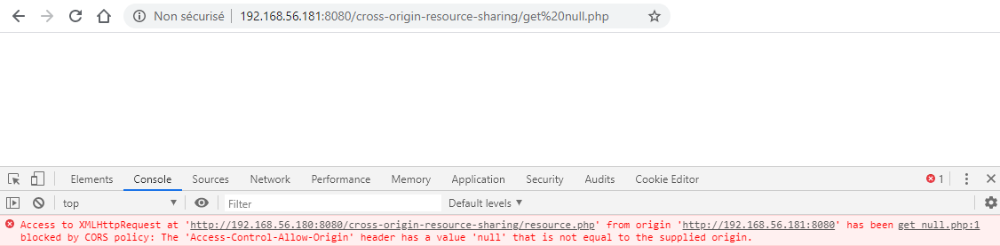
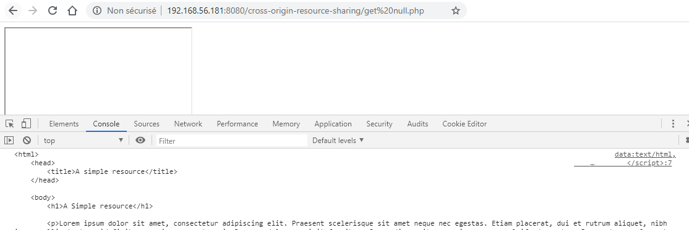
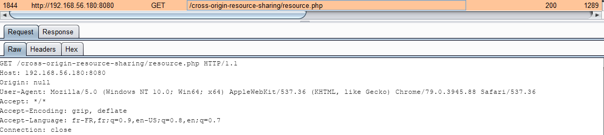

# Les iframes et l'Origin 'null'

L'entête de réponses `Access-Control-Allow-Origin` accepte comme valeur la valeur `null` :

```text
add_header 'Access-Control-Allow-Origin' 'null'
```

Etant donné qu'il est sans doute difficile d'avoir un domaine ayant comme valeur `null`, aucune requête cross-origin ne semble être possible. Prenons une requête simple en **`GET`** souhaitant afficher la réponse dans la console :

```markup
<html>
  <head>
    <title>A Simple get Request</title>
  </head>
​
  <body>
    <script>            
      var xhr = new XMLHttpRequest();            
      xhr.open("GET", 'http://192.168.56.180:8080/cross-origin-resource-sharing/resource.php', true);
​
      xhr.onreadystatechange = function() {
        if (this.readyState === XMLHttpRequest.DONE && this.status === 200) {
          console.log(xhr.response);                    
        }
      }
​
      xhr.send();
    </script>
  </body>
</html>
```

Le domaine émetteur n'était pas `null` la requête est refusée :



Il existe une solution \(et sans doute quelques autres\) pour obtenir une `Origin` à la valeur `null`, les iframes :

```markup
<html>
  <head>
    <title>Null Origin</title>
  </head>
​
  <body>
    <iframe src="data:text/html,
      <script>
        var xhr=new XMLHttpRequest();
        xhr.open('GET', 'http://192.168.56.180:8080/cross-origin-resource-sharing/resource.php', true);
        xhr.onreadystatechange = function() {
          if (this.readyState === XMLHttpRequest.DONE && this.status === 200) {
            console.log(xhr.response);
          }}; 
          
        xhr.send();
      </script>">
    </iframe>
  </body>
</html>
```

Avec cette technique, la réponse de la requête s'affiche correctement dans la console :



Via inspection de la requête, il est possible de voir qu'elle possède bien un entête `Origin` portant la valeur `null` :



