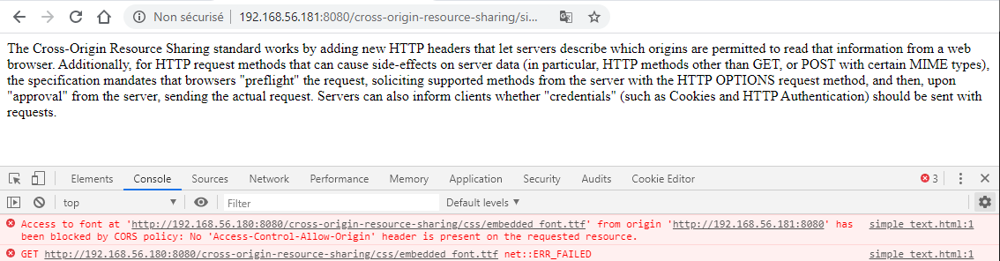
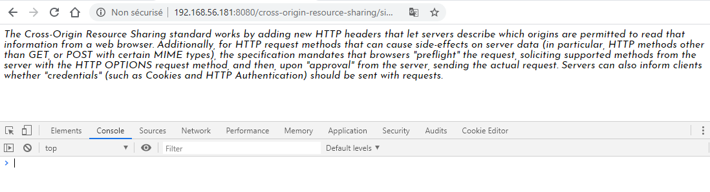

# Les polices web

Les polices web \(appelées avec `@font-face`\) sont soumissibles à CORS. Admettons que le domaine `http://192.168.56.181:8080` tente d'utiliser une police hébergée sur le domaine `http://192.168.56.180:8080` :

```css
@font-face {
  font-family: "Embedded Font";
  src: url("http://192.168.56.180:8080/cross-origin-resource-sharing/css/embedded_font.ttf");
}
  
body {
  font-family: "Embedded Font";
}
```

Le fichier html utilisant le fichier `.css` précédent est le suivant :

```markup
<html>
  <head>
    <title>A simple text with a font-face</title>
    <link rel = "stylesheet" type = "text/css" href = "css/style.css"/>
  </head>
​
  <body>
    <p>
      The Cross-Origin Resource Sharing standard works by adding new HTTP headers that let servers describe which origins are permitted to read that information from a web browser. Additionally, for HTTP request methods that can cause side-effects on server data (in particular, HTTP methods other than GET, or POST with certain MIME types), the specification mandates that browsers "preflight" the request, soliciting supported methods from the server with the HTTP OPTIONS request method, and then, upon "approval" from the server, sending the actual request. Servers can also inform clients whether "credentials" (such as Cookies and HTTP Authentication) should be sent with requests.  
    </p>
  </body>
</html>
```

Sans configuration spécifique CORS, la récupération de la police échoue :



On autorise son chargement grâce à l'entête de réponse `Access-Control-Allow-Origin` \(soit en spécifiant le domaine ou alors via le joker `*`\) :

```text
add_header 'Access-Control-Allow-Origin' 'http://192.168.56.181:8080'
```

La requête est maintenant autorisée. Il n'y a pas de preflight request pour le chargement des polices :



