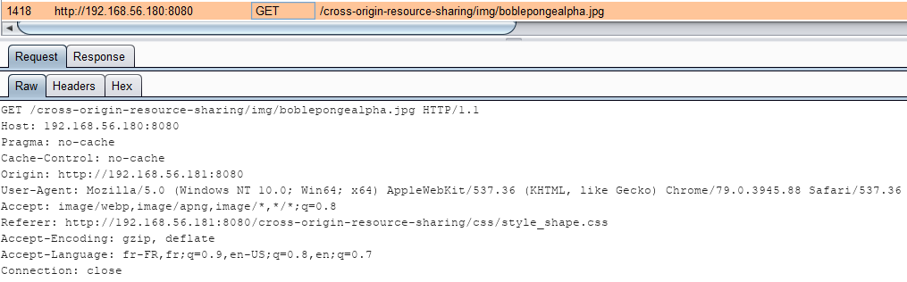

# Les Shapes

Les shapes en CSS peuvent travailler sur un image hébergée sur un domaine différent. L'exemple ci-dessous présente une page html \(sur le domaine `http://192.168.56.181:8080`\) intégrante une image et du texte mais travaillant la forme de l'image \(hébergé sur le domaine `http://192.168.56.180:8080`\).

Voici le code CSS :

```css
img {
  float: left;
  shape-outside: url(http://192.168.56.180:8080/cross-origin-resource-sharing/img/boblepongealpha.jpg);
  shape-image-threshold: .2;
  shape-margin: 20px;
}
```

Ainsi que la page HTML :

```markup
<html>
  <head>
    <title>Shape Image</title>
    <link rel = "stylesheet" type = "text/css" href = "css/style_shape.css"/>
  </head>
​
  <body>
    <div class="box"></div>
      
      <p>The Cross-Origin Resource Sharing standard works by adding new HTTP headers that let servers describe which origins are permitted to read that information from a web browser. Additionally, for HTTP request methods that can cause side-effects on server data (in particular, HTTP methods other than GET, or POST with certain MIME types), the specification mandates that browsers "preflight" the request, soliciting supported methods from the server with the HTTP OPTIONS request method, and then, upon "approval" from the server, sending the actual request. Servers can also inform clients whether "credentials" (such as Cookies and HTTP Authentication) should be sent with requests.  
      </p>
    </div>
  </body>
</html>
```

Sans configuration CORS, la requête de la forme est bloquée :


Mais une fois la politique relaxée en ajoutant à la configuration du serveur hébergeant l'image :

```text
add_header 'Access-Control-Allow-Origin' 'http://192.168.56.181:8080'
```

Alors la requête est honorée, l'entête `Origin` indiquant bien une requête cross-origin :



> Etant donné qu'il s'agit d'une requête simple, en **`GET`**, aucun prefllight request est effectuée au préalable

