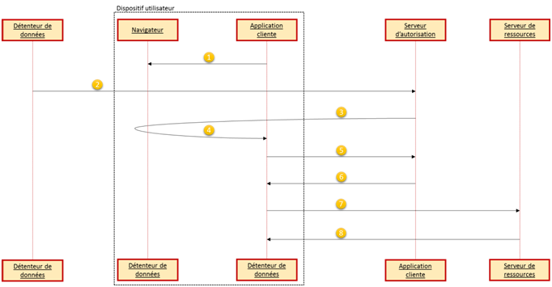
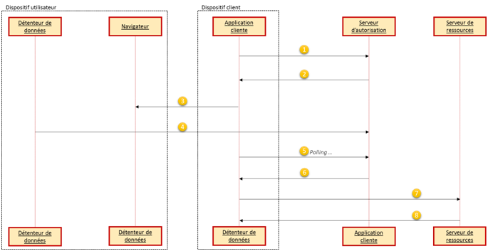

# Types d'autorisation \(extensions\)

## Authorization code grant \(PKCE\)

### Description

Les applications natives sont des clients installés et exécutés sur la machine du détenteur de ressources \(ordinateur personnel, smartphone, etc\). Ces types de clients possèdent des contraintes de sécurité spécifiques.

Etant donné que l’utilisation du endpoint d’autorisation nécessite une interaction entre l’application cliente et le navigateur de l’utilisateur final, il est possible dans le cas d’une application native qu’elle utilise soit un navigateur considéré comme programme externe ou alors un navigateur intégré à l’application.

* **External user-agent** \(navigateur externe\) : plusieurs choix sont possibles afin d’utiliser un navigateur externe, par exemple un choix peut être l’installation et l’utilisation d’un greffon du navigateur faisant la passerelle entre le navigateur et l’application cliente
* **Embedded user-agent** \(navigateur intégré\) : l’application utilise un navigateur intégré afin d’accéder aux informations nécessaires


Il est vivement recommandé d’utiliser un navigateur extérieur \(le navigateur de l’utilisateur\) et non embarqué. Cela apporte l’avantage de pouvoir utilisé les états du navigateur, par exemple si un système d’authentification SSO \(Single Sign-On\) est en place.


### Diagramme de séquence



1. Le client doit tout d’abord générer un secret \(qu’il doit également stocker\) nommé **code\_verifier** et également calculer un dérivé de ce secret \(grâce à une fonction de hachage par exemple\) nommé **code\_challenge**. L’application cliente ouvre le navigateur internet de l’utilisateur en spécifiant l’URL du endpoint d’autorisation du serveur d’autorisation en transmettant également le **code\_challenge** ainsi que la méthode de transformation utilisée
2. Le serveur d’autorisation reçoit la requête d’autorisation, enregistre le **code\_challenge** ainsi que la méthode transformation et authentifie l’utilisateur \(cela peut être via un SSO par exemple\) et obtient son autorisation
3. Le serveur d’autorisation redirige l’utilisateur \(via le navigateur\) en fournissant également le code d’autorisation
4. L’application cliente reçoit le code d’autorisation
5. L’application cliente présente le code d’autorisation au endpoint du serveur d’autorisation mais transmet également cette fois le secret généré à la première étape, c'est-à-dire la valeur de **code\_verifier**
6. Le serveur d’autorisation effectue la transformation du **code\_verifier** et la compare avec la version précédente stockée. Si les deux valeurs correspondent alors la requête est valide, sinon elle doit être rejetée. Le serveur d’autorisation valide également le code d’autorisation et fournit un jeton d’accès.
7. L’application cliente peut maintenant appeler la ressource protégée en soumettant le jeton d’accès précédemment reçu
8. Le serveur de ressources fournit la ressource demandée

### Synthèse des échanges \(focus sur PKCE\)

#### Requête de code d’autorisation \(étape 2\)

Le client effectue une requête au serveur d’autorisation en ajoutant les paramètres suivants :

* **code\_challenge** \(OBLIGATOIRE\) : la valeur du secret « code\_challenge »
* **code\_challenge\_method** \(OPTIONNEL\) : par défaut cette valeur est « plain » mais peut être « S256 » si la méthode de transformation est SHA-256

#### Requête de demande de jeton d’accès \(étape 5\)

Lorsque le client demande le jeton d ‘accès en fournissant le code d’autorisation, il transmet également le secret généré précédemment nommé **code\_verifier** :

* **code\_verifier** \(OBLIGATOIRE\) : la valeur du secret « code\_verifier »

### Informations complémentaires

#### Client de type public

Il est important de noter qu’une application native doit être enregistrée sur le serveur d’autorisation comme étant de type **public** et non **confidentiel**.

#### Client de type PKCE

Si le type du client est **public** et non **confidentiel** il doit alors implémenter l’extension OAuth nommé _Proof Key for Code Exchange_ \(PKCE, prononcé « pixy »\). Il faut également que le serveur d’autorisation supporte ce type de clients.

L’extension PKCE a été spécialement créée afin de réduire le risque d’interception du code d’autorisation par une autre application s’exécutant sur le même dispositif utilisateur que l’application cliente. Pour cela, le client génère un secret dont il envoi sa valeur hachée dans la requête du code d’autorisation. Le serveur d’autorisation reçoit également ce secret lors de la demande de jeton d’accès, vérifie sa valeur hachée ainsi que celle reçue par le client lors de la demande de code d’autorisation.

Concernant le client, la génération du secret doit être cryptographiquement sûr, et doit être d’une taille minimale de 43 caractères et maximum 128. Les caractères acceptés sont les caractères alphabétiques, les chiffres ainsi que les symboles "-", ".", "\_" et "~". Pour cela, il est par exemple recommandé d’utiliser une fonction de génération aléatoire sûr possédant une taille de sortie de 32 octets puis d’effectuer un encodage Base64 sur cette valeur donnant alors une chaîne de caractères de 43 octets.

#### Implicit authorization flow

Le type d’autorisation **Implicit** ne peut être protégé par l’extension PKCE. Pour cette raison, ce type d’autorisation n’est **pas recommandé** pour les clients natifs.

#### Attaque via un serveur d'autorisation compromis

Il est possible à un serveur d’autorisation compromis d’attaquer un second serveur d’autorisation en utilisant la même application cliente. Pour réduire ce risque, une application native s’enregistrant auprès d’un serveur d’autorisation doit fournir une seule URL de redirection par serveur d’autorisation \(par exemple en faisant varier le chemin\). Si l’URL de redirection fournit dans une requête d’autorisation de la part du client ne correspond pas à l’URL de redirection enregistrée au niveau du serveur d’autorisation, ce dernier doit alors refuser la demande.

De plus, l’application cliente doit stocker l’URL de redirection utilisée dans les requêtes d’autorisation \(par exemple en utilisant le paramètre « state »\) et doit vérifier que l’URL de ce paramètre correspond à l’URL permettant la réception de la réponse de d’autorisation.

## Device flow \(for browserless and input constrained devices\)

### Description

Ce type de flux permet de récupérer l’autorisation d’un utilisateur à un dispositif possédant un accès internet mais aucun moyen facile d’interaction \(une smart TV ou une imprimante par exemple\). Pour cela, l’utilisateur utilise un second dispositif \(comme par exemple un smartphone\) afin d’effectuer la requête d’autorisation.

### Diagramme de séquence




1. Le client demande l’accès au serveur d’autorisation en incluant son **client\_id** dans la requête
2. Le serveur d’autorisation répond en fournissant un code de vérification, un code utilisateur ainsi qu’une URL de vérification.
3. Le client fournit le code utilisateur et indique à l’utilisateur de visiter l’URL de vérification permettant le renseignement du code utilisateur fournit
4. Le serveur d’autorisation authentifie l’utilisateur et lui demande de donner son autorisation à l’application cliente en fournissant le code utilisateur. Une fois reçu, le serveur d’autorisation valide le code utilisateur
5. Pendant que l’utilisateur autorise l’application, elle effectue continuellement \(polling\) une demande au serveur d’autorisation afin de savoir si l’utilisateur a donné son autorisation. Dans ses requêtes, l’application doit fournir le code de vérification ainsi que son identifiant client \(**client\_id**\)
6. En admettant que l’utilisateur final a donné son autorisation, le serveur d’autorisation valide le jeton de vérification et répond par un jeton d’accès
7. L’application cliente peut maintenant appeler la ressource protégée en soumettant le jeton d’accès précédemment reçu
8. Le serveur de ressources fournit la ressource demandée

### Synthèse des échanges

#### Requête d’autorisation du dispositif \(étape 1\)

Le client effectue une requête au serveur d’autorisation en ajoutant les paramètres suivants :

* **client\_id** \(OBLIGATOIRE\) : l’identifiant du client
* **client\_secret** \(OPTIONNEL\) : si le client possède un **client\_secret** il doit alors s’authentifier auprès du serveur d’autorisation, via le header `Authorization` par exemple
* **scope** \(OPTIONNEL\) : scope demandé par le client

Exemple de requête :

```text
POST /device_authorization HTTP/1.1
Host: server.example.com
Content-Type: application/x-www-form-urlencoded

client_id=459691054427
```

#### Réponse d’autorisation du dispositif \(étape 2\)

En réponse, le serveur d’autorisation génère un code de vérification, un code utilisateur \(valide un certain temps\) :

* **device\_code** \(OBLIGATOIRE\) : le code de vérification du dispositif
* **user\_code** \(OBLIGATOIRE\) : le code de vérification de l’utilisateur
* **verification\_uri** \(OBLIGATOIRE\) : l’URL permettant à l’utilisateur de renseigner le code utilisateur. Il doit être court et facile à mémoriser par l’utilisateur \(car l’utilisateur va devoir le renseigner manuellement dans son navigateur\). Pour les dispositifs non-textuels, il est possible de fournir la demande d’autorisation à l’utilisateur par le biais d’un QR code par exemple ou encore par NFC
* **expires\_in** \(OPTIONNEL\) : temps d’expiration du code de vérification et du code de l’utilisateur
* **interval** \(OPTIONNEL\) : le temps minimum \(en secondes\) avant que le client puisse commencer les requêtes de type polling

Exemple de réponse :

```text
HTTP/1.1 200 OK
Content-Type: application/json
Cache-Control: no-store

{
  "device_code":"GMMhmHCXhWEzkobqIHGG_EnNYYsAkukHspeYUk9E8",
  "user_code":"WDJB-MJHT",
  "verification_uri":"https://www.example.com/device",
  "expires_in" : 1800,
  "interval": 5
}
```

#### Requête de jeton d’accès par polling \(étape 5\)

Pendant que l’utilisateur donne son accord, le client effectue une demande \(polling\) de jeton d’accès au serveur d’autorisation :

* **grant\_type** \(OBLIGATOIRE\) : doit avoir pour valeur « urn:ietf:params:oauth:grant-type:device\_code »
* **device\_code** \(OBLIGATOIRE\) : le code de vérification du dispositif
* **client\_id** \(OBLIGATOIRE\) : l’identifiant du client

Exemple de réponse :

```text
POST /token HTTP/1.1
Host: server.example.com
Content-Type: application/x-www-form-urlencoded

grant_type=urn%3Aietf%3Aparams%3Aoauth%3Agrant-type%3Adevice_code&device_code=GMMhmHCXhWEzkobqIHGG_EnNYYsAkukHspeYUk9E8&client_id=459691054427
```

### Informations complémentaires

#### Polling

Pour obtenir le jeton d’accès de la part du serveur d’autorisation, le client doit continuellement effectuer des requêtes. Tant que l’utilisateur n’a pas donné son autorisation, le serveur d’autorisation renvoie une erreur \(nommée ici soft\_error\) indiquant au client de continuer son polling.

L’erreur peut donner une indication à respecter au client, à savoir :

* **authorization\_pending** : indique que l’utilisateur n’a pas encore complété la demande d’autorisation
* **slow\_down** : indique au client qu’il effectue trop de requêtes trop rapidement et demande de diminuer la fréquence des requêtes
* **expired\_token** : l’utilisateur n’a pas encore complété la demande d’autorisation et en plus le code de vérification \(**device\_code**\) a expiré. Il faut donc recommencer le processus

De plus, le délai entre deux requêtes effectuées par le client lors du polling ne doit pas être inférieur au délai stipulé par le paramètre **interval**.

#### Format du code utilisateur

Afin de faciliter le renseignement du code utilisateur par l’utilisateur, il doit être facile à retenir et simple à taper. Par exemple, il est possible d’utiliser l’alphabet \[A-Z\] ainsi que les signes de ponctuation. Un code avec une entropie suffisante peut être : « WDJB-MJHT ». Il est également possible de supprimer les voyelles afin de ne pas générer de mots existants.

## Extension Grants

Le client peut utiliser le type d’autorisation spécifique qui étend ceux déjà existant en ajoutant un paramètre nommé **grant\_type** ayant pour valeur une URL absolue \(ces URLs sont définies par le serveur d’autorisation\).

Il peut être possible d’obtenir un jeton d’accès en fournissant une assertion SAML \(Security Assertion Markup Language\). Voici la requête effectuée par le client permettant cela :

```text
POST /token HTTP/1.1
Host: server.example.com
Content-Type: application/x-www-form-urlencoded

grant_type=urn%3Aietf%3Aparams%3Aoauth%3Agrant-type%3Asaml2-bearer&assertion=PEFzc2VydGlvbiBJc3N1ZUluc3RhbnQ9IjIwMTEtMDU[...omitted for brevity...]aG5TdGF0ZW1lbnQ-PC9Bc3NlcnRpb24-
```

