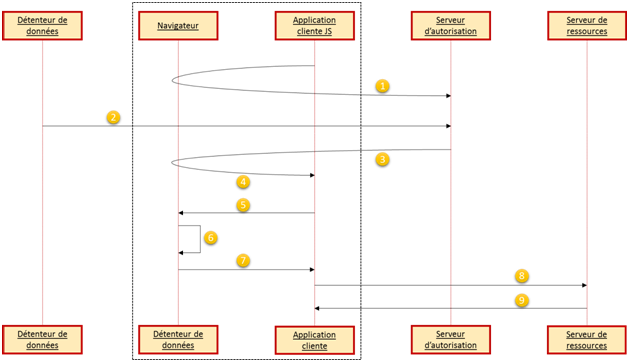

# Implicit Grant

## Description

Ce type d’autorisation est utilisé pour récupérer un jeton d’accès lorsque l’application consommatrice est développée côté client \(par exemple en Javascript SPA\). Il ne permet pas de récupérer de jeton de rafraîchissement. Ce type d’autorisation étant basé sur les redirections il est nécessaire que le client \(souvent un navigateur web\) soit capable de recevoir des requêtes de la part du serveur d’autorisation \(via des redirections\).

L’autorisation implicite ne comprend pas de phase d’authentification du client contrairement au type d’autorisation par code \(grâce au **client\_id** & **client\_secret**\). De plus, le jeton d’accès est présent dans les URLs de redirection, ce qui implique qu’il est accessible pour le détenteur de données ainsi que toute entité pouvant avoir accès aux données présentes dans les URLs.

## Diagramme de séquence



1. Le client initie la demande d’autorisation en redirigeant le détenteur de données \(via le navigateur\) vers le endpoint du serveur d’autorisation. Dans cette **redirection**, le client inclut son **client\_id**, le type d’autorisation demandé \(ici **token**\), le **scope** demandé, un paramètre **state** ainsi que l’**URL de redirection**
2. Le serveur d’autorisation authentifie le détenteur de données \(via le navigateur\) et lui demande s’il autorise l’application cliente à accéder aux ressources demandées
3. En supposant que le détenteur de données a accepté la demande, le serveur d’autorisation redirige le détenteur de données \(via le navigateur\) vers l’application cliente grâce à l’URL de redirection fournit à la première étape ou lors de la phase d’enregistrement du client. L’URL de redirection contient le jeton d’accès en tant que fragment de l’URL
4. Le navigateur suit la redirection et effectue la requête à l’application cliente. Le jeton d’accès \(contenu dans le fragment de l’URL\) n’est pas envoyé à l’application cliente mais reste disponible localement par le navigateur
5. L’application cliente répond à la requête en transmettant une page web contenant un script qui permet d’accéder au fragment de l’URL correspondant au jeton d’accès \(et d’autres paramètres\) afin de l'extraire
6. Le navigateur exécute le script précédemment fournit et extrait le jeton d’accès
7. Le navigateur envoie le jeton à l’application cliente
8. L’application cliente tente d’accéder à une ressource protégée en incluant le jeton d’accès à la requête
9. Le serveur de ressources répond en retournant les données demandées par le client \(si le jeton d’accès est valide\)


Note pour l'étape 4 : un fragment d’une URL est représenté par le signe « \# » et est accessible seulement côté client \(il n’est pas envoyé au serveur contrairement aux paramètres précédés du signe « ? » ou « & »\).


## Synthèse des échanges

### Demande de jeton d’accès \(étape 1\)

Le client construit l’URL de requête en ajoutant les paramètres suivants :

* **response\_type** \(OBLIGATOIRE\) : ici « token »
* **client\_id** \(OBLIGATOIRE\) : l’identifiant du client comme déclaré au niveau du serveur d’autorisation
* **redirect\_uri** \(OPTIONNEL\) : URL où sera redirigé le détenteur de données
* **scope** \(OPTIONNEL\) : scope demandé par le client
* **state** \(RECOMMANDE\) : un nonce à des fins de sécurité \(jeton anti-CSRF\) ou variable d'état

Exemple de requête :

```text
GET authorize?response_type=token&client_id=s6BhdRkqt3&state=xyz&redirect_uri=https%3A%2F%2Fclient%2Eexample%2Ecom%2Fcb HTTP/1.1
Host: server.example.com
```

### Réponse contenant le jeton d’accès \(étape 3\)

Le serveur d’autorisation fournit le jeton d’accès en tant que fragment de l’URL avec les paramètres suivants :

* **access\_token** \(OBLIGATOIRE\) : le jeton d’accès fournit par le serveur d’autorisation
* **token\_type** \(OBLIGATOIRE\) : le type de jeton délivré
* **expires\_in** \(RECOMMANDE\) : la durée de vie \(en secondes\) du jeton d’accès \(Si ce paramètre n’est pas fourni, le serveur d’autorisation doit le transmettre d’une autre manière\)
* **scope** \(OPTIONNEL si le même que celui demandé lors de la requête\) : scope demandé par le client, s'il est différent que celui demandé au préalable alors ce paramètre est OBLIGATOIRE
* **state** \(OBLIGATOIRE si présent lors de la requête d’autorisation\) : si le client fournit ce paramètre alors la même valeur doit également être présente dans la réponse

Exemple de réponse :

```text
HTTP/1.1 302 Found
Location: http://example.com/cb#access_token=2YotnFZFEjr1zCsicMWpAA&state=xyz&token_type=example&expires_in=3600
```

Réponse en cas d’erreur : Si une erreur survient à cause d’un problème concernant l’URL de redirection \(URL invalide, ne correspondant pas à celle enregistrée ou alors absente\) ou si l’identifiant du client **client\_id** est absent, le serveur d’autorisation doit prévenir l’utilisateur final et ne pas rediriger son navigateur vers l’URL de redirection non valide.

Si l’utilisateur final ne donne pas son consentement ou si la requête n’est pas valide pour d’autres raisons qu’un problème d’URL de redirection, le serveur d’autorisation doit alors ajouter les paramètres suivants :

* **error** \(OBLIGATOIRE\) : un code erreur en ASCII. Voici à quoi peuvent correspondre les codes erreur :
  * **invalid\_request** : requête invalide car mal-formée \(paramètre manquant ou invalide ou présent plusieurs fois\)
  * **unauthorized\_client** : le client n’est pas autorisé à demander un code d’autorisation en utilisant cette méthode
  * **access\_denied** : le détenteur de ressources n’a pas donné son consentement ou le serveur d’autorisation n’accepte pas la requête
  * **unspported\_response\_type** : le serveur d’autorisation ne permet pas d’obtenir un jeton d’accès en utilisant cette méthode
  * **invalid\_scope** : le scope fournit est invalide, inexistant ou mal-formé
  * **server\_error** : une erreur inattendue est survenue \(erreur HTTP 500\)
  * **temporary\_unavailable** : le serveur d’autorisation est occupé \(surcharge ou maintenance, erreur HTTP 503\)
* **error\_description** \(OPTIONNEL\) : description fournissant des informations complémentaires sur l’erreur
* **error\_uri** \(OPTIONNEL\) : URI qui permet de fournir de plus amples détails sur l’erreur
* **state** \(OBLIGATOIRE si présent lors de la requête d’autorisation\) : si le client fournit ce paramètre alors la même valeur doit également être présent dans la réponse

Exemple d’une erreur :

```text
HTTP/1.1 302 Found
Location: https://client.example.com/cb#error=access_denied&state=xyz
```

## 

