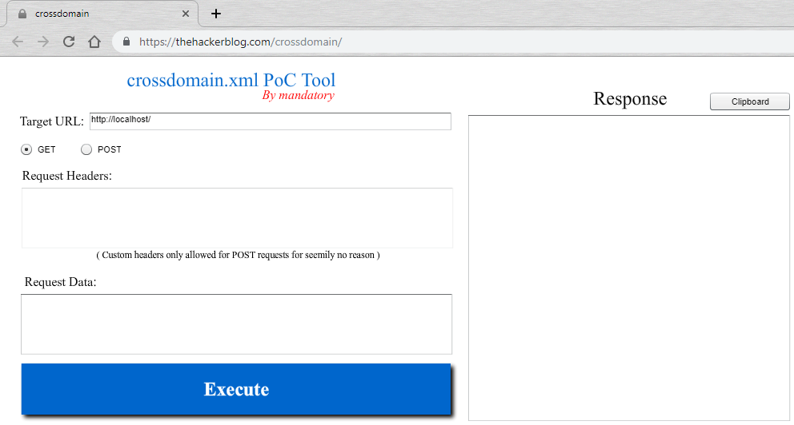
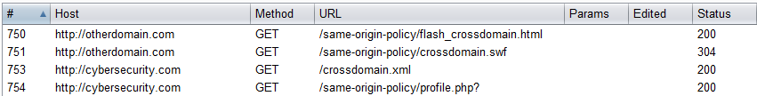
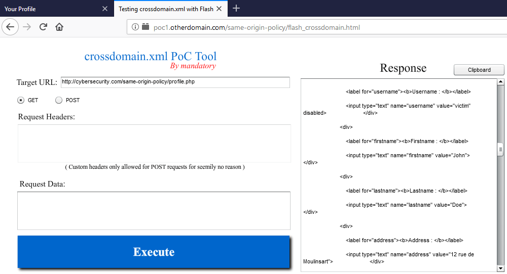
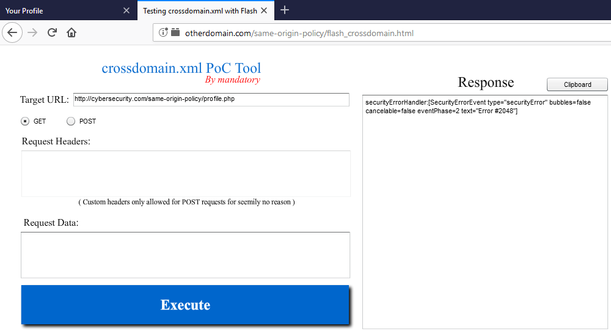
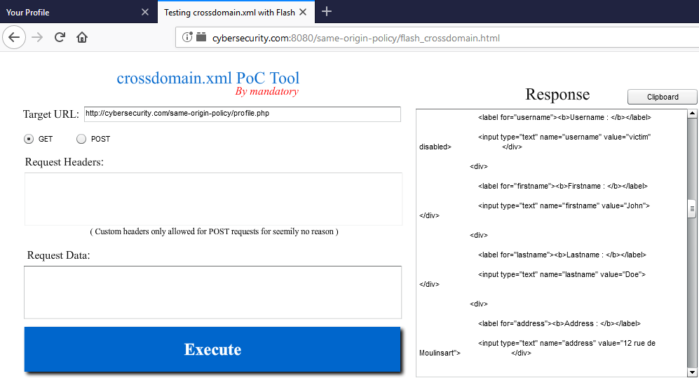
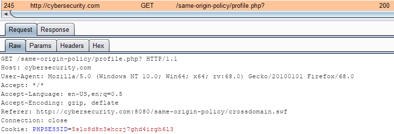
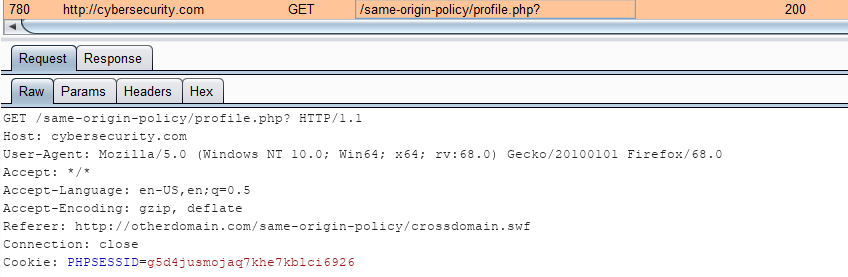
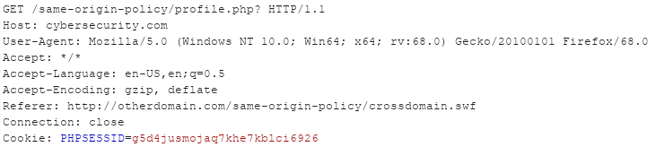

# Flash et le fichier crossdomain.xml

Flash propose son propre mécanisme permettant qu'une application développée sur un domaine A puisse effectuer une requête cross-origin. Pour cela, il s'appuie sur un fichier nommé `crossdomain.xml` hébergé sur le domaine cible \(généralement à la racine du site\).

## Application Flash

L'application Flash permettant de tester les requêtes cross-origin utilisée dans cet article provient du blog [thehackerblog](https://thehackerblog.com). Dans son [article](https://thehackerblog.com/crossdomain-xml-proof-of-concept-tool/), il présente son outil "[crossdomain.xml PoC Tool](https://thehackerblog.com/crossdomain/)" dont je me sers également ici :



Il est facilement réutilisable en téléchargeant directement le fichier flash .swf et en l'appelant via un tag `object` dans une simple page html :

```markup
<object type="application/x-shockwave-flash" data="crossdomain.swf" width="1000" height="480">
  <param name="movie" value="crossdomain.swf">
  <param name="quality" value="high">
  <param name="bgcolor" value="#ffffff">
  <param name="play" value="true">
  <param name="loop" value="true">
  <param name="wmode" value="window">
  <param name="scale" value="showall">
  <param name="menu" value="true">
  <param name="devicefont" value="false">
  <param name="salign" value="">
  <param name="allowScriptAccess" value="sameDomain">
            
  <!--<![endif]-->
  <a href="http://www.adobe.com/go/getflash">
    
  </a>
  <!--[if !IE]>-->
</object>
```


La version de Flash utilisée pour cet article est la **32.0 r0**


## Fichier crossdomain.xml

Le fichier `crossdomain.xml` est un fichier qui permet de spécifier les domaines autorisés à accéder aux ressources hébergées sur un domaine particulier.

Le fichier est au format XML. L'exemple suivant permet de restreindre le chargement des ressources au domaine `example.com` :

```markup
<cross-domain-policy>
  <allow-access-from domain="example.com"></allow-access-from>
</cross-domain-policy>
```

Il est également possible d'autoriser l'ensemble de ses sous-domaines grâce au joker :

```markup
<cross-domain-policy>
  <allow-access-from domain="*.example.com"></allow-access-from>
</cross-domain-policy>
```

### Autorisation d'un domaine

Lorsque le site détenteur de la ressource désirée possède un fichier `crossdomain.xml` bien configuré, par exemple en autorisant seulement le domaine `otherdomain.com` :

```markup
<cross-domain-policy>
    <allow-access-from domain="otherdomain.com" />
</cross-domain-policy>
```

Alors seul le domaine autorisé peut requêter la ressource :



A droite, la réponse en HTML contient les bien les informations de l'utilisateur récupérées auprès de `cybersecurity.com`


Les requêtes effectuées pendant cet échange indiquant bien la récupération du fichier `crossdomain.xml` et seulement ensuite la requête vers la page de profil :



Si la requête venait non pas du domaine principal mais d'un sous-domaine, alors la requête vers la ressource serait rejetée. Ici un exemple avec le domaine `poc1.otherdomain.com` :


### Autorisation d'un sous-domaine

Il est également possible de n'autoriser seulement qu'un sous-domaine spécifique, par exemple `poc1.otherdomain.com` :

```markup
<cross-domain-policy>
    <allow-access-from domain="poc1.otherdomain.com" />
</cross-domain-policy>
```

Alors seul le sous-domaine spécifié peut accéder à la ressource :



Par contre il n'est pas possible pour un autre sous-domaine \(`poc2.otherdomain.com`\) d'accéder à la ressource :


Ni même au domaine principal `otherdomain.com` :




Par contre, la requête serait autorisée si le fichier de politique autorisait tous les sous-domaines :

```markup
<allow-access-from domain="*.otherdomain.com" />
```


### Attribut "secure"

La directive `allow-access-from` admet un attribut `secure` qui permet de spécifier le comportement de Flash lorsque la ressource ou l'application sont sur un schéma différent \(`HTTP` ou `HTTPS`\). 

Si l'administrateur ne spécifie rien dans le fichier :

```markup
<cross-domain-policy>
    <allow-access-from domain="otherdomain.com" />
</cross-domain-policy>
```

Alors il n'est pas possible d'effectuer une requête cross-domain avec des schémas différents. Ici `http://otherdomain.com` tente de requêter `https://cybersecurity.com`  :


En fait dans ce cas, Flash admet la valeur par défaut `secure="true"` :

```markup
<cross-domain-policy>
    <allow-access-from domain="otherdomain.com" secure="true"/>
</cross-domain-policy>
```

Si l'administrateur force cette valeur à `false`, alors une telle requête devient possible :


Cela peut poser un problème de sécurité, le trafic sur HTTP n'étant pas chiffré.

### Absence du fichier

**Requête cross-domain**

Admettons qu'une application Flash soit hébergée sur `otherdomain.com` et souhaite accéder \(requête de type lecture via un `GET`\) à la page de profil d'un utilisateur à l'adresse `http://cybersecurity.com/same-origin-policy/profile.php`:


L'application retourne une erreur de type "securityError" et la requête n'aboutit pas. Voici les requêtes effectuées lors de ce test :


La première requête est celle effectuée par l'utilisateur lorsqu'il visite la page `http://otherdomain.com/same-origin-policy/flash_crossdomain.html`. Cette page contient un tag `object` qui embarque l'application Flash, il s'agit de la requête vers `http://otherdomain.com/same-origin-policy/crossdomain.swf`. L'application Flash a pour objectif d'effectuer une requête `GET` vers la page de profil de l'utilisateur hébergée sur `cybersecurity.com`, mais avant cela, l'application tente de récupérer le contenu du fichier `crossdomain.xml`. Suivant le contenu de ce fichier, l'application détermine si la requête désirée est légitime ou non.

Dans cet exemple, la requête vers ce fichier se solde par une erreur 404 car ce fichier n'existe pas. L'application n'effectue donc pas la requête sur le profil de l'utilisateur et affiche une "SecurityError" en réponse.

**Requête même domaine mais de port différent**

Selon SOP, deux origines sont différents si le port est différent. Ce n'est pas le cas avec Flash, si le port est différent alors la requête est autorisée :



Il est donc possible d'effectuer une requête en lecture provenant de l'origine `cybersecurity.com:8080` vers l'origine `cybersecurity.com` \(soit le port 80\) :



Avant cette requête, aucune recherche du fichier `crossdomain.xml` n'est effectuée par l'application.

**Requête même domaine mais de schéma différent**

Dans le cas ou la ressource n'est disponible seulement sur le protocole `HTTPS` mais que l'application le soit sur `HTTP`, alors Flash retourne une erreur de sécurité :


Dans le cas d'une telle requête, Flash tente d'abord de récupérer le fichier `crossdomain.xml`afin de vérifier les autorisations.


Le cas inverse \(ressource sur `HTTP` et l'application sur `HTTPS`\) retourne la même erreur.


## Entête Origin

Il est intéressant de noter que les requêtes effectuées par l'application Flash afin de récupérer la ressource ne possède pas d'entête nommé `Origin` contrairement aux requêtes habituelles :



## Problématiques de sécurité

Un administrateur fainéant peut vouloir mettre en place une restriction de ce type :

```markup
<cross-domain-policy>
    <allow-access-from domain="*" />
</cross-domain-policy>
```

Cela autorise tous les domaines à requêter le domaine cible. Il ouvre ainsi une brèche permettant à un attaquant de récupérer les ressources disponibles sur le serveur et également les données privées liées à l’authentification/session de la victime en exploitant une faille CSRF :


En effet, lorsque Flash effectue la requête vers la ressource désirée, le jeton de session stocké dans le cookie de la victime est bien envoyé par son navigateur :




L'exploitation de cette faille utilisant la technologie Flash, cela nécessite que la victime possède Flash et autorise son utilisation


Afin de sécuriser un peu sa plateforme, l'administrateur peut être tenté de mettre en place ceci :

```markup
<cross-domain-policy>
    <allow-access-from domain="*.cybersecurity.com" />
</cross-domain-policy>
```

Cela est déjà mieux, mais si l'attaquant réussit à compromettre un sous-domaine \(présence d'une faille XSS par exemple, création illégitime d'un autre sous-domaine etc\) alors l'exploitation reste possible.


