# Silverlight et le fichier clientaccess-policy.xml

Silverlight est une technologie développée par Microsoft qui permet de créer des application web riches \(RIA pour Rich Internet Application\). Il s'agit d'une alternative à Flash et répond aux même problématiques concernant SOP.

## Application Silverlight

L'application Silverlight permettant de tester les requêtes cross-origin utilisée dans cet article est disponible sur [GitHub](https://github.com/nccgroup/CrossSiteContentHijacking). Elle est développée par "nccgroup" :

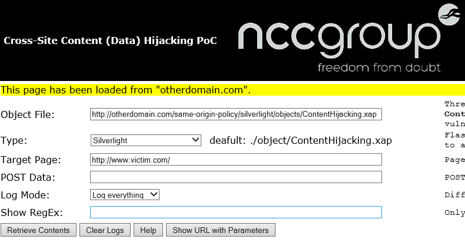

Elle est facilement réutilisable en téléchargeant le dossier `ContentHijacking` et en appelant \(via le navigateur\) le fichier `index.html`.

## Fichier clientaccesspolicy.xml

De la même façon que Flash, le fichier `clientaccesspolicy.xml` est un fichier qui permet de spécifier les domaines autorisés à accéder aux ressources hébergées sur un domaine particulier, par exemple ici pour le domaine `example.com` :

```markup
<access-policy>
  <cross-domain-access>
    <policy>
      <allow-from>      
        <domain uri="http://example.com"/>
      </allow-from>      
      <grant-to>      
        <resource path="/" include-subpaths="true"/>
      </grant-to>      
    </policy>
  </cross-domain-access>
</access-policy>
```


Contrairement au fichier utilisé par Flash, le nom de domaine doit s'inscrire comme étant une URI \(schéma + domaine + port\).


Il est possible d'autoriser les requêtes provenant de tous les domaines grâce au joker :

```markup
<access-policy>
  <cross-domain-access>
    <policy>
      <allow-from>      
        <domain uri="*"/>
      </allow-from>      
      <grant-to>      
        <resource path="/" include-subpaths="true"/>
      </grant-to>      
    </policy>
  </cross-domain-access>
</access-policy>
```

### Autorisation d'un domaine

Lorsque le site détenteur de la ressource désirée possède un fichier `clientaccesspolicy.xml` bien configuré, par exemple en autorisant seulement le domaine `otherdomain.com` :

```markup
<access-policy>
  <cross-domain-access>
    <policy>
      <allow-from>      
        <domain uri="http://otherdomain.com"/>
      </allow-from>      
      <grant-to>      
        <resource path="/" include-subpaths="true"/>
      </grant-to>      
    </policy>
  </cross-domain-access>
</access-policy>
```

Alors seul le domaine autorisé peut requêter la ressource :

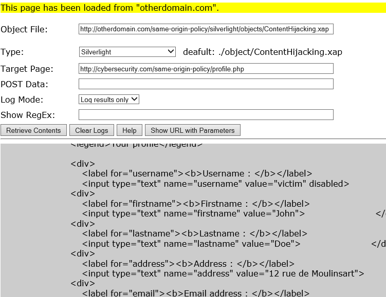

Les requêtes effectuées pendant cet échange indiquent bien la récupération du fichier `clientaccesspolicy.xml` suivi de la requête vers la page de profil :

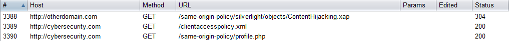

Si la requête provenait non pas du domaine principal mais d'un sous-domaine, alors la requête vers la ressource serait rejetée. Ici un exemple avec le domaine `poc1.otherdomain.com` :

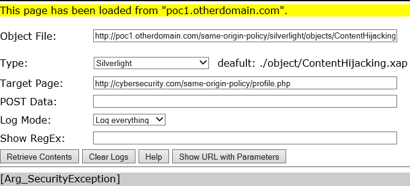

### Autorisation d'un sous-domaine

Il est également possible de n'autoriser seulement qu'un sous-domaine spécifique, par exemple `poc1.otherdomain.com` :

```markup
<access-policy>
  <cross-domain-access>
    <policy>
      <allow-from>      
        <domain uri="http://poc1.otherdomain.com"/>
      </allow-from>      
      <grant-to>      
        <resource path="/" include-subpaths="true"/>
      </grant-to>      
    </policy>
  </cross-domain-access>
</access-policy>
```

Alors seul le sous-domaine spécifié peut accéder à la ressource :

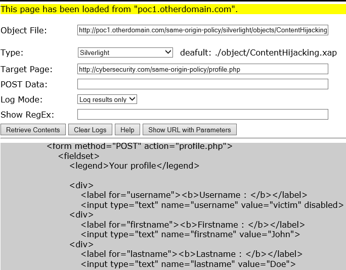

Par contre il n'est pas possible pour un autre sous-domaine \(`poc2.otherdomain.com`\) d'accéder à la ressource :

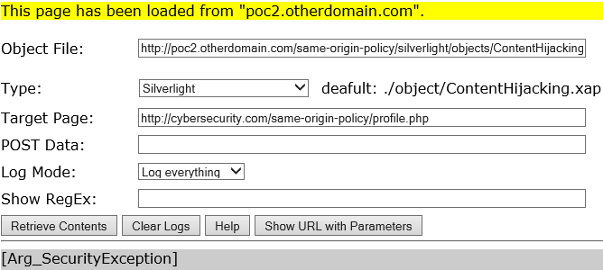

Ni même au domaine principal `otherdomain.com` :

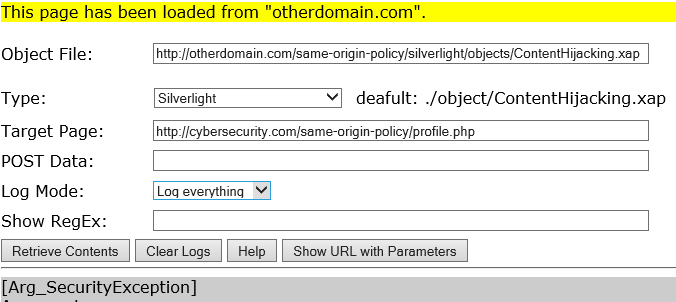


Contrairement à Flash, la requête du domaine principal serait également rejetée si le fichier de politique autorisait tous les sous domaines :

```markup
<domain uri="http://*.otherdomain.com"/>
```


### Absence du fichier

**Requête cross-domain**

Lorsqu'un domaine \(`otherdomain.com`\) tente d'accéder à une ressource \(hébergée sur `cybersecurity.com`\) via Silverlight mais que le fichier `clientaccesspolicy.xml` est absent, alors l'application va tenter de récupérer le fichier `crossdomain.xml` \(il s'agit du fichier utilisé par Flash\). En effet, Silverlight peut s'appuyer également sur ce fichier pour fonctionner \(cela a pour avantage de ne pas avoir à maintenir deux fichiers distincts lorsque le site accepte Flash et Silverlight\) :

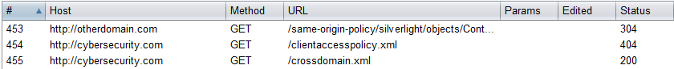


Cette technique semble avoir quelques limites car Silverlight acceptera la requête seulement si le fichier `crossdomain.xml` autorise tous les domaines \(grâce au symbole "\*"\)


**Requête même domaine mais de port différent**

Une origine se calcul à en se basant sur le domaine, le port ainsi que le schéma. Lorsque la requête s'effectue sur un port différent, alors la requête est considérée comme étant d'origine différente \(respect du principe de SOP\) :

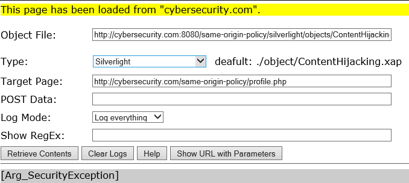

Cela implique donc la recherche du fichier `clientaccesspolicy.xml` :

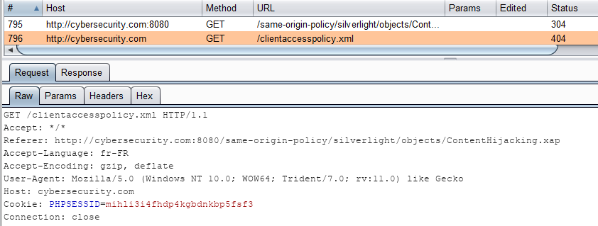

**Requête même domaine mais de schéma différent**

Lorsque le schéma est différent \(que cela soit `HTTP` vers `HTTPS` ou inversement\) la ressource n'est pas récupérée auprès de l'hébergeur **:**

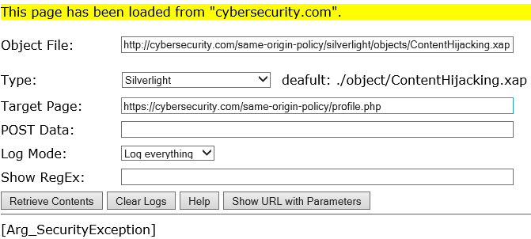

La raison est que le fichier de politique est d'abord recherché ce qui signifie que Silverlight considère la requête comme étant une requête cross-origin :

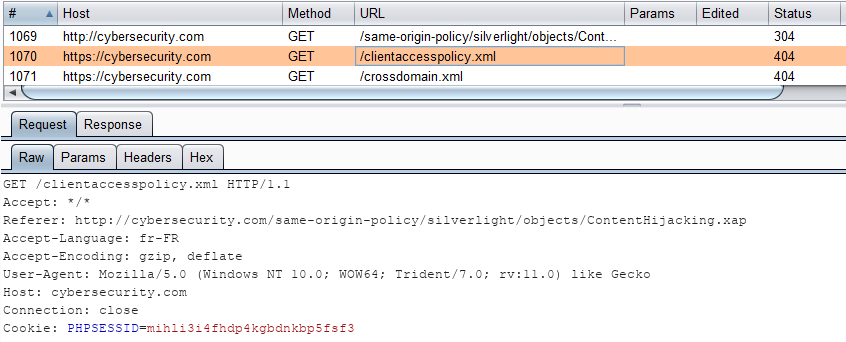

## Entête Origin

A l'instar de Flash, les requêtes cross-origin provenant d'une application Silverlight ne contiennent pas l'entête `Origin` :

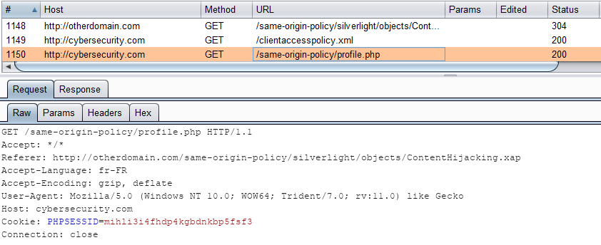

## Problématiques de sécurité

La problématique est ici similaire à celle de Flash. En effet, il est possible d'autoriser tous les domaines à effectuer des requêtes vers la ressource :

```markup
<access-policy>
  <cross-domain-access>
    <policy>
      <allow-from>      
        <domain uri="*"/>
      </allow-from>      
      <grant-to>      
        <resource path="/" include-subpaths="true"/>
      </grant-to>      
    </policy>
  </cross-domain-access>
</access-policy>
```

Cela peut poser les mêmes problèmes de fuite de données privées en s'appuyant sur des vulnérabilités de type CSRF.

Il est également possible de n'autoriser seulement les sous-domaines d'un domaine spécifique. Cela réduit le risque d'exploitation d'une vulnérabilité CSRF mais ne l'annule pas :

```markup
<access-policy>
  <cross-domain-access>
    <policy>
      <allow-from>      
        <domain uri="http://*.otherdomain.com"/>
      </allow-from>      
      <grant-to>      
        <resource path="/" include-subpaths="true"/>
      </grant-to>      
    </policy>
  </cross-domain-access>
</access-policy>
```

Concernant le respect de SOP, Silverlight améliore un peu les choses en considérant les requêtes d'un même domaine et même schéma mais de port différent comme étant une requête cross-origin \(contrairement à Flash\).


