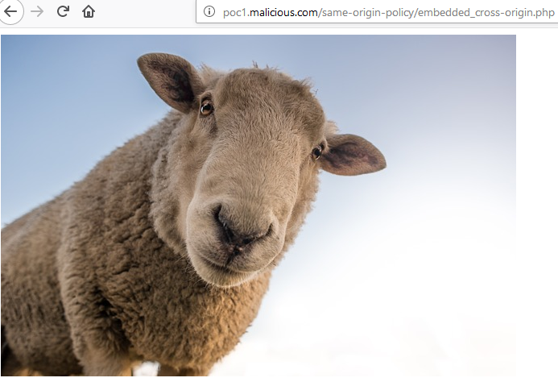
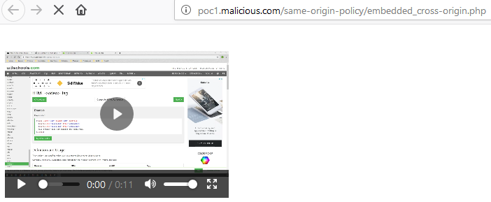
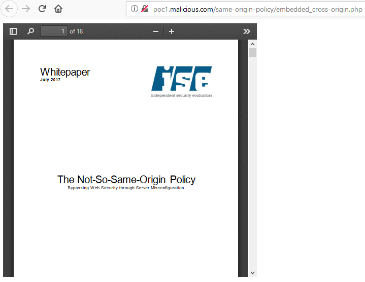
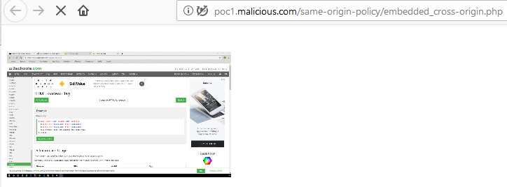
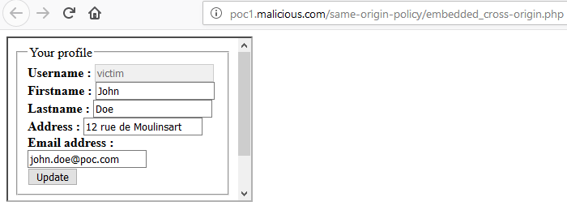

# Interactions de type embarqué

Bien que contraire à la politique SOP \(l'interdiction des interactions cross-origin\), certaines ressources peuvent tout de même être embarquées par une application d'origine A et ce même si ces ressources sont hébergées par une origine B. Il s'agit principalement des ressources externes : fichiers de script Javascript, images ou encore feuilles de style.

## Scripts Javascript, balise &lt;script src="..."&gt;&lt;/script&gt;

En admettant que le fichier javascript soit hébergé à l'adresse `http://poc1.cybersecurity.com/same-origin-policy/embedded_javascript.js` il est possible d'embarquer cette ressource pour n'importe quelle origine.

### Requête same-origin

Il s'agit d'embarquer une ressource d'une même origine, par exemple :

```markup
<html>
    <head>
        <title>Embedded Same-Origin</title>
    </head>

    <body>
        <script src="embedded_javascript.js"></script>
    </body>
</html>
```

Il est également possible de remplacer la source en utilisant le FQDN \(cela n'impacte pas la requête effectuée\) :

```markup
<script src="http://poc1.cybersecurity.com/same-origin-policy/embedded_javascript.js"></script>
```

Le script embarqué est bien chargé :


Puis finalement exécuté :


Une ressource de type `<script src="..."></script>` est donc bien embarquée pour une requête de même origine.

### Requête cross-origin

#### Requête provenant d'un autre sous-domaine

Cela fonctionne également depuis un autre sous-domaine :


Bien que le script soit hébergé sur le site `http://poc1.cybersecurity.com` il est exécuté dans le contexte de la requête appelante \(appelée grâce à la balise `<script src="..."></script>`. Par exemple si le script est :

```javascript
alert(document.domain);
```

Le résultat sera l'origine appelante \(soit ici `http://poc2.cybersecurity.com`\) :


#### Requête provenant d'un domaine différent

Et également depuis un domaine différent :


De la même façon qu'une requête d'un autre sous-domaine, l'origine ici sera `http://poc1.malicious.com` :


## Images, balise &lt;img&gt;

Aucune restriction en ce qui concerne la balise image, n'importe quel origine peut embarquer une image :

```markup

```

Ici par exemple à partir de l'origine `http://poc1.malicious.com` :



Il est intéressant de noter que le cookie de l'utilisateur est également envoyé dans la requête qui permet de récupérer l'image :


## Feuilles de style, balise &lt;link rel="stylesheet" href="..."&gt;

Il en va de même pour les feuilles de style. Une simple feuille hébergée à l'adresse `http://poc1.cybersecurity.com/same-origin-policy/style.css` :

```css
body {
    background-color: grey; 
    font-family: Verdana, sans-serif; 
    font-size: 100%;
}
```

Peut être embarquée depuis n'importe quelle origine :

```markup
<link href="http://poc1.cybersecurity.com/same-origin-policy/style.css" rel="stylesheet" media="all" type="text/css"> 
```

Soit ici depuis `http://poc1.malicious.com` \(la couleur de fond est devenu grise\) :


Il est intéressant de noter que le cookie de l'utilisateur est également envoyé dans la requête qui permet de récupérer le fichier CSS :


## Fichiers média, balises &lt;video&gt; et &lt;audio&gt;

Les balises vidéo et audio peuvent également être embarquées depuis n'importe quelle origine. Par exemple, le fichier `.mp4` et le fichier `.mp3` sont hébergés sur la machine `http://poc1.cybersecurity.com` :

```markup
<video width="320" height="240" controls>
  <source src="http://poc1.cybersecurity.com/same-origin-policy/video_tag.mp4" type="video/mp4">
</video>
```

```markup
<audio controls>
  <source src="http://poc1.cybersecurity.com/same-origin-policy/audio_tag.mp3" type="audio/mpeg">
</audio>
```

Les ressources sont embarquées depuis l'adresse `http://poc1.malicious.com` :



Le cookie de l"utilisateur est également envoyé lors de la requête d'accès à la ressource :


Et pour le fichier audio :


Ainsi que l'envoi du cookie de l'utilisateur :


## Plugins, balises &lt;object&gt; et &lt;embed&gt;

### Balise &lt;object&gt;

Dans l'exemple qui suit, la ressource chargée depuis `http://poc1.cybersecurity.com` grâce à la balise `<object>` est un document de type pdf :

```markup
<object type="application/pdf"
  data="http://poc1.cybersecurity.com/same-origin-policy/same-origin-policy_whitepaper.pdf"
  width="500"
  height="500">
</object>
```

Une fois que la page \(hébergée sur `http://poc1.malicious.com`\) incluant la balise est chargée, le pdf s'affiche :



Lors de la requête cross-origin vers la ressource demandée, le cookie du visiteur est également envoyé :


### Balise &lt;embed&gt;

Balise qui permet d'intégrer du contenu, généralement utilisée conjointement à un plugin. L'exemple ici est la même vidéo que pour la balise `<video>` :

```markup
<embed type="video/webm" src="http://poc1.cybersecurity.com/same-origin-policy/video_tag.mp4" width="320" height="240">
```

Une fois chargée depuis `http://poc1.malicious.com` :



Comme pour toutes les requêtes concernant les ressources embarquées vues ici, le cookie de l'utilisateur est envoyé dans la requête :


## Règle @Font-face

La règle `@Font-face` est spécifiée dans les fichiers de style CSS \(et non dans le fichier HTML\) :

```css
@font-face {
  font-family: "Embedded Font";
  src: url("http://poc1.cybersecurity.com/same-origin-policy/embedded_font.ttf");
}

body {
  font-family: "Embedded Font";
}
```

Ce qui donne un paragraphe avec la font spécifiée :


Au niveau de la requête cross-origin ayant pour origine `http://poc1.malicious.com`, le cookie de l'utilisateur n'est, cette fois, pas envoyé dans la requête :


## Iframes, balises &lt;iframe&gt;

Une iframe permet d'ouvrir \(d'intégrer\) une page HTML \(qui possède son propre contexte\) au niveau de la page courante, cette page intégrée peut être une page d'un autre domaine. Par exemple le site `http://poc1.malicious.com` intègre la page de profil du site `http://poc1.cybersecurity.com` :

```markup
<iframe 
  title="Your profile poc1.cybersecurity.com" 
  width="300" 
  height="200" 
  src="http://poc1.cybersecurity.com/same-origin-policy/profile.php">
</iframe>
```

Et lorsque l'utilisateur visite le site `http://poc1.malicious.com` :



Etant donné que les informations de l'utilisateur s'affichent, cela signifie que le cookie de session est bien transmis lors de la requête :


Il est par contre évident que le site `http://poc1.malicious.com` ne peut pas accéder aux informations contenues dans l'iframe, car il s'agit alors d'une requête cross-origin de type lecture.


Certains entêtes de sécurité interdisent \(ou limitent\) l'intégration des pages d'un domaine dans une iframe \(voir [X-Frame-Options](https://developer.mozilla.org/fr/docs/Web/HTTP/Headers/X-Frame-Options) et [Frame Ancestors](https://developer.mozilla.org/en-US/docs/Web/HTTP/Headers/Content-Security-Policy/frame-ancestors)\)


