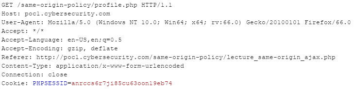
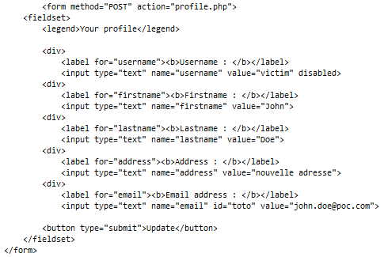
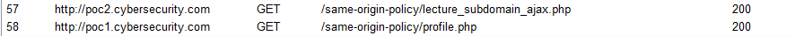
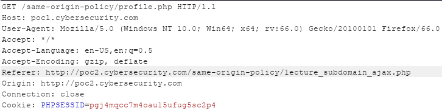
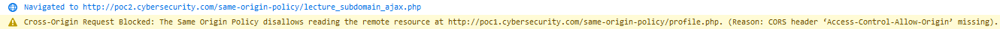
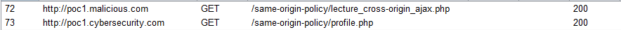
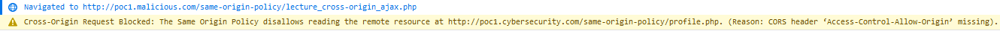

# Interactions de type lecture

## Requête same-origin

Dans le cas mis en place, c'est bien l'utilisateur qui déclenche la requête et demande à récupérer la page comprenant ses informations privées \(en tapant par exemple l'adresse dans sa barre d'URL\), ce qui n'a pas grand rapport avec SOP. Qu'en est-il si le site lui-même tente de récupérer les informations de l'utilisateur via une autre page \(que l'utilisateur visite durant sa navigation\) ?

La page présente à l'URL `http://poc1.cybersecurity.com/same-origin-policy/lecture_same-origin_ajax.php` effectue une requête de type **`GET`** en XHR afin de récupérer les informations de l'utilisateur \(disponibles donc à la page `/same-origin-policy/profile.php`\) . Voici le code source d'une telle requête :

```markup
<!-- GET XHR -->
<script>
  var xhr = new XMLHttpRequest();
  xhr.open("GET", 'http://poc1.cybersecurity.com/same-origin-policy/profile.php', true);
  xhr.withCredentials = true;

  xhr.onreadystatechange = function() {
    if (this.readyState === XMLHttpRequest.DONE && this.status === 200) {
      console.log(xhr.response);
    }
  }

  xhr.send();
</script>
```


`xhr.withCredentials` permet de transmettre les informations d'authentification \(ici le cookie\) de l'utilisateur dans la requête


Si la requête XHR réussit, alors le script affiche simplement la réponse associée dans la console du navigateur.

Deux requêtes sont observables en sortie du navigateur de l'utilisateur. La première est l'accès à la page `http://poc1.cybersecurity.com/same-origin-policy/lecture_same-origin_ajax.php` \(que l'utilisateur souhaite visiter\) , la seconde est la requête effectuée par le site afin de récupérer les informations de l'utilisateur :


Voici les entêtes HTTP de la requête XHR :



Dans la console du navigateur, le contenu de la page `poc1.cybersecurity.com/same-origin-policy/profile.php` est bien présent :



La lecture d'une réponse d'une requête provenant de la même origine que la ressource désirée fonctionne donc bien. En effet, si l'on se réfère au tableau récapitulatif des requêtes soumises à la politique SOP, la requête est légitime car le schéma, l'hôte ainsi que le port sont les mêmes.

## Requête cross-origin

La lecture cross-origin est un type de requête qui est interdite pour des raisons évidentes de sécurité.

### Requête provenant d'un autre sous-domaine

Admettons que la page `lecture_same-origin_ajax.php` utilisée précédemment ne soit plus hébergée sur `http://poc1.cybersecurity.com` mais sur `http://poc2.cybersecurity.com` \(la requête XHR reste la même\). La page devient donc accessible à l'adresse `http://poc2.cybersecurity.com/same-origin-policy/lecture_subdomain_ajax.php` \(on renomme la page afin d'être cohérent 🙂 \) et tentera d'accéder aux informations de l'utilisateur disponibles à l'adresse  `http://poc1.cybersecurity.com/same-origin-policy/profile.php` \(il s'agit donc d'une requête entre deux sous-domaines différents\).

Les deux requêtes sont bien effectuées par le navigateur lorsque l'utilisateur visite la page `http://poc2.cybersecurity.com/same-origin-policy/lecture_subdomain_ajax.php` et obtiennent un **`200 OK`** de la part du serveur :



La requête XHR complète est :



Un entête HTTP supplémentaire est présent par rapport à la requête de type same-origin : il s'agit de l'entête `Origin` qui a pour valeur le domaine exécutant la requête. Par contre, le navigateur n'affiche pas la réponse de la requête XHR mais seulement un warning indiquant que la politique SOP interdit la lecture de la ressources distante présente à l'adresse `http://poc1.cybersecurity.com/same-origin-policy/profile.php` :



Un sous-domaine A ne peut donc pas récupérer des informations \(lecture\) d'une ressource d'un sous domaine B \(appartenant au même domaine\) car les origines sont différentes selon SOP.

### Requête provenant d'un domaine différent

Il est assez facile de deviner que si une requête en lecture est interdite entre deux sous-domaines du même domaine cela doit également l'être pour une requête provenant d'un autre domaine. Mais étant donné que rien ne vaut la pratique 🙃 

La page effectuant la requête XHR est maintenant disponible à l'adresse `http://poc1.malicious.com/same-origin-policy/lecture_cross-origin_ajax.php` et tente d'accéder aux informations de l'utilisateur disponibles sur `http://poc1.cybersecurity.com/same-origin-policy/profile.php`. 

Lorsque l'utilisateur visite cette nouvelle page, deux requêtes sont bien envoyées par le navigateur :



Les entêtes HTTP de la requête XHR sont les suivants :



Bien noter l'entête `Origin` qui contient le domaine du site effectuant la requête, soit ici `http://poc1.malicious.com`


Encore une fois le navigateur interdit la lecture de la réponse XHR pour le domaine `poc1.malicious.com` :



Un domaine B ne peut donc lire la réponse d'une requête effectuée vers un domaine A \(car origine différente\). En effet, si c'était le cas, cela entraînerai une énorme faille de sécurité \(imaginez qu'un site malicieux puisse lire la réponse à une requête sur votre compte en banque, récupérant ainsi votre numéro de compte, son solde, vos dernières opérations etc\).


