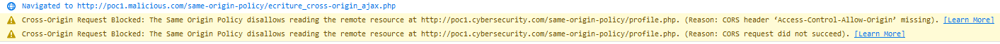
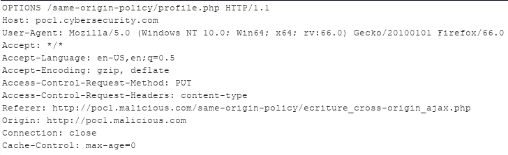

# Methodes HTTP et encodages

## Formulaire HTML

Le [standard HTML](https://www.w3.org/TR/html5/sec-forms.html#element-attrdef-form-method) ne supporte que les méthodes HTTP **`GET`** et **`POST`** ainsi que les encodage suivants :

* `application/x-www-form-urlencoded`
* `multipart/form-data`
* `text/plain`

Il est donc impossible par exemple d'effectuer une requête comme ceci via un formulaire HTML :

```markup
<form method="PUT" action="http://poc1.cybersecurity.com/same-origin-policy/profile.php">
  <input type="hidden" name="email" value="hacked_by_put_request@poc.com">
</form>
```

Ou encore ceci :

```markup
<form method="POST" enctype="application/json" action="http://poc1.cybersecurity.com/same-origin-policy/profile.php">
  <input type="hidden" name="email" value="hacked_by_specific_enctype_request@poc.com">
</form>
```

Si de tels cas se produisent, alors le formulaire sera envoyé avec des valeurs par défaut, c'est à dire **`GET`** dans le cas d'une méthode invalide ou `application/x-www-form-urlencoded` dans le cas d'un encodage invalide.

## Requête XHR

Par contre il est tout à fait possible de spécifier un autre verbe HTTP \(**`PUT`** par exemple\) grâce à une requête XHR \(bien évidemment, il faut que le destinataire de la requête soit configuré pour répondre à une telle requête\) ou encore de spécifier un encodage spécifique \(ici `application/json`\) :

```markup
<!-- PUT XHR -->
<script>
  var xhr = new XMLHttpRequest();
  xhr.open("PUT", 'http://poc1.cybersecurity.com/same-origin-policy/profile.php', true);
  xhr.setRequestHeader("Content-Type", "application/json");
  xhr.withCredentials = true;

  xhr.onreadystatechange = function() {
    if (this.readyState === XMLHttpRequest.DONE && this.status === 200) {
      console.log(xhr.response);
    }
  }

  xhr.send("email=hacked_by_put_request@poc.com");
</script>
```

Mais dans ce cas, lorsque l'utilisateur va visiter la page effectuant la requête cross-origin, le navigateur va afficher un second warning \(dans la console\) :



Sans rentrer dans les détails, si la requête utilise un verbe ou un encodage non supporté par la spécification HTML alors le navigateur effectue tout d'abord une requête préliminaire afin de savoir si cette requête est légitime ou non. 

Cette requête est effectuée avec le verbe **`OPTIONS`**, elle est nommée `preflight request`:



Par défaut, ces requêtes ne sont pas autorisées par le serveur cible \(qui héberge la ressource\), sauf s'il implémente les entêtes spécifiques à [CORS](https://developer.mozilla.org/fr/docs/Web/HTTP/CORS).

En l'état, en étant régis seulement par SOP, nous admettrons que ces requêtes ne sont donc pas possibles.


