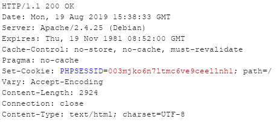
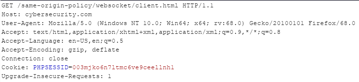
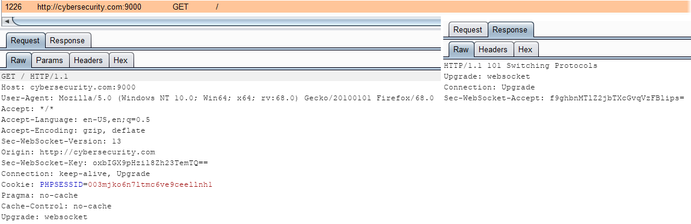
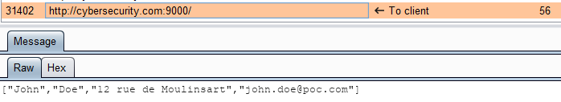
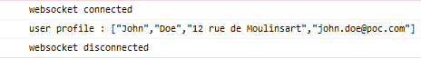
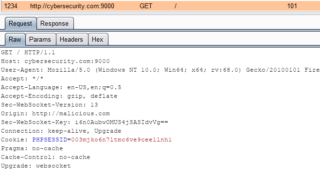
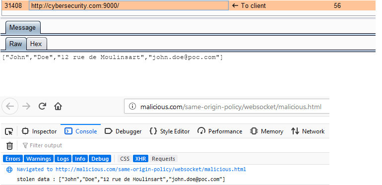
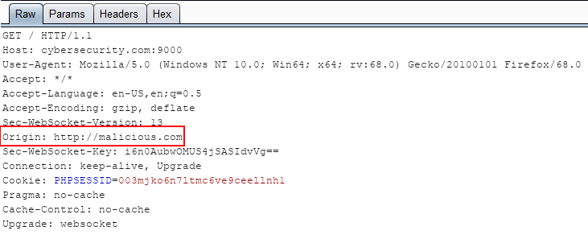

# Websockets

Websocket est une technologie \(un protocole exactement, fonctionnant au dessus de TCP\) qui permet de créer une communication bidirectionnelle entre un client et un serveur \(elle n'utilise donc pas le protocole HTTP\). Son avantage est que le serveur peut pousser des données au client sans que ce dernier effectue une requête au préalable.

Pour les tests suivants, la librairie [Websocked](http://websocketd.com/) a été utilisée aidée par du code PHP.


J'utilise souvent le terme "les websockets" mais il faut bien comprendre qu'il s'agit en fait d'un protocole


## Implémentation

Le site légitime hébergé sur `cybersecurity.com` effectue une connexion au websocket. Une fois la connexion établie, le serveur émet un websocket contenant le profil de l'utilisateur \(au format JSON\) au client \(le navigateur\). Le profil de l'utilisateur est privé, il faut donc évidemment que l'utilisateur soit connecté au préalable.

### Côté serveur

Le code côté serveur est plutôt simple puisqu'un simple `echo` permet d'écrire sur le socket \(ouvert sur le port 9000\) afin de les envoyer au client :

```php
    $profileArray = array($_SESSION['firstname'], $_SESSION['lastname'], $_SESSION['address'], $_SESSION['email']);
    echo json_encode($profileArray). "\n"; 
```

### Côté client

Lors de la visite de la page `cybersecurity.com/same-origin-policy/websocket/client.html` par l'utilisateur, le client se connecte au websocket puis affiche les informations potentiellement reçues \(provenant du serveur\) dans la console du navigateur \(j'ai fait au plus simple 😋 \) :

```markup
<!-- Websocket -->
<script>
    var ws = new WebSocket("ws://cybersecurity.com:9000/");
    ws.onopen    = function() { console.log("websocket connected") };
    ws.onclose    = function() { console.log("websocket disconnected") };
                
    ws.onmessage = function(event) {
        console.log('user profile : ' + event.data);
    };
</script>
```

### Cas d'utilisation

Le cas d'utilisation est simple ici. Le visiteur s'authentifie tout d'abord sur le site et reçois en retour son cookie de session :



Il navigue sur le site jusqu’à visiter la page client.html :



Cette page initie la connexion au websocket \(socket sur le port 9000\) :



Le serveur pousse au client le profil de l'utilisateur grâce aux websockets :



Le client affiche finalement le profile du visiteur dans la console :



## Problématiques de sécurité

### Absence de SOP et CSRF

Contrairement aux requêtes standards, les websockets ne sont pas soumis à la politique SOP, c'est à dire qu'une origine B peut lire la réponse \(ou plus exactement les données poussées par l'origine A\) d'une connexion établie entre ces deux origines. Cela peut conduire à des attaques de type CSRF ce qui rend possible à l'attaquant de récupérer des données potentiellement sensibles de la victime.

Dans l'exemple ci-dessus, admettons qu'un site malicieux \(`malicious.com`\) tente de récupérer les données de profile de sa victime via la page `malicious.html` :

```markup
<script>
  var ws = new WebSocket("ws://cybersecurity.com:9000/");
                   
  ws.onmessage = function(event) {
    console.log('stolen data : ' + event.data);
  };
</script>
```

Lorsque la victime visite la page malicieuse \(en s'étant authentifié au préalable sur le site `cybersecurity.com`\), son cookie de session est envoyé dans la requête de connexion au websocket :



Le serveur légitime approuve la connexion et envoi par websocket le profil de l'utilisateur \(récupéré donc par l'attaquant\) :



**Protection**

Pour se protéger de ****cela, il faut que le serveur vérifie la valeur du champ `Origin` présente dans la requête client lors de la demande de connexion au websocket :



Si cette valeur ne correspond pas à l'origine légitime \(ici l'origine A / `cybersecurity.com`\) alors la connexion doit être refusée.

### HTTPS pour websocket

A l'instar de `HTTPS` pour `HTTP`, les websockets sont également disponibles sur un canal sécurisé SSL/TLS grâce au protocole `WSS` \(contre `WS` pour une communication en clair\). Il faut évidemment privilégier ce type de connexion.

De plus, il faut également respecter le principe de `mixed content`, c'est à dire ne pas mélanger une connexion non sécurisée \(`HTTP` ou `WS`\) avec une connexion sécurisé \(`HTTPS` ou `WSS`\). 


