# Cas des requêtes simples

## La requête HEAD

La requête est une requête simple ne nécessitant donc pas de preflight request à condition qu'elle ne possède pas d'entête custom. Voici une requête de type HEAD provenant du domaine `http://192.168.56.181:8080` vers le domaine `http://192.168.56.180:8080` :

```markup
<script>            
  var xhr = new XMLHttpRequest();            
  xhr.open("HEAD", 'http://192.168.56.180:8080/cross-origin-resource-sharing/resource.php', true);
  
  xhr.onreadystatechange = function() {
    if (this.readyState === XMLHttpRequest.DONE && this.status === 200) {
      console.log(xhr.getAllResponseHeaders());                    
    }
  }
​
  xhr.send();
</script>
```

Par défaut, la requête est bien effectuée mais la réponse n'est pas lisible par le code Javascript car bloquée par SOP :

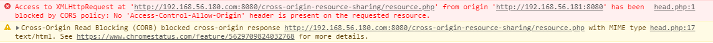

Grâce à CORS, il va être possible d'autoriser cette lecture. Pour cela, il faut que le domaine hébergeant la ressource \(`http://192.168.56.180:8080`\), autorise le domaine effectuant la requête \(ici `http://192.168.56.181:8080`\). Soit la configuration Nginx suivante :

```text
add_header 'Access-Control-Allow-Origin' '*';
```

Cette configuration autorise en fait tous les domaines \(dont `http://192.168.56.181:8080`\) à effectuer la requête et la lecture des entêtes de réponse devient possible :

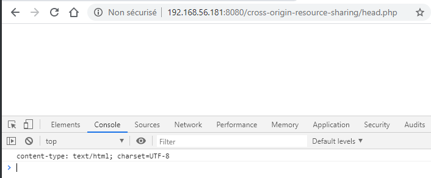

L'entête `Origin` , indiquant une requête Cross-Origin est bien présent dans la requête. La réponse, quant à elle, autorise bien cette requête par la présence de l'entête `Access-Control-Allow-Origin` ayant pour valeur `*` :

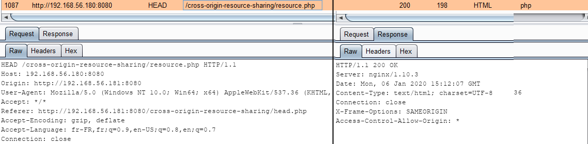

Il est bien sur possible de n'autoriser seulement que le domaine \(ou une liste de domaines\) souhaité\(s\) :

```text
add_header 'Access-Control-Allow-Origin' 'http://192.168.56.181:8080'
```

Par contre, un seul entête est affiché dans la console alors que la réponse en possède plusieurs. En effet, il faut se rappeler que, par défaut, CORS n'expose seulement que 6 entêtes :

* `Cache-Control`
* `Content-Language`
* `Content-Type`
* `Expires`
* `Last-Modified`
* `Pragma`

Il est possible grâce à l'entête `Access-Control-Expose-Headers` d'autoriser également l'exposition des autres entêtes, par exemple ici l'entête Server :

```text
Access-Control-Expose-Headers: Server
```

La nouvelle lecture de la réponse donne maintenant :

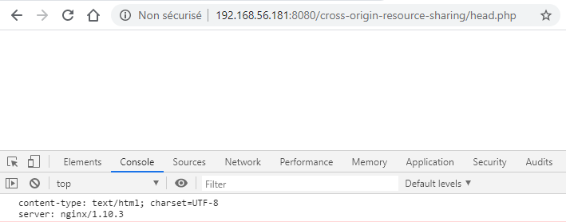

> Note : il s'agit ici juste d'un exemple, ce fonctionnement est également valable pour les autres requêtes que HEAD

## La requête GET

La requête **`GET`** fonctionne de la même façon que la requête **`HEAD`** puisque SOP interdit également la lecture de la réponse par du Javascript :

```markup
<script>            
  var xhr = new XMLHttpRequest();            
  xhr.open("GET", 'http://192.168.56.180:8080/cross-origin-resource-sharing/resource.php', true);
  
  xhr.onreadystatechange = function() {
    if (this.readyState === XMLHttpRequest.DONE && this.status === 200) {
      console.log(xhr.response);                    
    }
  }
​
  xhr.send();
</script>
```

Toujours à cause de SOP, le navigateur émet une erreur :

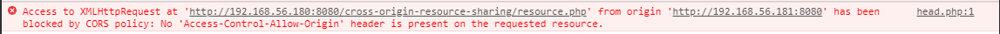

De la même manière que précédemment, grâce à CORS, il est possible d'autoriser cette lecture :

```text
add_header 'Access-Control-Allow-Origin' '*';
```

La console affiche alors le contenu de la page représentant la ressource :

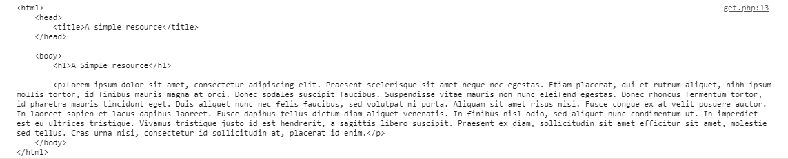

La requête présente bien l'entête `Origin` et la réponse l'entête CORS autorisant l'accès à la ressource :

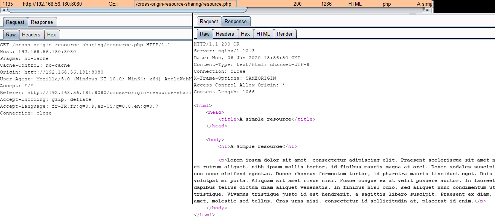

Qu'en est il si la ressource n'est disponible seulement si l'utilisateur est authentifié sur le site hébergeant la ressource ? En l'état et même si l'utilisateur est authentifié sur le site, l'accès à la ressource protégée se termine par une erreur \(401 dans l'exemple\) :

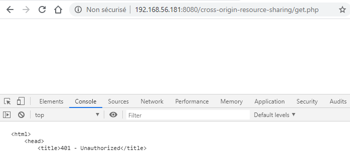

Pour que la requête XHR envoi également les informations d'authentification à la requête, il faut ajouter la ligne suivante au Javascript :

```javascript
xhr.withCredentials = true;
```

Mais en faisant cela, le navigateur génère une erreur lors de la requête :

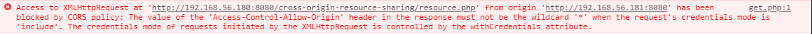

A des fins de sécurité, le navigateur refuse d'honorer la requête si la valeur de l'entête de réponse `Access-Control-Allow-Origin` contient la valeur `*` et que la requête demande l'envoi des informations d'authentification. En effet, si c'était possible, les sites implémentant une telle configuration permettraient à d'éventuels attaquants de récupérer des informations sensibles de leurs victimes.

La configuration du Nginx nécessite donc d'être changée en autorisant seulement le domaine souhaité :

```text
add_header 'Access-Control-Allow-Origin' 'http://192.168.56.181:8080';
```

Malheureusement, le navigateur génère une autre erreur :

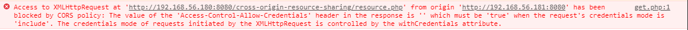

Le problème est qu'il faut également configurer le serveur hébergeant la ressource afin qu'il accepte les requêtes contenant des informations d'authentification. Cela se fait avec l'entête de réponse `Access-Control-Allow-Credentials` :

```text
add_header 'Access-Control-Allow-Credentials' 'true';
```

La nouvelle requête vers la ressource donne :

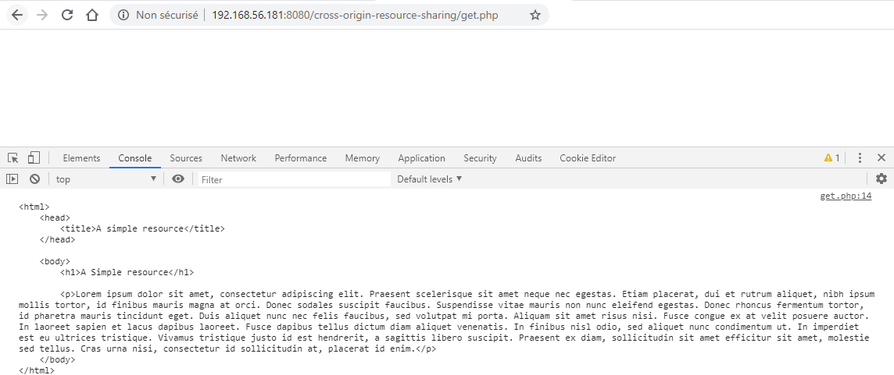

## La requête POST

La requête **`POST`** est autorisée et n'est pas considérée comme une requête nécessitant une preflight request si elle ne contient pas d'entête custom et si son `Content-Type` est standard. A savoir :

* `application/x-www-form-urlencoded`
* `multipart/form-data`
* `text/plain`

Sans refaire l'exercice, car le même principe s'applique que pour les requêtes précédentes, la lecture n'est par défaut pas autorisée par SOP. CORS va permettre de modifier cela en autorisant le domaine désiré et en gérant les informations de connexion si besoin.

Attention pour rappel, l'action suite au **`POST`** va pouvoir être effectuée sur le serveur cible \(il s'agit de la faille CSRF\), c'est bien seulement la lecture que SOP interdit.

