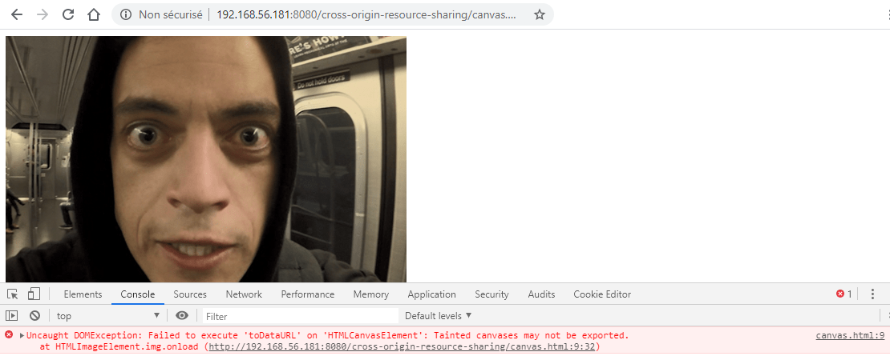
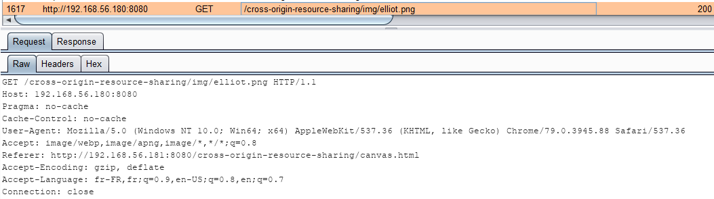
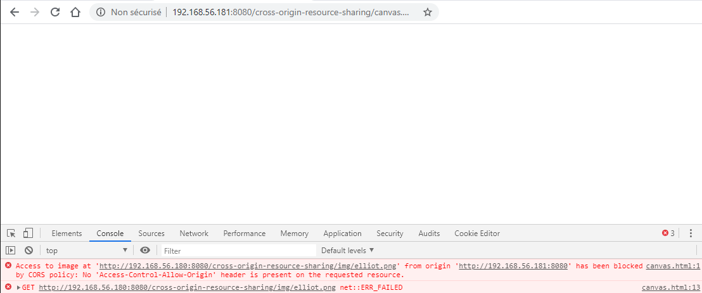
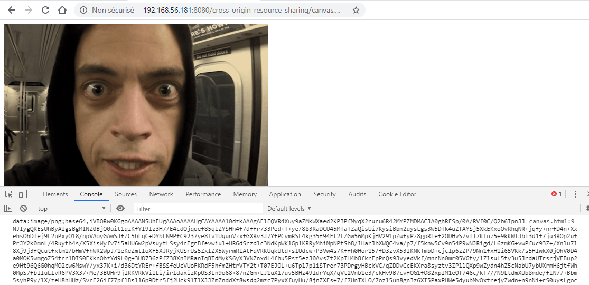
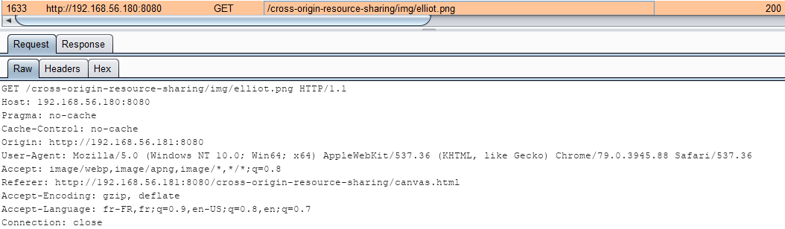

# Les canvas

Les canvas permet de dessiner des graphismes grâce à du Javascript. Cela permet par exemple de dessiner un graphique à partir d'une image hébergée sur un autre domaine.

L'exemple ci-dessous montre un canvas \(hébergé sur `http://192.168.56.181:8080`\) récupérant une image hébergée sur le domaine `http://192.168.56.180:8080` :

```markup
<canvas id="canvas" width="640" height="480">
  <script>
    let img = document.createElement('img');
    let canvas = document.getElementById('canvas');
    let ctx = document.getElementById('canvas').getContext('2d');
​
    img.onload = function(e) {
      ctx.drawImage(img, 0, 0);
      console.log(canvas.toDataURL());
    };
​
    img.src = 'http://192.168.56.180:8080/cross-origin-resource-sharing/img/elliot.png';
  </script>
</canvas>
```

De plus, le code tente d'extraire les données du canvas et, pour l'exemple, de l'afficher dans la console. Lorsqu'on visite la page du canvas l'image s'affiche bien mais une erreur indique que le canvas est corrompu \(_tainted_\) et que ses données ne peuvent être récupérées :




Les méthodes suivantes déclencheront une erreur lorsque le canvas est considéré comme corrompu : `getImageData()`, `toBlob()` et `toDataURL()`


La requête de récupération de l'image n'est pas une requête cross-origin puisque l'entête `Origin` n'est pas présent :



Si l'on souhaite récupérer les données du canvas \(et qu'il ne soit plus traité comme étant corrompu\) il faut passer par CORS. On indique dans le canvas que la récupération de l'image est une requête cross-origin :

```markup
<canvas id="canvas" width="640" height="480">
  <script>
    ...
​
    img.crossOrigin = "Anonymous";
    img.src = 'http://192.168.56.180:8080/cross-origin-resource-sharing/img/elliot.png';
  </script>
</canvas>
```


La valeur `Anonymous` permet d'effectuer une requête cross-origin sans envoyer les informations d'authentification. Cet attribut peut également prendre la valeur `use-credentials` permettant l'envoi de ces informations.


Si le canvas effectue une requête cross-origin mais que le serveur ne possède pas les entêtes adéquats alors l'image ne s'affiche pas et une erreur apparaît dans la console du navigateur :




On modifie la configuration CORS du serveur hébergeant l'image :

```markup
add_header 'Access-Control-Allow-Origin' 'http://192.168.56.181:8080'
```

Avec cette nouvelle configuration l'image s'affiche bien et la récupération des données du canvas est possible :



La requête est bien une requête cross-origin visible via la présence de l'entête `Origin` :



> Note : Etant donné qu'il s'agit d'une requête simple en GET aucune preflight-request n'est nécessaire

