# Les preflight-request

Certaines requêtes Cross-Origin vont nécessiter une preflight request avant d'être honorées par le navigateur. Une preflight request est une requête de type **`OPTIONS`** contenant des informations sur la requête d'accès à la ressource. Son objectif est de demander l'autorisation d'effectuer la principale requête au serveur hébergeant la ressource. Voici à quoi ressemble une preflight request :

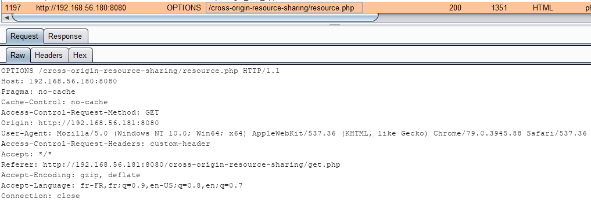

Le navigateur demande au domaine `http://192.168.56.180:8080` si la requête de type **`GET`** \(`Access-Control-Request-Method: GET`\) ayant pour `Origin` `http://192.168.56.181:8080` et contenant un entête HTTP supplémentaire nommé 'custom-header' \(`Access-Control-Request-Headers: custom-header`\)

## Les requêtes HEAD et GET

La seule façon de faire qu'une requête **`HEAD`** ou **`GET`** \(et accessoirement **`POST`**\) nécessite une preflight request est qu'elle possède un entête custom \(voir le schéma de d'introduction à CORS au besoin\).

Par exemple, une requête **`GET`** ajoutant un entête nommé 'Custom-Header' et ayant comme valeur 'Custom-Value' :

```markup
<script>            
  var xhr = new XMLHttpRequest();            
  xhr.open("GET", 'http://192.168.56.180:8080/cross-origin-resource-sharing/resource.php', true);
  xhr.setRequestHeader('Custom-Header', 'Custom-Value');
​
  xhr.onreadystatechange = function() {
    if (this.readyState === XMLHttpRequest.DONE && this.status === 200) {
      console.log(xhr.response);                    
    }
  }
​
  xhr.send();
</script>
```

Afin que la requête soit autorisée par le serveur hébergeant la ressource, il est nécessaire qu'il déclare l'entête suivante dans sa configuration :

```text
Access-Control-Allow-Headers: Custom-Header
```

La preflight request demande l'autorisation et la serveur répond avec les entêtes adéquats :

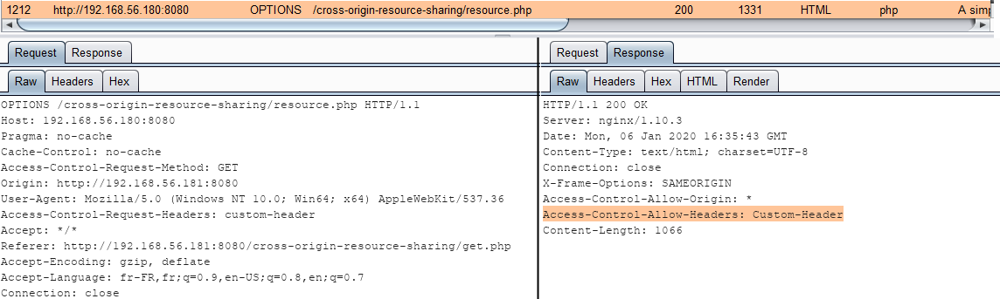

Autorisant ainsi la requête vers la ressource cross-origin :

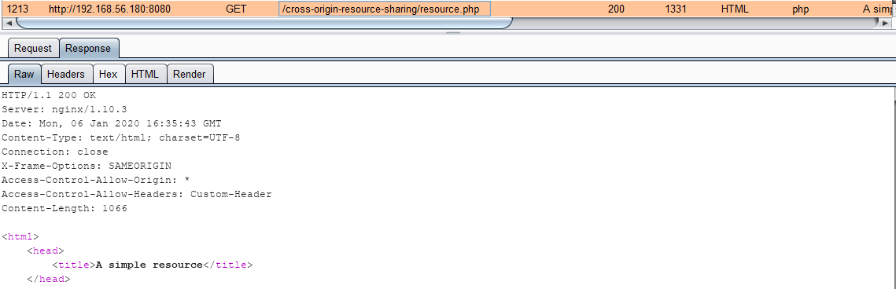

Ainsi qu'au Javascript de lire la réponse \(et de l'afficher dans la console\) :

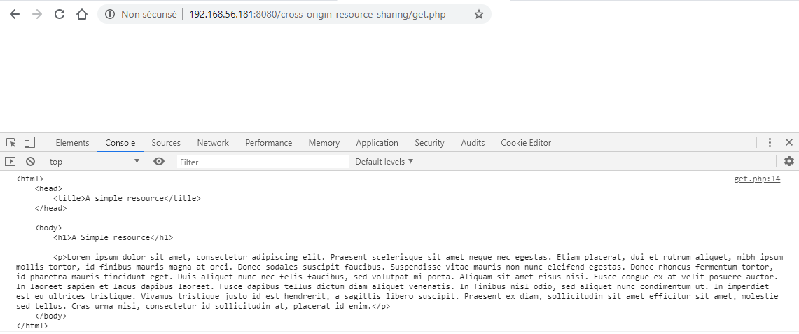


## La requête POST

La requête **`POST`** est considérée comme une requête nécessitant une preflight request si son entête `Content-Type` ne contient pas une valeur standard, à savoir :

* `application/x-www-form-urlencoded`
* `multipart/form-data`
* `text/plain`

C'est par exemple le cas d'une requête possédant des données de type JSON :

```markup
<script>
  var xhr = new XMLHttpRequest();
  xhr.open("POST", 'http://192.168.56.180:8080/cross-origin-resource-sharing/resource.php', true);
  xhr.setRequestHeader("Content-Type", "application/json");
​
  xhr.onreadystatechange = function() {
    if (this.readyState === XMLHttpRequest.DONE && this.status === 200) {
      console.log(xhr.response);
    }
  }
​
  xhr.send("{'username':'toto', 'password':'toto'}");
</script>
```

Le navigateur déclenche une preflight request demandant l'autorisation d'un entête spécifique :

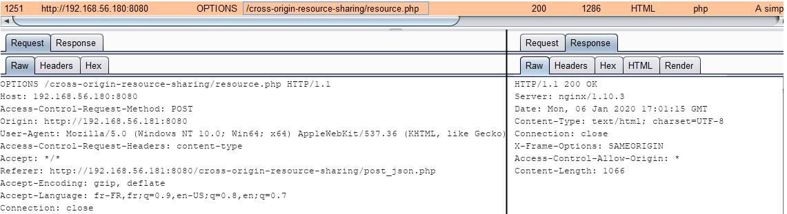

Le serveur n'étant pas configuré pour accepter une telle requête, la requête **`POST`** n'est alors pas exécutée et le navigateur affiche une erreur :

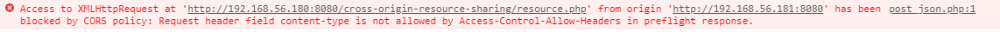

La configuration suivante permet d'autoriser cette requête cross-origin :

```text
add_header 'Access-Control-Allow-Headers' 'Content-Type'
```

La requête est alors autorisée que cela soit en écriture \(effet du **`POST`** sur le serveur cible\) ainsi que la lecture \(lecture de la réponse du **`POST`**\).

## Les autres requêtes

Les autres requêtes nécessitent une preflight request afin de pouvoir être honorées. Il s'agit par exemple des autres verbes HTTP bien connus : **`PATCH`**, **`PUT`**, **`DELETE`**, **`TRACE`**, **`CONNECT`** ou encore des verbes customs.

Un exemple avec le verbe **`PUT`** :

```markup
<script>
  var xhr = new XMLHttpRequest();
  xhr.open("PUT", 'http://192.168.56.180:8080/cross-origin-resource-sharing/resource.php', true);
​
  xhr.onreadystatechange = function() {
    if (this.readyState === XMLHttpRequest.DONE && this.status === 200) {
      console.log(xhr.response);
    }
  }
​
  xhr.send("username=toto&submit=submit");
</script>
```

Le navigateur interdit évidement la requête en générant une erreur :

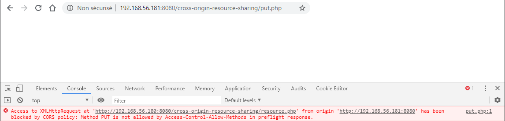


Et la requête n'est pas exécutée car la preflight-request ne le permet pas :

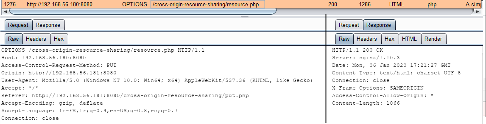

Un changement de configuration sur le serveur hébergeant la ressource va permettre de modifier cela :

```text
add_header 'Access-Control-Allow-Methods' 'PUT'
```

La requête est bien effectuée :

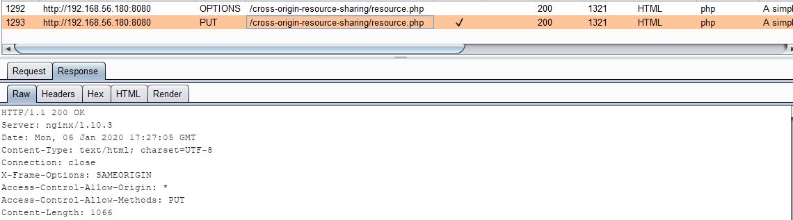

Et la lecture de la réponse est également possible :

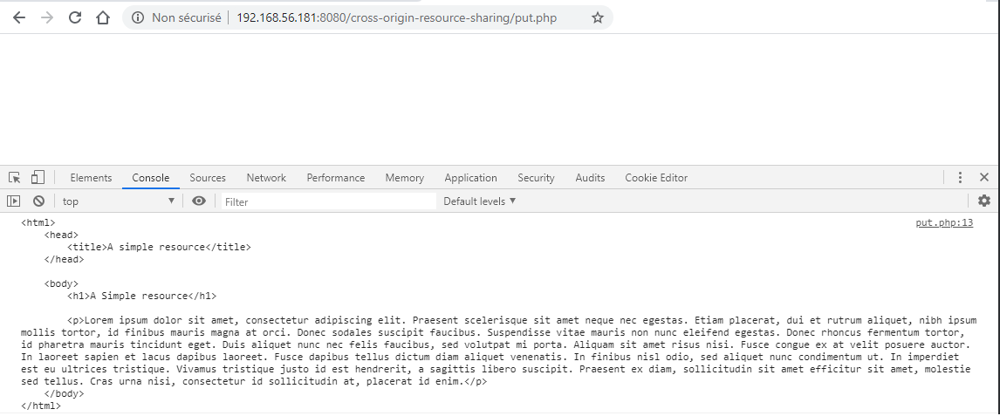


## La mise en cache

Un dernier entête permet de mettre en cache la réponse de la preflight request. Cela permet au navigateur de ne pas devoir effectuer cet appel pendant un certain laps de temps. Cette durée, exprimée en secondes, est défini par le serveur comme ceci :

```text
add_header 'Access-Control-Max-Age' '120'
```

> Note : Chaque navigateur possède sa propre valeur maximale de cet attribut. Si la directive côté serveur semble être ignorée par le navigateur c'est sans doute que la valeur renseignée est trop haute.

Lors de la première preflight request le serveur répond en ajoutant l'entête `Access-Control-Max-Age` :

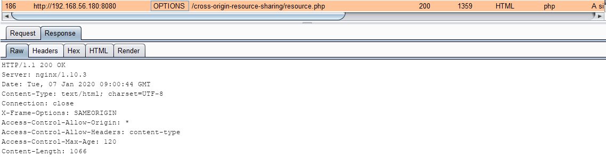

Les prochaines requêtes cross-origin seront effectuées en utilisant la réponse de la preflight request mise en cache, et ce pendant une durée de 120 secondes.

> Le cache fonctionne par URL et non par domaine

