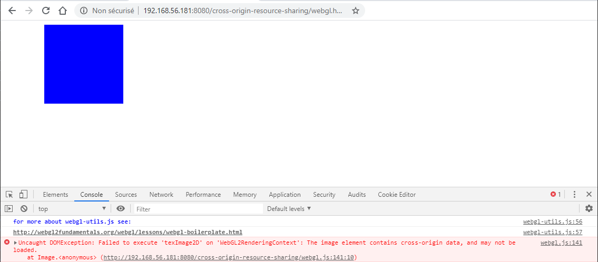
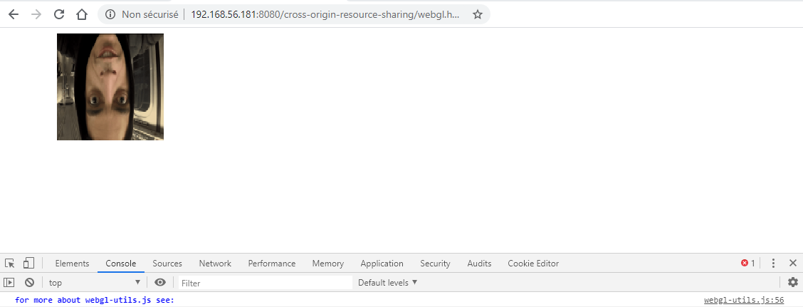
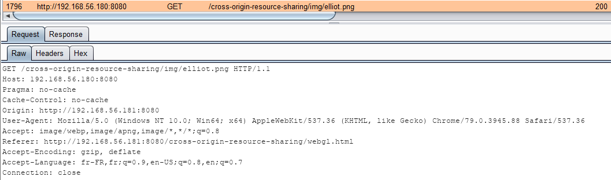

# Les textures WebGL

Le cas des textures WebGL est encore plus restrictif puisqu'il sera impossible de récupérer l'image si la requête n'est pas une requête cross-origin valide.

Le code source ne sera pas présenté car assez long mais il est très fortement inspiré de [cet exemple](https://webgl2fundamentals.org/webgl/lessons/webgl-cors-permission.html).

Sans indiquer que la requête de récupération de l'image est une requête cross-origin son chargement est interdit :



> Note : La couleur bleu est la couleur de remplissage lorsque l'image n'est pas disponible


On modifie la configuration du serveur hébergeant l'image :

```text
add_header 'Access-Control-Allow-Origin' 'http://192.168.56.181:8080'
```

Ainsi que le code source WebGL \(les modifications sont exactement les mêmes que celles pour le canvas\) :

```javascript
img.crossOrigin = "Anonymous";
```

Et l'image du héro "Elliot" s'affiche \(bon, il est à l'envers mais cela n'a pas d'importance dans notre cas 😅 \) :



Côté requête, la présence de l'entête `Origin` indique bien que le chargement de l'image est cross-origin :



