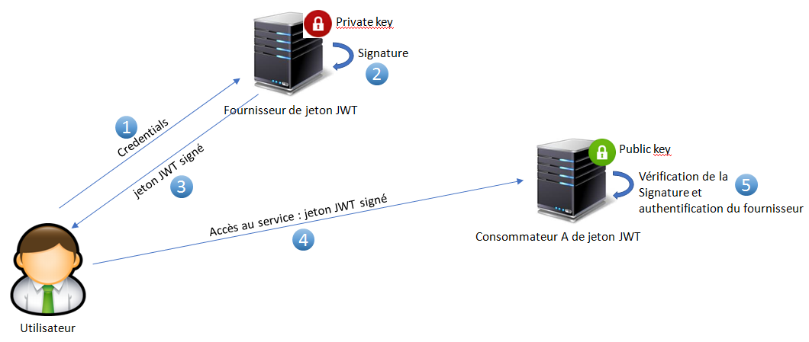
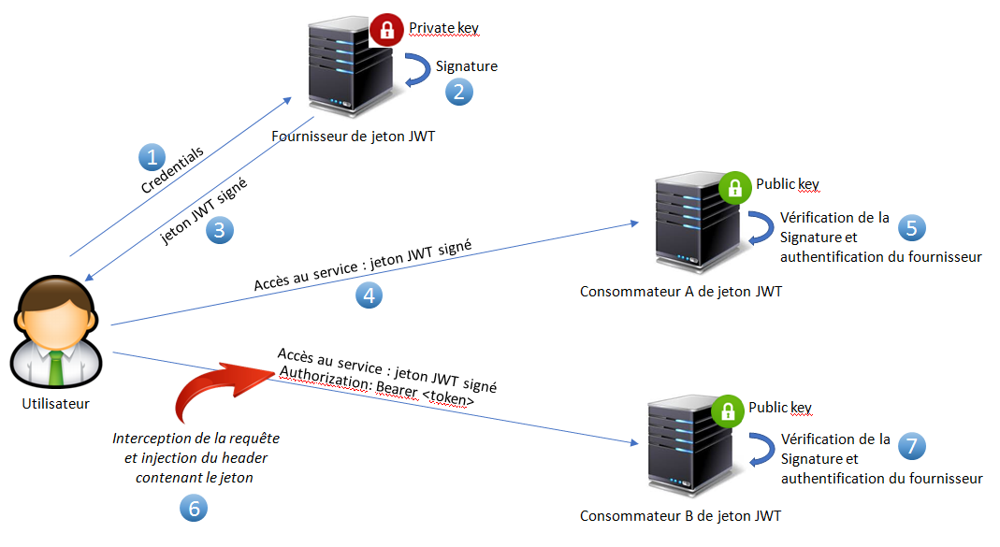

# Substitution Attacks

Admettons que dans un réseau d'entreprise, plusieurs services sont disponibles grâce aux jetons JWT et que ce jeton JWT soit délivré par une entité unique pour l'entreprise. Un utilisateur peut par exemple \(après authentification\) accéder au service consommateur A :

Cette requête est légitime, l’utilisateur possède bien les droits pour accéder à ce service. Admettons maintenant qu'un service consommateur B existe, mais que l'utilisateur ne possède pas les droits d'accès pour ce service. Par exemple, lorsqu'il tente d'y accéder, il est redirigé vers le fournisseur de jeton pour authentification et celui-ci indique une erreur \(accès non-autorisé\) après sa saisie de son login/mot de passe.

Un utilisateur malicieux peut alors tenter d'injecter le jeton valide utilisé pour accéder au service consommateur A mais dans une requête à destination du service consommateur B \(en interceptant la requête avec un proxy puis en injectant le header d'autorisation avec le jeton\) :

Pour contrer cela, un champ spécifique \(**aud**\) peut être ajouté dans l'entête du jeton permettant d'indiquer le service pour lequel le jeton a été créé.

