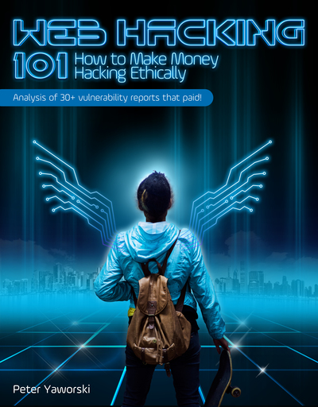

# Web Hacking 101: How to Make Money Hacking Ethically

## Description du livre

**Titre :** Web Hacking 101: How to Make Money Hacking Ethically\
**Auteur :** Peter Yaworski\
**Dernière parution :** 30 novembre 2018\
**Langue :** Anglaise\
**Prix (minimum) :** 9,99 $\
**Lien :** [https://leanpub.com/web-hacking-101](https://leanpub.com/web-hacking-101)

**Résumé / Présentation :**`On December 22, 2015, Twitter paid over $14,000 to ethical hackers for exposing vulnerabilities. This wasn't a shakedown. Sites like Twitter, Shopify, Dropbox, Yahoo, Google, Facebook and more, ask ethical hackers to report security bugs and pay them. This book will teach you how you can get started with ethical hacking.`\

**Table des matières :**

1. Foreword
2. Introduction
3. Background
4. Open Redirect Vulnerabilities
5. HTTP Parameter Pollution
6. Cross-Site Request Forgery
7. HTML Injection
8. CRLF Injection
9. Cross-Site Scripting
10. Template Injection
11. SQL Injection
12. Server Side Request Forgery
13. XML External Entity Vulnerability
14. Remote Code Execution
15. Memory
16. Sub Domain Takeover
17. Race Conditions
18. Insecure Direct Object References
19. OAuth
20. Application Logic Vulnerabilities
21. Getting Started
22. Vulnerability Reports
23. Tools
24. Resources
25. Glossary
26. Appendix A - Take Aways
27. Appendix B - Web Hacking 101 Changelog

## Mon avis

Une bonne surprise qu'est ce très bon livre, il se lit très facilement et de façon plutôt fluide.&#x20;

De prime abord ce livre peut ressembler à beaucoup d'autres listes de vulnérabilités déjà connues comme par exemple le Top Ten OWASP. Il y a bien sûr ici plus de vulnérabilités détaillées mais la principale différence se situe dans la manière de les expliquer. L'auteur s'appuie en fait sur des cas réels tirés des différents rapports de Bug Bounty de la plateforme HackerOne ([https://www.hackerone.com/](https://www.hackerone.com/)). Certaines de ces vulnérabilités proviennent de ses propres trouvailles, mais il arrive à les noyer dans la masse et sans jamais donner une impression de se mettre en avant, une certaine humilité qui rend d'autant plus agréable la lecture.

Le fait de s'appuyer sur des cas concrets est intéressant et surtout cela change des innombrables exemples basés sur des applications vues et revues comme WebGoat / DVWA / BWapp ou autres. Une dimension supplémentaire est d'avoir un contexte métier qui accompagne la vulnérabilité (ainsi que les explications quand cela est nécessaire), cela permet de mieux s'immerger et de se mettre "dans la peau" de la personne qui a identifié la vulnérabilité (on se pose souvent la question "Y aurai-je pensé ?").

En plus de cela, nous avons le droit à un chapitre dédié au retour d'expérience de l'auteur, les erreurs à éviter et que lui à commises lors de ses débuts dans le monde de la chasse aux bugs. Un second chapitre sur les principaux outils utilisés ainsi qu'une liste de ressources pour approfondir notre lecture.

Pour ma part j'ai lu le livre d'un bout à l'autre, mais suivant vos besoins vous pouvez piocher là où bon vous semble, si par exemple vous souhaitez approfondir vos connaissances sur une vulnérabilité particulière. De plus, les exemples sont assez concis, pas de fioritures, c'est un bon point quand le temps nous manque, car cela permet d'arrêter plus facilement la lecture et de reprendre au prochain exemple ou à la prochaine vulnérabilité.

Je l'ai trouvé très abordable techniquement parlant, quelques petits tips à droite à gauche qui permettent de s'améliorer pour les prochains challenges. Mais selon moi, le but du livre n'est pas tant d'exposer des faits techniques que des manières de penser lors de la recherche de failles. Une chose soulevée assez fréquemment est de ne jamais abandonner la recherche, toujours creuser plus loin (ou alors autour, vous comprendrez à la lecture). En quelques mots "Never give up !".

En résumé, je vous conseille fortement ce livre, vous ne perdrez pas votre temps. Le seul regret à son sujet est que je n'ai pas trouvé de version papier directement achetable.

