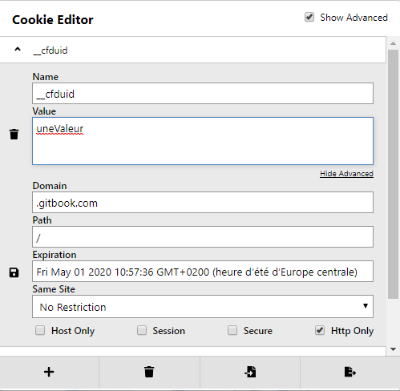
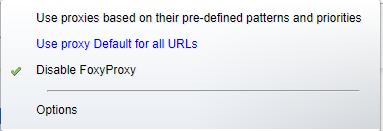
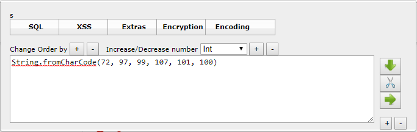
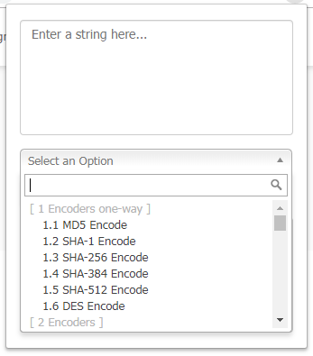
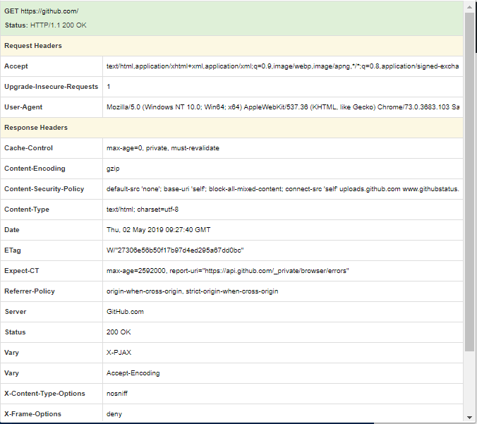
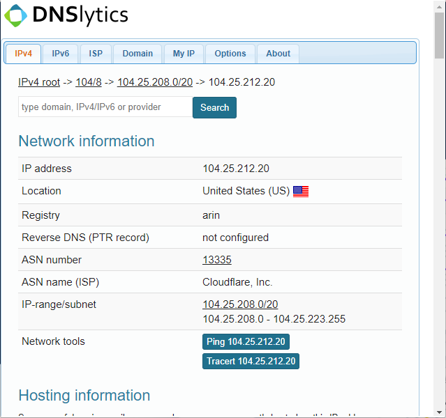
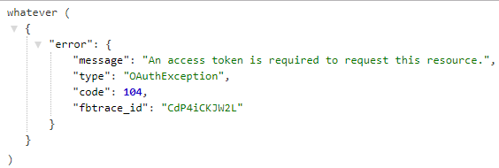
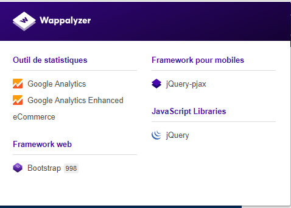
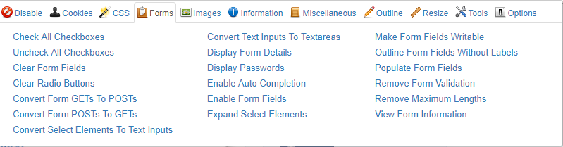
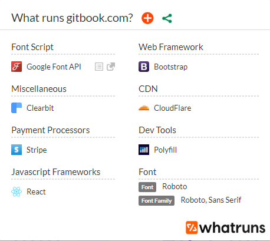

# Extensions navigateurs

La liste d'extensions \(pour Chrome\) proposée ci-dessous est loin d'être exhaustive, il s'agit seulement des extensions que j'utilise lors de me tests. D'autres extensions, absentes ici, peuvent tout de même être utiles, mais font doublon avec l'utilisation de l'outil Burp. Etant donné que je lance Burp dès le début de mes tests, je préfère ne pas surcharger mon navigateur d'extensions que je n'utiliserai pas.

## Cookie-Editor

**URL :** [https://chrome.google.com/webstore/detail/cookie-editor/hlkenndednhfkekhgcdicdfddnkalmdm](https://chrome.google.com/webstore/detail/cookie-editor/hlkenndednhfkekhgcdicdfddnkalmdm)

**Développeur :** cookie-editor.cgagier.ca

**Navigateur\(s\) :** Chrome, Opera, Edge, Firefox

**Description :** permet de visualiser, d'éditer ou d'ajouter des cookies assez simplement. En tout cas, plus simplement que d'aller dans la console de dév du navigateur 🙃 

## Foxy Proxy

**URL :** [https://chrome.google.com/webstore/detail/foxyproxy-standard/gcknhkkoolaabfmlnjonogaaifnjlfnp](https://chrome.google.com/webstore/detail/foxyproxy-standard/gcknhkkoolaabfmlnjonogaaifnjlfnp)

**Développeur :** FoxyProxy

**Navigateur\(s\) :** Chrome, Firefox

**Description :** un must qui permet de switcher de configuration proxy simplement. Mon utilisation principale est de passer à une configuration sans proxy à une inspection/interception via Burp

## HackBar

**URL :** [https://chrome.google.com/webstore/detail/hackbar/ejljggkpbkchhfcplgpaegmbfhenekdc](https://chrome.google.com/webstore/detail/hackbar/ejljggkpbkchhfcplgpaegmbfhenekdc)

**Développeur :** Ayush Gupta

**Navigateur\(s\) :** Chrome, Firefox

**Description :** permet facilement d'encoder les payloads d'injections \(par exemple avec la méthode `String.FromCharCode()` pour JS ou équivalent en SQL\). Cela est utile lorsque certains caractères sont filtrés par le site ciblé \(je m'en sert principalement lors des challenges/CTFs par exemple\)

## Hackers toolkit

**URL :** [https://chrome.google.com/webstore/detail/hackers-toolkit/iebkeiopbbfnmieadmojmocohdmaghmb](https://chrome.google.com/webstore/detail/hackers-toolkit/iebkeiopbbfnmieadmojmocohdmaghmb)

**Développeur :** codelab.rs

**Navigateur\(s\) :** Chrome

**Description :** outil d'encodage/décodage qui embarque un certain nombre d'algorithmes différents. Cela évite d'aller chercher un outil en ligne ou de devoir lancer un outil lourd pour décoder en Base64 par exemple \(qui a parlé de Burp ?\)

## HTTP Headers

**URL :** [https://chrome.google.com/webstore/detail/http-headers/nioieekamcpjfleokdcdifpmclkohddp](https://chrome.google.com/webstore/detail/http-headers/nioieekamcpjfleokdcdifpmclkohddp)

**Développeur :** www.esolutions.se

**Navigateur\(s\) :** Chrome, Opera

**Description :** bien que Burp permet également de voir les entêtes HTTP \(que cela soit au niveau de la requête ou de la réponse\), il est parfois agréable d'y avoir accès en un clic, et c'est ce que permet cette extension

## IP Address and Domain Information

**URL :** [https://chrome.google.com/webstore/detail/ip-address-and-domain-inf/lhgkegeccnckoiliokondpaaalbhafoa](https://chrome.google.com/webstore/detail/ip-address-and-domain-inf/lhgkegeccnckoiliokondpaaalbhafoa)

**Développeur :** dnslytics.com

**Navigateur\(s\) :** Chrome, Firefox, Safari, Opera

**Description :** permet d'obtenir des informations réseau sur le site web visité comme l'adresse IPV4 \(ou IPV6 si disponible\) ou encore concernant l'ISP ainsi que le domaine. Un autre onglet qui peut être bien pratique est celui qui permet de connaitre son IP publique \(cela sert souvent quand on configure son reverse shell 😋 \)

## JSON Formatter

**URL :** [https://chrome.google.com/webstore/detail/json-formatter/bcjindcccaagfpapjjmafapmmgkkhgoa](https://chrome.google.com/webstore/detail/json-formatter/bcjindcccaagfpapjjmafapmmgkkhgoa)

**Développeur :** callumlocke.co.uk

**Navigateur\(s\) :** Chrome

**Description :** extension qui permet d'afficher une mise en page correcte quand la réponse du serveur est au format JSON

## Wappalyzer

**URL :** [https://chrome.google.com/webstore/detail/wappalyzer/gppongmhjkpfnbhagpmjfkannfbllamg](https://chrome.google.com/webstore/detail/wappalyzer/gppongmhjkpfnbhagpmjfkannfbllamg)

**Développeur :** wappalyzer.com

**Navigateur\(s\) :** Chrome, Firefox

**Description :** très utile lors de la phase de fingerprinting, cette extension permet d'identifier les technologies \(composants, frameworks, etc\) utilisées par le site web ciblé \(et leur numéro de version dans certains cas\) afin de vérifier l'existence de CVE par exemple

## Web Developer

**URL :** [https://chrome.google.com/webstore/detail/web-developer/bfbameneiokkgbdmiekhjnmfkcnldhhm](https://chrome.google.com/webstore/detail/web-developer/bfbameneiokkgbdmiekhjnmfkcnldhhm)

**Développeur :** chrispederick.com

**Navigateur\(s\) :** Chrome, Opera, Firefox

**Description :** extension de type "boite à outils" qui permet pas mal de choses : désactiver le javascript de la page, éditer / ajouter des cookies ou encore désactiver les images. Les actions concernant les formulaires sont sans doute ceux dont je me sers le plus : affichage des champs cachées, affichages du texte pour les champs de type "password", activation des champs désactivés ...

## WhatRuns

**URL :** [https://chrome.google.com/webstore/detail/whatruns/cmkdbmfndkfgebldhnkbfhlneefdaaip](https://chrome.google.com/webstore/detail/whatruns/cmkdbmfndkfgebldhnkbfhlneefdaaip)

**Développeur :** www.whatruns.com

**Navigateur\(s\) :** Chrome, Firefox

**Description :** je l'utilise en complément à Wappalyzer car ces deux extensions ont le même objectif : détecter les technologies utilisées par le site visité. Les deux extensions ne donnent pas de résultats contradictoires mais parfois cela permet de récupérer quelques détails supplémentaires

