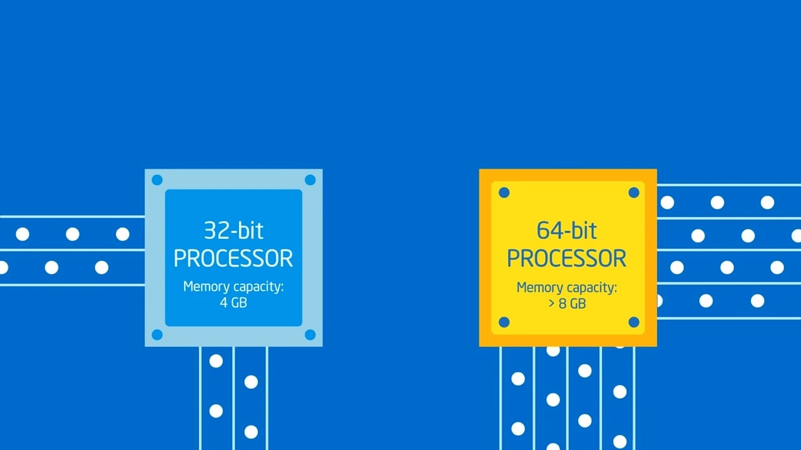

# Architecture x86 \(32 bits\) & x86\_64 \(64 bits\)

Avant de se plonger dans le code assembleur il est important de comprendre les différentes architectures utilisées. Le focus est fait sur l'architecture x86 \(32 bits\) avec quelques rappels sur l'architecture 16 bits, puis, pour terminer, l'architecture x64 est abordée.

