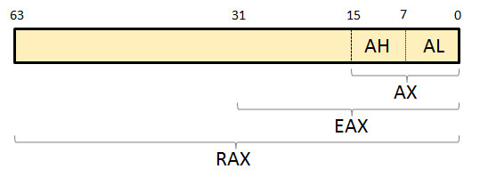

# De x86 à x64

L'architecture x64 étend l'architecture x86 et ajoute quelques nouveautés aux précédents concepts étudiés.

## Modification des registres

La taille des registres évolue en passant de 32 bits \(architexture x86\) à 64 bits. Le nom des registres évoluent également, en remplaçant le _E_ d'_Extended_ \(architecture x86\) par la lettre _R_, pour _\_Re\_extended_. Voici ces modifications regroupées dans les tableaux suivants :

| 16 bits | 32 bits | 64 bits |
| :---: | :---: | :---: |
| AX | EAX | RAX |
| BX | EBX | RBX |
| CX | ECX | RCX |
| DX | EDX | RDX |

| 16 bits | 32 bits | 64 bits |
| :---: | :---: | :---: |
| SI | ESI | RSI |
| DI | EDI | RDI |

| 16 bits | 32 bits | 64 bits |
| :---: | :---: | :---: |
| IP | EIP | RIP |
| BP | EBP | RBP |
| SP | ESP | RSP |

| 16 bits | 32 bits | 64 bits |
| :---: | :---: | :---: |
| FLAGS | EFLAGS | RFLAGS |

* Concernant l’architecture 32 bits le _E_ signifie _Extended_.
* Concernant l’architecture 32 bits le _R_ signifie _Re-extended_.

Le découpage peut alors s'effectuer comme ceci \(registre _RAX_\) : 

Enfin le nombre des registres généraux doublent, en passant de 8 à 16 registres.

## Passage des paramètres de fonction

Une modification importante à saisir, est la manière de passer des paramètres à une fonction. Pour rappel, en architecture x86, le passage s'effectue via la pile \(opération _push_ du dernier jusqu'au premier paramètre\). Ces paramètres étaient ensuite récupérés grâce à un calcul en fonction du registre _EBP_.

L'architecture x64 change la donne en utilisant un autre mécanisme également dépendant du système d'exploitation. Sous Windows 64 bits, les quatre premiers paramètres sont passés par les registres _RCX_, _RDX_, _R8_ puis _R9_. Si la fonction possède plus de paramètres, alors les paramètres supplémentaires sont passés par la pile, de droite à gauche \(en reprenant donc ce qui avait été fait pour l'architecture x86\). Sous Linux, les 5 premiers paramètres sont passés par les registres _RDI_, _RSI_, _RDX_, _R8_ puis _R9_. Le principe reste également le même pour d'éventuels paramètres supplémentaires.

