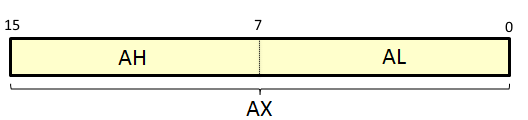
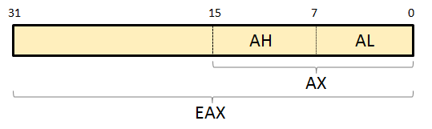

# Architecture Processeur

Avant d'appréhender le langage assembleur, il est nécessaire de connaître les principaux éléments de l'architecture d'un processeur. Les processeurs actuels sont très complexes à comprendre offrant toujours plus d'optimisations afin de gagner en performance. C'est pourquoi ici, seul quelques éléments seront étudiés, mais cela sera suffisant pour s'essayer au reverse engineering.

## Rappels

Tout d'abord, quelques rappels :

* **Bit** : unité la plus simple ne pouvant prendre que deux valeurs, 0 ou 1
* **Octet** : groupe de 8 bits
* **Mot \(word\)** : groupe de 2 octets, soit 16 bits
* **Double Mot \(dword\)** : groupe de 4 octets, soit 32 bits
* **Quadruple Mot \(qword\)** : groupe de 8 octets, soit 64 bits

## Le processeur

Un processeur est un ensemble de composants permettant d’exécuter des instructions en langage machine. Pour cela il est composé des éléments principaux suivants :

* **Le séquenceur** : permet de décoder la prochaine instruction à exécuter
* **L'UAL \(Unité Arithmétique et Logique\)** : permet d’effectuer des calculs arithmétiques et logiques
* **Les registres** : mémoires internes du processeur permettant de ne pas utiliser la mémoire \(RAM\) pour chaque opération. En effet plus la mémoire est physiquement proche du processeur plus l’accès y est rapide
* **Bus d’adresses, bus de données** : permet de véhiculer les informations pour l’accès/la sélection aux zones mémoires \(bus d'adresse\), ou des données à lire ou écrire dans les zones mémoires \(bus de données\)

## Les registres

Les registres sont des emplacements mémoire, internes au processeur, qui peuvent stocker des données ou des adresses. Les instructions en assembleur permettent d’adresser ces registres. Pour faciliter cela, chaque registre possède un nom permettant de l'identifier.

### Les différents registres

* Registres de travail
  * AX
  * BX
  * CX
  * DX
* Registres de segments
  * CS
  * DS
  * SS
  * ES
* Registres d’index
  * SI
  * DI
* Registres de pointeurs
  * IP
  * BP
  * SP
* Registre de drapeaux
  * FLAGS

Les registres de travail peuvent alors être découpés comme ceci :

* AX donne AH \(poids fort, soit 8 bits car AX = 16 bits\) et AL \(poids faible, 8 bits\).
* BX donne BH \(poids fort, soit 8 bits car BX = 16 bits\) et BL \(poids faible, 8 bits\).
* CX donne CH \(poids fort, soit 8 bits car CX = 16 bits\) et CL \(poids faible, 8 bits\).
* DX donne DH \(poids fort, soit 8 bits car DX = 16 bits\) et DL \(poids faible, 8 bits\).

Découpage pour le registre _AX_ : 

Il s'agit ici des registres d'une architecture 16 bits. Les registres 32 et 64 bits sont présentés au cours des différents chapitres.

### Leurs rôles

#### Les registres de travail

Les registres de travail sont destinés au calcul \(résultat d’une opération, valeur intermédiaire etc\). Les identifiants ne sont pas sélectionnés au hasard, voici leur définition :

* **A pour Accumulateur \(Accumulator\) :** sert principalement à stocker des informations de calculs arithmétiques et également la valeur de retour d’une fonction
* **B pour Base \(Base\) :** sert principalement à stocker des adresses qui pointent vers une donnée présentes dans le segment DS
* **C pour Compteur \(Counter\) :** sert principalement à stocker les variables de type compteur, pour les itérations des boucles par exemple
* **D pour Données \(Data\) :** utilisé lors des opérations d’entrées/sorties, sert aussi conjointement au registre Accumulateur afin de stocker des informations de calcul arithmétique \(extension de l’accumulateur\)

#### Les registres de segments

* **CS pour Code Segment :** contient l’adresse du début du segment de code \(espace d’adressage alloué _.text_\) qui stocke les instructions du programme
* **DS pour Data Segment :** contient l’adresse du début du segment de données \(espace d’adressage alloué _.data_\) qui stocke les variables globales et statiques initialisées
* **SS pour Stack Segment :** contient l’adresse du début de la pile \(espace d’adressage alloué _.stack_\)
* **ES pour Extended Segment :** segment additionnel permettant de stocker des données, souvent utilisé afin de manipuler des pointeurs sur les opérations de chaînes de caractères

**Note** : il existe également les segments FS et GS qui permettent de stocker des données additionnelles.

#### Les registres d’index

* **SI pour Source Index :** pointe vers l’adresse source concernant les opérations sur les chaînes de caractères
* **DI pour Destination Index :** pointe vers l’adresse de destination concernant les opérations sur les chaînes de caractères

#### Les registres de pointeurs

* **IP pour Instruction Pointer :** ce registre stocke l’adresse de la prochaine instruction à exécuter. Dans la littérature il est également nommé Compteur Ordinal ou encore Programme Counter
* **BP pour Base Pointer :** pointe vers l’adresse de la pile contenant les informations du contexte \(ou frame\), par exemple les informations propres à une fonction \(variables locales, adresse de retour de la fonction\). Ce registre est également appelé Frame Pointer
* **SP pour Stack Pointer :** permet de stocker l’adresse du sommet de la pile. Il se met à jour suivant les instructions d’empilement et de dépilement \(nommées respectivement _push_ et _pop_\). Il pointe donc toujours vers le sommet de la pile

#### Le registre de drapeaux

Le registre de drapeaux sert à indiquer une information spécifique. Chaque bit de ce registre indique un événement particulier. Pour donner quelques exemples voici les indicateurs fréquemment rencontrés :

* **ZF \(Zero Flag ou Drapeau zéro\) :** indique le résultat d’une opération \(arithmétique ou de comparaison\). Si le drapeau ZF est à 1, alors, le résultat de l’opération est 0
* **CF \(Carry Flag ou Drapeau de retenue\) :** ce drapeau permet d’indiquer lorsqu'une retenue est présente sur le bit le plus à gauche \(bit significatif ou bit de poids fort\) lors d’un calcul arithmétique. Il peut être utilisé pour indiquer une erreur de type débordement sur un calcul comprenant des entiers non signés. Il est également utilisé lors des rotations et décalages de bits.
* **OF \(Overflow Flag ou Drapeau de débordement\)** : ce drapeau est à 1 si le résultat d’une opération ne peut tenir au sein du registre de destination
* **PF \(Parity Flag ou Drapeau de parité\) :** ce drapeau est à 1 si le nombre de bits à 1 composant le résultat est pair

## La mémoire

La mémoire ne fait pas partie du processeur. Elle permet de stocker les données utilisées par l'ordinateur.

La taille de la mémoire allouable dépend principalement de la taille du bus d'adresse :

* Un bus d'adresse de 8 bits donnera alors 256 \(octets\) cases adressables \(2^8 = 256\)
* Un bus d'adresse de 16 bits donnera alors 65536 \(octets\) cases adressables \(2^16 = 65536\), soit 64 Ko
* Un bus d'adresse de 32 bits donnera alors 42949672964 \(octets\) cases adressables \(2^32 = 42949672964\), soit 4 Go
* Un bus d'adresse de 64 bits donnera alors 18446744073709551616 \(octets\) cases adressables \(2^64 = 18446744073709551616\), soit 16384 Po

### Les segments

La mémoire est divisée en 5 segments différents \(dans cet ordre, adresses hautes au sommet de la mémoire\) :

* **.stack** : la pile stocke des informations comme les variables locales ou encore les adresses de retour des fonctions. Sa taille est dynamique et évolue vers les adresses basses.
* **.heap** : le tas stocke les zones mémoires qui sont allouées dynamiquement par le développeur par des méthodes d'allocation et de libération mémoire \(malloc\(\) ou new\(\) par exemple\). Sa taille est dynamique et évolue vers les adresses hautes.
* **.bss** : stocke les variables globales et statiques non initialisées. L'écriture y est possible mais, le segment possède une taille fixe.
* **.data** : stocke les variables globales et statiques initialisées. L'écriture y est possible mais, le segment possède une taille fixe.
* **.text** : contient les instructions du programme en langage machine. L'écriture y est impossible et le segment possède une taille fixe. 

Le schéma suivant résume les différents segments ainsi que leur position \(attention les adresses basses sont en haut et les adresses hautes sont en bas\) :

### Zoom sur la pile

Maintenant que la mémoire ainsi que les registres sont connus il peut être nécessaire d'étudier le fonctionnement et le rôle de la pile.

La pile \(_stack_\) peut être imaginée comme une pile d’assiettes. Sur une telle structure, il faudra dépiler l’assiette la plus au sommet tout d’abord \(qui est celle que l’on a mis sur la pile en dernière\) pour finalement accéder à la dernière assiette \(qui était la première à avoir été empilée\). On nomme cela la méthode _LIFO_ pour Last In, First Out. Son contraire est la méthode _FIFO_ pour First In, First Out qui peut être représentée par une file \(une file de personnes qui attendent au guichet de la gare par exemple\).

Comme déjà vu auparavant, le rôle du registre SP est simple, il pointe toujours vers le sommet de la pile. Par contre, le rôle du registre BP est plus difficile à comprendre. Lorsque le programme doit exécuter une fonction, certaines informations sont empilées. On retrouve les variables passées en paramètre à cette fonction, ses variables locales ainsi que l'adresse de retour \(c'est-à-dire l'adresse de l'instruction à exécuter une fois la fonction terminée\). Ce bloc d'information est nommé _contexte_ ou _bloc d'activation_. Le registre BP va alors pointer vers le début de ce bloc d'activation et permettre de faire référence aux informations concernées. Étant donné qu'il est possible qu'une fonction en appelle une autre, la pile peut contenir alors plusieurs blocs d'activation.

**Note** : une information supplémentaire est présente au sein d'un bloc d'activation il s'agit de la valeur SFP \(Saved Frame Pointer\) qui pointe vers l'ancienne position du registre BP afin de lui redonner sa valeur originelle à la fin de l'appel de la fonction. Dans les chapitres suivants, il sera noté _old\_ebp_.

## Exécution d'un programme

Lorsque le programme s'exécute \(pour rappel, les instructions sont stockées en mémoire dans le segment _.text_\), le registre IP va pointer vers la première instruction du programme, autrement dit, IP aura pour valeur l'adresse de la première instruction du programme. Pour la suite de l'exécution du programme, l'algorithme concernant le registre IP sera semblable à ceci : 1. Lire la valeur du registre IP \(adresse de la prochaine instruction à exécuter\). 2. Ajouter la taille de l'instruction à l'adresse stockée dans IP \(afin de pointer vers la prochaine instruction\). 3. Exécuter l'instruction lue à l'étape 1. 4. Retourner à l'étape 1.

## L'architecture 32 bits

L'architecture précédente est de type 16 bits et permet de comprendre plus simplement le fonctionnement du processeur et de la mémoire. Mais les processeurs modernes reposent sur une architecture 32 bits \(et surtout 64 bits, mais cela sera étudié bien plus tard\), nommée x86. Les registres passent donc de 16 à 32 bits et leurs noms changent légèrement :

| 16 bits | 32 bits |
| :---: | :---: |
| AX | EAX |
| BX | EBX |
| CX | ECX |
| DX | EDX |

| 16 bits | 32 bits |
| :---: | :---: |
| SI | ESI |
| DI | EDI |

| 16 bits | 32 bits |
| :---: | :---: |
| IP | EIP |
| BP | EBP |
| SP | ESP |

| 16 bits | 32 bits |
| :---: | :---: |
| FLAGS | EFLAGS |

* Concernant l’architecture 32 bits, le _E_ signifie _Extended_.

Le découpage peut alors s'effectuer comme ceci \(registre _EAX_\) : 

