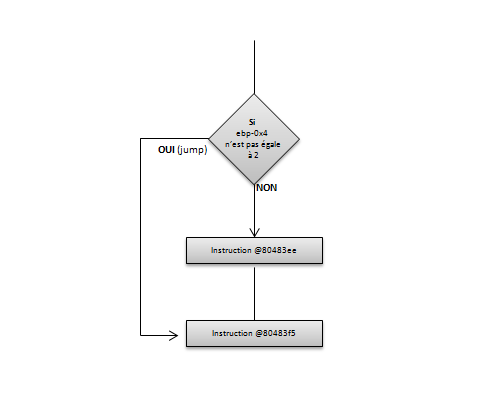
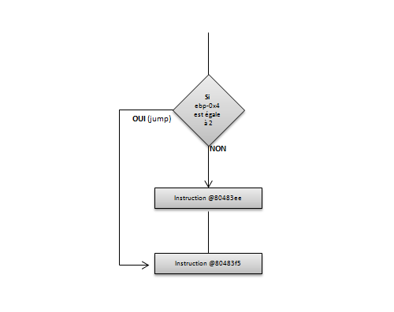

# Les conditions

Afin de continuer l'exploration du code assembleur, ce chapitre va se concentrer sur les instructions de type **conditions**, à savoir : les _if_, _else_, _switch_ ou encore les conditions _ternaires_.

## L'instruction _if_

L'instruction _if_ permet d'exécuter \(ou de ne pas exécuter\) certaines instructions selon les conditions requises. Tout d'abord, avec un test d'égalité :

```c
int main(int argc, char **argv) {
    int nb_exploit = 2;
    char *os;

    if(nb_exploit == 2) {
         os = "Windows";
    }

    return 0;
}
```

Puis son code assembleur :

```text
01: 80483db:       55                      push   ebp
02: 80483dc:       89 e5                   mov    ebp,esp
03: 80483de:       83 ec 10                sub    esp,0x10
04: 80483e1:       c7 45 fc 02 00 00 00    mov    DWORD PTR [ebp-0x4],0x2
05: 80483e8:       83 7d fc 02             cmp    DWORD PTR [ebp-0x4],0x2
06: 80483ec:       75 07                   jne    80483f5 <main+0x1a>
07: 80483ee:       c7 45 f8 80 84 04 08    mov    DWORD PTR [ebp-0x8],0x8048480
08: 80483f5:       b8 00 00 00 00          mov    eax,0x0
09: 80483fa:       c9                      leave
10: 80483fb:       c3                      ret
```

Pour rappel, les lignes 1 à 3 représentent le _prologue_ de la fonction. La ligne 4 copie la valeur 2 à l'emplacement _\[ebp-0x4\]_, qui correspond donc à la variable _nb\_exploit_. La ligne 5 compare la variable _nb\_exploit_ \(_\[ebp-0x4\]_\) à la valeur 2. L'exécution continue à l'adresse _0x080483f5_, c'est à dire à la ligne 8, si le test d'égalité échoue \('not equal'\). Dans le cas contraire, l'instruction à la ligne 7 est exécutée. Cette instruction copie l'adresse _0x08048480_ dans la variable "os" à l'adresse _\[ebp-0x8\]_. L'adresse _0x08048480_ correspond à la chaîne de caractères "Windows". La ligne 8 correspond à l'affectation de la valeur 0 au registre _EAX_, c'est à dire à l'instruction _return 0_ en C. Les lignes 9 et 10 représentent l'_épilogue_ de la fonction.



Le test d'inégalité sera :

```c
int main(int argc, char **argv) {
    int nb_exploit = 2;
    char *os;

    if(nb_exploit != 2) {
         os = "Windows";
    }

    return 0;
}
```

Avec son équivalent en assembleur :

```text
01: 80483db:       55                      push   ebp
02: 80483dc:       89 e5                   mov    ebp,esp
03: 80483de:       83 ec 10                sub    esp,0x10
04: 80483e1:       c7 45 fc 02 00 00 00    mov    DWORD PTR [ebp-0x4],0x2
05: 80483e8:       83 7d fc 02             cmp    DWORD PTR [ebp-0x4],0x2
06: 80483ec:       74 07                   je     80483f5 <main+0x1a>
07: 80483ee:       c7 45 f8 80 84 04 08    mov    DWORD PTR [ebp-0x8],0x8048480
08: 80483f5:       b8 00 00 00 00          mov    eax,0x0
09: 80483fa:       c9                      leave
10: 80483fb:       c3                      ret
```

Seul la ligne 6 est modifiée. L'instruction _jne_ précédente devient ici _je_ indiquant un saut en cas d'égalité.



Il est possible dans un _if_ d'ajouter des opérateurs logiques, par exemple **AND** \(ET\) ou encore **OR** \(OU\), voici un exemple :

```c
int main(int argc, char **argv) {
  int nb_exploit = 2;
  int vuln = 4;
  char *os;

  if(nb_exploit == 2 && vuln == 4) {
    os = "Windows";
  }

  return 0;
}
```

Ainsi que le code assembleur associé :

```text
01: 80483db:       55                      push   ebp
02: 80483dc:       89 e5                   mov    ebp,esp
03: 80483de:       83 ec 10                sub    esp,0x10
04: 80483e1:       c7 45 fc 02 00 00 00    mov    DWORD PTR [ebp-0x4],0x2
05: 80483e8:       c7 45 f8 04 00 00 00    mov    DWORD PTR [ebp-0x8],0x4
06: 80483ef:       83 7d fc 02             cmp    DWORD PTR [ebp-0x4],0x2
07: 80483f3:       75 0d                   jne    8048402 <main+0x27>
08: 80483f5:       83 7d f8 04             cmp    DWORD PTR [ebp-0x8],0x4
09: 80483f9:       75 07                   jne    8048402 <main+0x27>
10: 80483fb:       c7 45 f4 90 84 04 08    mov    DWORD PTR [ebp-0xc],0x8048490
11: 8048402:       b8 00 00 00 00          mov    eax,0x0
12: 8048407:       c9                      leave
13: 8048408:       c3                      ret
```

La première comparaison est effectuée à la ligne 6 entre la valeur 2 et la valeur stockée à _\[ebp-0x4\]_ \(soit ici également 2\). Le test à la ligne 7 indique que l'exécution continuera à l'adresse _0x08048402_ \(soit à la ligne 11\) en cas d'inégalité. Dans le cas contraire, la seconde comparaison à la ligne 8 sera executée. Cette comparaison représente la seconde condition de la condition _if_ : comparaison de la variable "vuln" a la valeur 4. La ligne 9 effectue un saut à l'adresse _0x08048402_ en cas d'inégalité, sinon, la ligne 10 est exécutée et l'adresse de la chaîne "Windows" est alors copiée dans _\[ebp-0xc\]_. Il faut bien saisir ici que la seconde condition ne sera jamais testée si la première condition n'est pas vérifiée. Si besoin, l'analyse de la table de vérité de l'opérateur **ET** donnera plus de détails.

Pour bien illustrer ce propos, un exemple avec un **OU** :

```c
int main(int argc, char **argv) {
  int nb_exploit = 2;
  int vuln = 4;
  char *os;

  if(nb_exploit == 2 || vuln == 4) {
    os = "Windows";
  }

  return 0;
}
```

```text
01: 80483db:       55                      push   ebp
02: 80483dc:       89 e5                   mov    ebp,esp
03: 80483de:       83 ec 10                sub    esp,0x10
04: 80483e1:       c7 45 fc 02 00 00 00    mov    DWORD PTR [ebp-0x4],0x2
05: 80483e8:       c7 45 f8 04 00 00 00    mov    DWORD PTR [ebp-0x8],0x4
06: 80483ef:       83 7d fc 02             cmp    DWORD PTR [ebp-0x4],0x2
07: 80483f3:       74 06                   je     80483fb <main+0x20>
08: 80483f5:       83 7d f8 04             cmp    DWORD PTR [ebp-0x8],0x4
09: 80483f9:       75 07                   jne    8048402 <main+0x27>
10: 80483fb:       c7 45 f4 90 84 04 08    mov    DWORD PTR [ebp-0xc],0x8048490
11: 8048402:       b8 00 00 00 00          mov    eax,0x0
12: 8048407:       c9                      leave
13: 8048408:       c3                      ret
```

Il faut ici également se référer à la table de vérité du **OU**. Si la première condition est vraie, ligne 6 et 7, alors le résultat est vrai. En assembleur, cela se traduit non plus par un _jne_ pour la première condition, mais, par un _je_ qui effectuera un saut vers l'adresse _@0x80483fb_ \(affectation de l'adresse de la chaîne à la variable "os"\). Si la première condition est fausse, il faut alors dans ce cas, vérifier la seconde condition présente à la ligne 8 et 9, car, c'est elle qui déterminera le résultat du test.

## L'instruction if/else

Un _else_ est maintenant ajouté au programme :

```c
int main(int argc, char **argv) {
  int nb_exploit = 2;
  char *os;

  if(nb_exploit == 2) {
    os = "Windows";
  }
  else {
    os = "Linux";
  }

  return 0;
}
```

```text
01: 80483db:       55                      push   ebp
02: 80483dc:       89 e5                   mov    ebp,esp
03: 80483de:       83 ec 10                sub    esp,0x10
04: 80483e1:       c7 45 fc 02 00 00 00    mov    DWORD PTR [ebp-0x4],0x2
05: 80483e8:       83 7d fc 02             cmp    DWORD PTR [ebp-0x4],0x2
06: 80483ec:       75 09                   jne    80483f7 <main+0x1c>
07: 80483ee:       c7 45 f8 90 84 04 08    mov    DWORD PTR [ebp-0x8],0x8048490
08: 80483f5:       eb 07                   jmp    80483fe <main+0x23>
09: 80483f7:       c7 45 f8 98 84 04 08    mov    DWORD PTR [ebp-0x8],0x8048498
10: 80483fe:       b8 00 00 00 00          mov    eax,0x0
11: 8048403:       c9                      leave
12: 8048404:       c3                      ret
```

Si la variable _nb\_exploit_ n'est pas égale à "2", ligne 5 et 6, alors un saut est effectué vers l'instruction à l'adresse _0x080483f7_, ligne 9. Cette instruction va stocker la chaîne "Linux" dans la variable "os". Dans le cas contraire, l'instruction ligne 7, stockant la chaîne "Windows" dans la variable "os" sera exécutée puis un saut inconditionnel sera effectué, ligne 8, pour arriver à la fin du programme \(afin de ne pas exécuter la partie du _else_\).

## Le switch

Voici un petit programme simple utilisant une condition _switch_ :

```c
int main(int argc, char **argv) {
  int nb_exploit = 2;
  char *os;

  switch (nb_exploit) {
    case 2:
      os = "MacOS";
      break;
    case 6:
      os = "Linux";
      break;
    case 12:
      os = "Android";
      break;
    default:
      os = "Windows";
      break;
  }

  return 0;
}
```

Une fois désassemblé :

```text
01: 80483db:       55                      push   ebp
02: 80483dc:       89 e5                   mov    ebp,esp
03: 80483de:       83 ec 10                sub    esp,0x10
04: 80483e1:       c7 45 fc 02 00 00 00    mov    DWORD PTR [ebp-0x4],0x2
05: 80483e8:       8b 45 fc                mov    eax,DWORD PTR [ebp-0x4]
06: 80483eb:       83 f8 06                cmp    eax,0x6
07: 80483ee:       74 13                   je     8048403 <main+0x28>
08: 80483f0:       83 f8 0c                cmp    eax,0xc
09: 80483f3:       74 17                   je     804840c <main+0x31>
10: 80483f5:       83 f8 02                cmp    eax,0x2
11: 80483f8:       75 1b                   jne    8048415 <main+0x3a>
12: 80483fa:       c7 45 f8 b0 84 04 08    mov    DWORD PTR [ebp-0x8],0x80484b0
13: 8048401:       eb 1a                   jmp    804841d <main+0x42>
14: 8048403:       c7 45 f8 b6 84 04 08    mov    DWORD PTR [ebp-0x8],0x80484b6
15: 804840a:       eb 11                   jmp    804841d <main+0x42>
16: 804840c:       c7 45 f8 bc 84 04 08    mov    DWORD PTR [ebp-0x8],0x80484bc
17: 8048413:       eb 08                   jmp    804841d <main+0x42>
18: 8048415:       c7 45 f8 c4 84 04 08    mov    DWORD PTR [ebp-0x8],0x80484c4
19: 804841c:       90                      nop
20: 804841d:       b8 00 00 00 00          mov    eax,0x0
21: 8048422:       c9                      leave
22: 8048423:       c3                      ret
```

Le premier cas \(soit : _nb\_exploit_ est-il égal à 6 ?\) est testé à la ligne 6. Si le test est vrai \(ligne 7\), alors un saut est effectué vers la ligne 14 permettant de stocker la chaîne de caractère "Linux" dans la variable "os", puis, exécute un saut inconditionnel vers la ligne 20 \(fin du programme\). Dans le cas contraire, l'exécution continue ligne 8 en comparant cette fois _nb\_exploit_ à la valeur 12. Si le test est vrai \(ligne 9\), alors un saut est effectué vers la ligne 16 permettant de stocker la chaîne de caractère "Android" dans la variable "os", puis, exécute un saut inconditionnel vers la ligne 20 \(fin du programme\). Dans le cas contraire, l'exécution continue ligne 10 en comparant cette fois _nb\_exploit_ à la valeur 2. Si l'égalité n'est pas vérifiée, l'exécution continue à l'adresse _0x08048415_, ligne 18, stockant la chaîne "Windows" dans la variable "os" \(sélection du cas par défaut\). Autrement, la ligne 12 va permettre de stocker la chaîne de caractère "MacOS" dans la variable "os", puis, exécute un saut inconditionnel vers la ligne 20 \(fin du programme\).

## La condition ternaire

Ici le programme indique que si la variable _nb\_nexploit_ est égale à 2, alors, le système d'exploitation est de type "Windows", sinon il est de type "Linux" :

```c
int main(int argc, char **argv) {
  int nb_exploit = 2;
  char *os;

  os = (nb_exploit == 2) ? "Windows" : "Linux";

  return 0;
}
```

Le code assembleur associé :

```text
01: 80483db:       55                      push   ebp
02: 80483dc:       89 e5                   mov    ebp,esp
03: 80483de:       83 ec 10                sub    esp,0x10
04: 80483e1:       c7 45 fc 02 00 00 00    mov    DWORD PTR [ebp-0x4],0x2
05: 80483e8:       83 7d fc 02             cmp    DWORD PTR [ebp-0x4],0x2
06: 80483ec:       75 07                   jne    80483f5 <main+0x1a>
07: 80483ee:       b8 90 84 04 08          mov    eax,0x8048490
08: 80483f3:       eb 05                   jmp    80483fa <main+0x1f>
09: 80483f5:       b8 98 84 04 08          mov    eax,0x8048498
10: 80483fa:       89 45 f8                mov    DWORD PTR [ebp-0x8],eax
11: 80483fd:       b8 00 00 00 00          mov    eax,0x0
12: 8048402:       c9                      leave
13: 8048403:       c3                      ret
```

A la ligne 5 et 6, Le programme teste si la valeur du registre _\[ebp-0x4\]_ est différente de la valeur 2. Si c'est le cas, alors un saut est effectué à l'adresse _0x080483f5_, qui a pour effet de stocker la chaîne de caractère "Linux" dans le registre _EAX_ \(ligne 9\). Dans le cas contraire, la chaîne "Windows" y est stockée, ligne 7, puis un saut inconditionnel, ligne 8, est effectué vers la ligne 10 permettant de stocker le résultat dans la variable "os".

