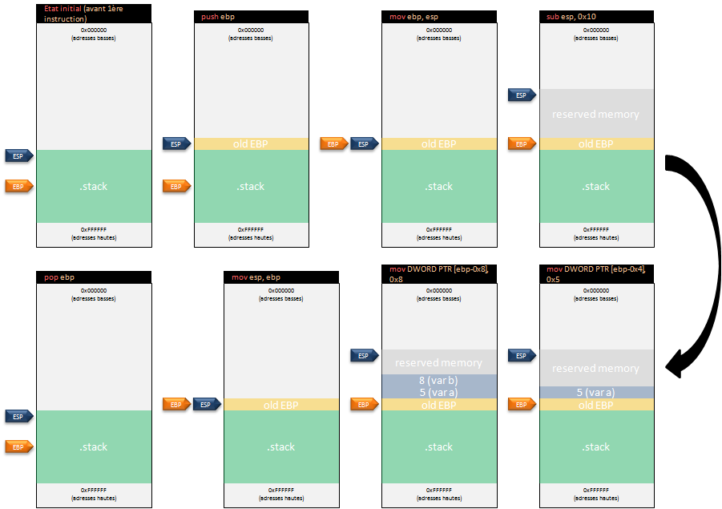
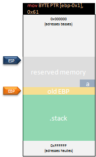
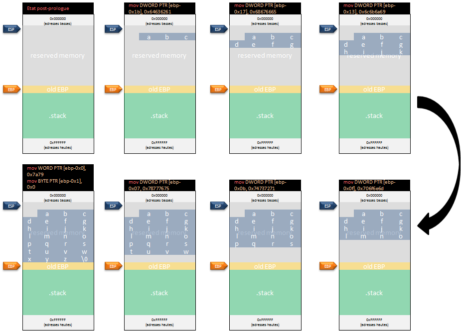
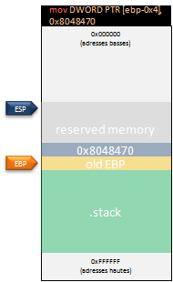

# Les variables

Les variables servent à stocker des données. Mais elles ne sont pas toutes égales, car, dans un programme, elles ne sont pas toutes stockées au même endroit. Certaines sont stockées directement dans la pile, quand d'autres, seront stockées dans le tas par exemple.

## Les variables locales

### Type entier \(int\)

Le premier cas peut être l'initialisation de variables locales \(à une fonction\) :

```c
int main(int argc, char **argv) {
  int a = 5;
  int b = 8;

  return 0;
}
```

Et son équivalent en assembleur :

```text
01: 80483db:       55                      push   ebp
02: 80483dc:       89 e5                   mov    ebp,esp
03: 80483de:       83 ec 10                sub    esp,0x10
04: 80483e1:       c7 45 fc 05 00 00 00    mov    DWORD PTR [ebp-0x4],0x5
05: 80483e8:       c7 45 f8 08 00 00 00    mov    DWORD PTR [ebp-0x8],0x8
06: 80483ef:       b8 00 00 00 00          mov    eax,0x0
07: 80483f4:       c9                      leave
08: 80483f5:       c3                      ret
```

Les lignes 1 à 2 ont déjà été vues au chapitre précédent. La ligne 3 permet de réserver l'espace mémoire au niveau de la pile en effectuant une soustraction de 16 octets au registre _ESP_. Il est important de noter que cette ligne fait également partie du _prologue_ de la fonction \(le _prologue_ précédent était simplifié\). Ligne 4 et 5, les valeurs 5, soit la variable "a", et 8, soit la variable "b", sont copiées sur la pile respectivement à _\[EBP-0x4\]_ et _\[EBP-0x8\]_. La ligne 6 copie la valeur 0 dans le registre _EAX_ \(valeur retournée par la fonction _main\(\)_\). Les lignes 7 et 8 représentent l'_épilogue_ vu précédemment. A noter que l'instruction _pop_ a ici été remplacé par _leave_. En effet, contrairement à l'exemple du chapitre précédent, ici, de l'espace mémoire supplémentaire a été réservée \(grâce à l'instruction _sub_, ligne 3\). Il faut donc maintenant récupérer \(afin de restaurer le contexte précédent\) cette espace et c'est ce que permet la ligne 7. L'instruction _leave_ est en fait semblable aux instructions :

```text
mov esp ebp
pop ebp
```

Afin de bien comprendre l’enchaînement des instructions, voici un schéma complet de la pile \(ne pas se soucier de l'instruction _ret_ pour l'instant\) :



### Caractère \(char\)

Un autre exemple intéressant peut être l'allocation d'un caractère \(soit 1 seul octet\) :

```c
int main(int argc, char **argv) {
  char monChar = 'a';

  return 0;
}
```

```text
01: 80483db:       55                      push   ebp
02: 80483dc:       89 e5                   mov    ebp,esp
03: 80483de:       83 ec 10                sub    esp,0x10
04: 80483e1:       c6 45 ff 61             mov    BYTE PTR [ebp-0x1],0x61
05: 80483e5:       b8 00 00 00 00          mov    eax,0x0
06: 80483ea:       c9                      leave
07: 80483eb:       c3                      ret
```

Sans revenir sur le _prologue_ et l'_épilogue_ qui reste semblable, la ligne 4 stocke la valeur "a" \(soit en héxa "0x61"\) dans la pile à _ebp - 0x1_. En effet, un caractère peut être stocké sur un seul octet \(ce que confirme l'utilisation d'un _BYTE_\).



### Chaîne de caractères

Il est possible d'initialiser une chaîne de caractère de cette façon :

```c
int main(int argc, char **argv) {
  char maChaine[] = "abcdefghijklmnopqrstuvwxyz";

  return 0;
}
```

Le code assembleur correspondant :

```text
01: 80483db:       55                      push   ebp
02: 80483dc:       89 e5                   mov    ebp,esp
03: 80483de:       83 ec 20                sub    esp,0x20
04: 80483e1:       c7 45 e5 61 62 63 64    mov    DWORD PTR [ebp-0x1b],0x64636261
05: 80483e8:       c7 45 e9 65 66 67 68    mov    DWORD PTR [ebp-0x17],0x68676665
06: 80483ef:       c7 45 ed 69 6a 6b 6c    mov    DWORD PTR [ebp-0x13],0x6c6b6a69
07: 80483f6:       c7 45 f1 6d 6e 6f 70    mov    DWORD PTR [ebp-0xf],0x706f6e6d
08: 80483fd:       c7 45 f5 71 72 73 74    mov    DWORD PTR [ebp-0xb],0x74737271
09: 8048404:       c7 45 f9 75 76 77 78    mov    DWORD PTR [ebp-0x7],0x78777675
10: 804840b:       66 c7 45 fd 79 7a       mov    WORD PTR [ebp-0x3],0x7a79
11: 8048411:       c6 45 ff 00             mov    BYTE PTR [ebp-0x1],0x0
12: 8048415:       b8 00 00 00 00          mov    eax,0x0
13: 804841a:       c9                      leave
14: 804841b:       c3                      ret
```

La ligne 4 stocke la suite de caractères "abcd" dans _\[ebp-0x1b\]_. Puis, ligne 5, la chaîne "efgh" dans _\[ebp-0x17\]_. Ligne 6, la chaîne "ijkl" dans _\[ebp-0x13\]_. Ligne 7, la chaîne "mnop" dans _\[ebp-0x0f\]_. Ligne 8, la chaîne "qrst" dans _\[ebp-0x0b\]_. Ligne 9, la chaîne "uvwx" dans _\[ebp-0x07\]_. Ligne 10, il s'agit la fin de l'alphabet soit la chaîne "yz" dans _\[ebp-0x03\]_, et, finalement, ligne 11, le caractère de fin de chaîne '\0' à _\[ebp-0x1\]_.



Il est également possible de représenter une chaîne en utilisant un pointeur :

```c
int main(int argc, char **argv) {
  char *maChaine = "abcdefghijklmnopqrstuvwxyz";

  return 0;
}
```

Le code assembleur correspondant :

```text
01: 80483db:       55                      push   ebp
02: 80483dc:       89 e5                   mov    ebp,esp
03: 80483de:       83 ec 10                sub    esp,0x10
04: 80483e1:       c7 45 fc 70 84 04 08    mov    DWORD PTR [ebp-0x4],0x8048470
05: 80483e8:       b8 00 00 00 00          mov    eax,0x0
06: 80483ed:       c9                      leave
07: 80483ee:       c3                      ret
```

A la ligne 4, l'adresse où est stockée la chaîne de caractère est copiée dans _\[ebp-0x4\]_. Pour analyser le contenu de la chaîne il faut donc visualiser le contenu de l'adresse en question. La différence principale est que, cette fois, la chaîne est stockée au sein de la section _data_ et non dans la pile.



#### L'utilitaire strings

L'utilitaire _strings_ sous Unix permet d'afficher toutes les chaînes de caractères imprimables d'un fichier. Cet outil est très utile pour connaître les constantes et autres chaînes hard-codées dans un binaire. En reprenant le code source précédent cela donne :

```text
$ strings monProgramme
/lib/ld-linux.so.2
-"g
]v<iB~&
libc.so.6
_IO_stdin_used
__libc_start_main
__gmon_start__
GLIBC_2.0
PTRhP
UWVS
t$,U
[^_]
abcdefghijklmnopqrstuvwxyz
;*2$"
GCC: (Debian 6.3.0-18+deb9u1) 6.3.0 20170516
prog.c
argv
...
```

Bien que de nombreuses informations apparaissent, la chaîne "abcdefghijklmnopqrstuvwxyz" est bien présente.

## Les variables globales

Les variables globales ont l'avantage d'être accessibles dans tout le programme. Il est facile d'en déduire qu'elles ne peuvent être stockées dans la pile, la _stack frame_ représentant le contexte d'une seule fonction.

### Initialisée

Dans le cas d'une variable globale initialisée puis modifiée :

```c
int id_process = 1;

int main(int argc, char **argv) {
  id_process = 1456;
  return 0;
}
```

Le code assembleur correspondant :

```text
01: 80483db:       55                      push   ebp
02: 80483dc:       89 e5                   mov    ebp,esp
03: 80483de:       c7 05 18 a0 04 08 b0    mov    DWORD PTR ds:0x804a018,0x5b0
04: 80483e5:       05 00 00
05: 80483e8:       b8 00 00 00 00          mov    eax,0x0
06: 80483ed:       5d                      pop    ebp
07: 80483ee:       c3                      ret
```

Ici, le prologue ne réserve pas d'espace supplémentaire dans la pile en effectuant la soustraction sur le registre _ESP_. A la ligne 3, la valeur hexadécimale "0x5b0" \(représentant la valeur "1456" en décimale\) est chargée dans la section _data_ qui stocke les variables globales et statiques initialisées, soit ici à l'adresse _0x804a01c_.

### Non initialisé

Dans le cas d'une variable globale non initialisée puis modifiée :

```c
int id_process;

int main(int argc, char **argv) {
  id_process = 1456;
  return 0;
}
```

Le code assembleur correspondant :

```text
01: 80483db:       55                      push   ebp
02: 80483dc:       89 e5                   mov    ebp,esp
03: 80483de:       c7 05 1c a0 04 08 b0    mov    DWORD PTR ds:0x804a01c,0x5b0
04: 80483e5:       05 00 00
```

Le prologue ne réserve toujours pas d'espace supplémentaire dans la pile. A la ligne 3, la valeur hexadécimale "0x5b0" \(représentant la valeur "1456" en décimale\) est chargée dans la section _bss_ qui stocke les variables globales et statiques non initialisées, soit ici à l'adresse _0x804a01c_.

**Note :** Il est intéressant de voir qu'une variable globale initialisée à la valeur "0" sera stockée dans la section _bss_ et non _data_. En fait, toutes les variables globales ayant pour valeur 0 ou _NULL_ sont stockées dans la section _bss_. Les variables globakes non initialisées sont implicitement mises à "0" \(ou _NULL_ pour les pointeurs\) et sont donc également stockées dans la section _bss_.

## Les variables statiques

Les variables statiques ont l'avantage d'avoir une durée de vie supérieure aux variables locales \(elles survivent d'un appel à l'autre\), il est facile d'en déduire qu'elles ne peuvent être stockées dans la pile, la _stack frame_ représentant le contexte d'une seule fonction.

### Initialisée

Dans le cas d'une variable statique initialisée puis modifiée :

```c
int main(int argc, char **argv) {
  static int nb_processus = 1;

  nb_processus = 2;
  return 0;
}
```

Le code assembleur correspondant :

```text
01: 80483db:       55                      push   ebp
02: 80483dc:       89 e5                   mov    ebp,esp
03: 80483de:       c7 05 18 a0 04 08 02    mov    DWORD PTR ds:0x804a018,0x2
04: 80483e5:       00 00 00
05: 80483e8:       b8 00 00 00 00          mov    eax,0x0
06: 80483ed:       5d                      pop    ebp
07: 80483ee:       c3                      ret
```

Ligne 2, la valeur hexadécimale "0x2" \(représentant la valeur "2" en décimale\) est chargée dans la section _data_ qui stocke les variables globales et statiques initialisées, soit ici à l'adresse _0x804a018_.

### Non initialisée

Dans le cas d'une variable statique non initialisée puis modifiée :

```c
int main(int argc, char **argv) {
  static int nb_processus;

  nb_processus = 1;
  return 0;
}
```

Le code assembleur correspondant :

```text
01: 80483db:       55                      push   ebp
02: 80483dc:       89 e5                   mov    ebp,esp
03: 80483de:       c7 05 1c a0 04 08 01    mov    DWORD PTR ds:0x804a01c,0x1
04: 80483e5:       00 00 00
05: 80483e8:       b8 00 00 00 00          mov    eax,0x0
06: 80483ed:       5d                      pop    ebp
07: 80483ee:       c3                      ret
```

Ligne 3, la valeur hexadécimale "0x1" \(représentant la valeur "1" en décimale\) est chargée dans la section _bss_ qui stocke les variables globales et statiques non initialisées, soit ici à l'adresse _0x804a01c_.

**Note :** Il est intéressant de voir qu'une variable statique initialisée à la valeur "0" sera stockée dans la section _bss_ et non _data_. En fait, toutes les variables statiques ayant pour valeur 0 ou NULL sont stockées dans la section _bss_. Les variables statiques non initialisées sont implicitement mises à "0" \(ou _NULL_ pour les pointeurs\) et sont donc également stockées dans la section _bss_.

## L'allocation de mémoire dynamique

Il est possible d'allouer de la mémoire dynamiquement en utilisant par exemple la méthode _malloc\(\)_ :

```c
#include <stdlib.h>

int main(int argc, char **argv) {
  int *p = malloc (sizeof(int));

  return 0;
}
```

Le code assembleur correspondant :

```text
01: 804840b:       8d 4c 24 04             lea    ecx,[esp+0x4]
02: 804840f:       83 e4 f0                and    esp,0xfffffff0
03: 8048412:       ff 71 fc                push   DWORD PTR [ecx-0x4]
04: 8048415:       55                      push   ebp
05: 8048416:       89 e5                   mov    ebp,esp
06: 8048418:       51                      push   ecx
07: 8048419:       83 ec 14                sub    esp,0x14
08: 804841c:       83 ec 0c                sub    esp,0xc
09: 804841f:       6a 04                   push   0x4
10: 8048421:       e8 ba fe ff ff          call   80482e0 <malloc@plt>
11: 8048426:       83 c4 10                add    esp,0x10
12: 8048429:       89 45 f4                mov    DWORD PTR [ebp-0xc],eax
13: 804842c:       8b 45 f4                mov    eax,DWORD PTR [ebp-0xc]
14: 804842f:       c7 00 05 00 00 00       mov    DWORD PTR [eax],0x5
15: 8048435:       b8 00 00 00 00          mov    eax,0x0
16: 804843a:       8b 4d fc                mov    ecx,DWORD PTR [ebp-0x4]
17: 804843d:       c9                      leave
18: 804843e:       8d 61 fc                lea    esp,[ecx-0x4]
19: 8048441:       c3                      ret
```

Ici, seul le principe d'alloation dynamique sera étudié, toutes les lignes de code assembleur ne seront donc pas expliquées. La méthode _malloc\(\)_ accepte un paramètre qui est la taille de l'espace à allouer. Dans le programme en lanage C elle est de la taille d'un entier \(_sizeof\(int\)_\). La ligne 9 correspond à l'empilement du paramètre de la fonction _malloc\(\)_, la valeur d'un entier est donc ici de 4 octets. L'appel de la fonction est, quant à elle, effectuée à la ligne 10 grâce à l'opérateur _call_. Ligne 12, le registre _EAX_ est copié à l'adresse à _\[ebp-0xc\]_. Sachant que _EAX_ contient le retour de la fonction _malloc\(\)_ alors _\[ebp-0xc\]_ représente la variable de type pointeur nommée "p". Cette variable est bien stockée dans la pile \(il s'agit d'une variable locale à la fonction _main\(\)_\). Par contre, l'adresse vers laquelle pointe le pointeur "p" après l'allocation par _malloc\(\)_ est une adresse sur le tas. L'allocation dynamique alloue donc bien l'espace mémoire sur le tas et non sur la pile.

