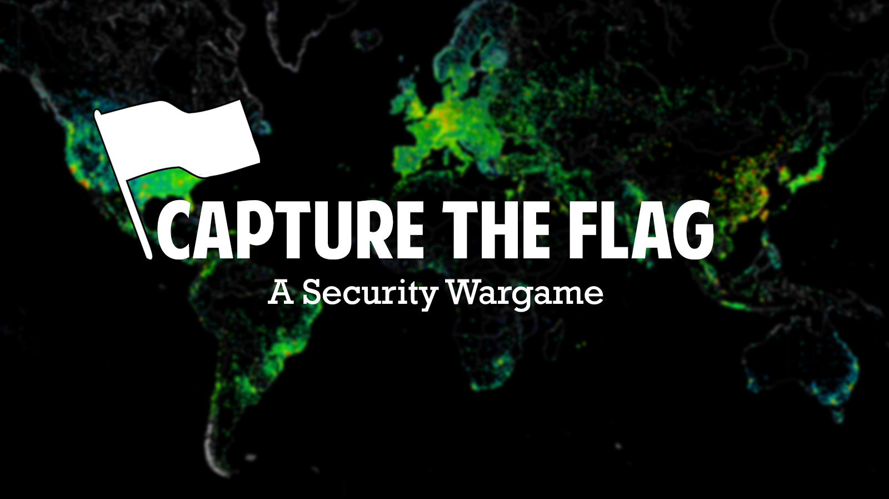

# Capture The Flag

Dans le domaine de la sécurité informatique, la « capture du drapeau » est un jeu consistant à exploiter des vulnérabilités affectant des logiciels de manière à s'introduire sur des ordinateurs pour récupérer les drapeaux, preuves de l'intrusion.Les Capture The Flag (CTF) sont des challenges (merci [Wikipedia](https://fr.wikipedia.org/wiki/Capture\_du\_drapeau)).

