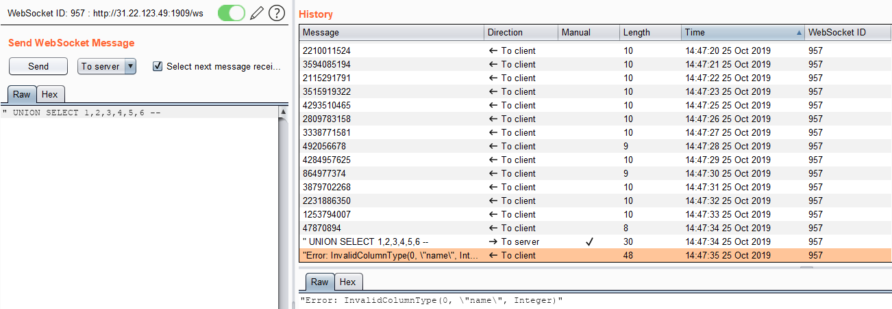
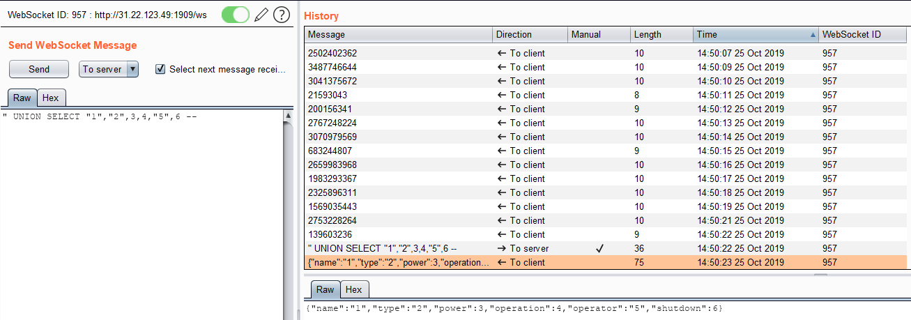

# Nucular Power Plant

## Détails du challenge

"Nucular Power Plant!" est un challenge Web de niveau très facile (baby plus exactement). Son accès se fait via une adresse indiquée dans son énoncé :

Il a été résolu 238 fois pour 973 équipes :

## Reconnaissance

Une seule page est à priori disponible. Cette page permet de visualiser des informations concernant des centrales électriques :

La page ne se recharge pas lorsqu'on sélectionne une centrale mais des requêtes websocket permettent de récupérer les infos :

On est tenté assez rapidement de tester l'injection SQL. L'insertion d'un caractère `'` remonte une erreur indiquant qu'aucune ligne n'est remontée :

On tente le caractère `"` :

L'erreur retournée renseigne sur le type de base de données utilisé tout en renfonçant notre confiance quant à la présence d'une injection. Pour confirmer, on effectue un test de tautologie :

## Exploitation

Il s'agit donc d'exploiter une injection SQL mais sur une base SQLite, ce qui va faire légèrement varier les requêtes par rapport à une habituelle base MySQL. Dans un premier temps, on confirme la présence de seulement 7 centrales électriques et qu'il n'existe pas de centrale secrète :stuck\_out\_tongue: :

On retrouve le nombre de colonnes de la table :

La table possède donc 6 colonnes. Reste maintenant à régler le problème de typage :

Après quelques essais, notre requête ne remonte plus d'erreur :

On récupère quelques informations, par exemple le numéro de version :

On passe maintenant à la récupération des informations sur les tables existantes :

La table "secret" contient le flag :

Le flag permettant de valider le challenge est donc `flag{sqli_as_a_socket}`.

