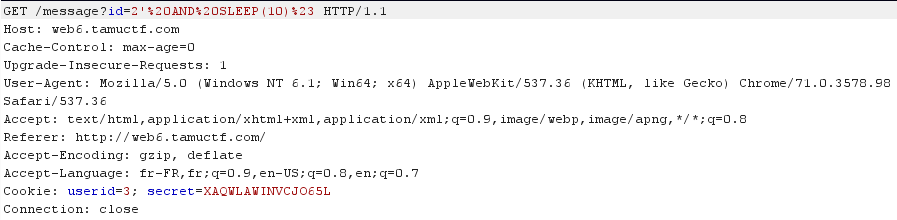

# 1337 Secur1ty

## Détails du challenge

"1337 Secur1ty" est un challenge Web de niveau difficile (hard). Son accès se fait grâce à une URL indiquée dans une modale :

## Reconnaissance

L'application permet de s'authentifier ainsi que de se créer un compte. Je commence donc par m'enregistrer afin d'aller voir ce qu'il se cache derrière cette mire d'authentification :

Une fois notre compte créé, nous sommes automatiquement authentifié et arrivons sur la page de notre profil :

Je possède donc une adresse email "sforce@1337secur1ty.hak" qui a été automatiquement créée par l'application. Avant d'aller plus loin, je me suis intéressé au mécanisme de session. L'application fournit deux cookies. Le premier nommé "secret", semble contenir une valeur aléatoire, le second est nommé "userid" et a pour valeur 3, qui représente sans aucun doute l'id en base de données de la ligne correspondant à mon compte. J'ai tout d'abord essayé de changer cet id, l'objectif était de voir s'il n'était pas possible d'accéder à un compte d'une autre personne. Malheureusement cela nous ramène à la mire d'authentification.

Je continue donc l'exploration des fonctionnalités avec l'onglet "Messages" et "Employees". Je commence ici par le dernier, soit "Employees" :

Le premier compte est intéressant, il s'agit d'un compte de type administrateur. L'identifiant "ID" correspond également à l'id stocké dans le cookie, soit "3" dans mon cas.

On passe à la fonctionnalité "Messages". Nous avons déjà un message en attente de lecture provenant de l'administrateur du site :

En cliquant sur le numéro du message (# 1) il est possible de lire le message complet :

Le message possède l'id 2 présent en paramètre de l'URL. Le champ des possibles est assez grand ici, on commence par tenter d'accéder à d'autres messages en itérant l'id. Je l'ai fait via Burp et son intruder pour pouvoir itérer sur un grand ensemble de valeur dans le cas ou un message serait "caché" avec un id très grand par exemple :

La taille de la réponse permet de voir que l'id 1 est un message valide :

Intéressant, les cookies ne doivent pas être si sécurisés que cela. On tente maintenant de détecter une injection SQL. Après plusieurs essais, on identifie l'injection grâce à un `sleep(10)`. De plus, il faut faire attention au paramètre qui ne semble pas être un entier comme on peut s'y attendre pour un id :

## Exploitation

On sort l'artillerie lourde pour gagner du temps, merci `sqlmap` . Une seule base de données est disponible (en plus de "information\_schema") nommée "1337\_Secur1ty"  :

On dump la base qui nous intéresse, et plus particulièrement la table nommé "Users" :

`sqlmap` n'arrive pas à cracker le mot de passe de l'administrateur. Ce n'est pas grave, nous connaissons son id (id 1) et nous possédons la valeur de son jeton secret (transmis par le cookie). Un petit changement et nous voilà connecté en tant qu'administrateur et s'affiche ainsi le flag :

Il est tout de même possible de récupérer le mot de passe grâce à [https://hashtoolkit.com](https://hashtoolkit.com) :

Mais la connexion au compte administrateur n'est pas possible car nous ne connaissons pas son OTP (One Time Password) demandé à l'authentification.

