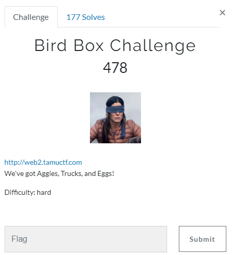
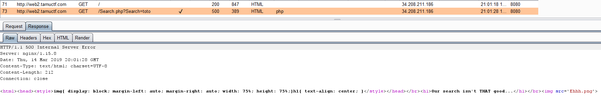
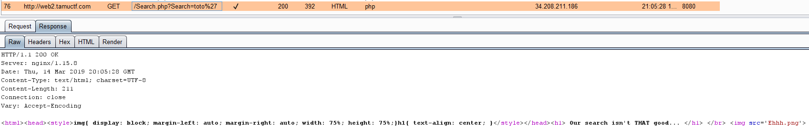
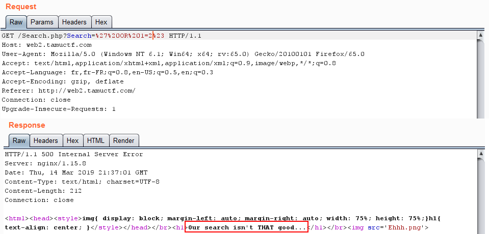
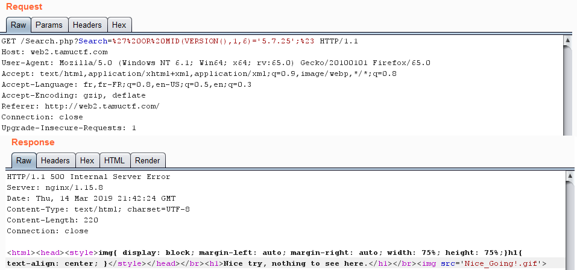

# Bird Box Challenge

## Détails du challenge

"Bird Box Challenge" est un challenge Web de niveau difficile (hard). Son accès se fait grâce à une URL indiquée dans une modale :

## Reconnaissance

La première page contient un champ permettant une recherche (une recherche sur quoi on ne le sait pas encore) :

En renseignant une valeur aléatoire, ici "toto", le résultat semble indiqué que notre recherche n'est pas ce qui est attendu :

On prend le soin de remarquer que le paramètre nommé "Search" est envoyé en GET et non en POST à la page "Search.php" :

Rien de particulier au niveau du code source que cela soit pour la page d'accueil ou pour la page de résultats de la recherche. Par contre une chose intéressante est que la réponse de notre recherche est un code d'erreur HTTP 500 ("Internal Server Error") :

La première chose que j'ai tenté est de ne plus recevoir une erreur 500 mais un 200 OK indiquant que la requête s'est déroulée sans encombre, tout en gardant en mémoire quelle vulnérabilité était la plus susceptible d'arriver sur ce genre de scénario (je pense notamment au SQLi). On ajoute donc sans trop se poser de questions une apostrophe pour tenter de déclencher une erreur SQL. Mais en faisant cela la le traitement de la requête s'effectue correctement et le serveur répond un 200 OK :

Comportement étrange. Mais cela peut ressembler à une erreur de développement (et surtout un manque flagrant de tests de la part du dév :yum: ). En effet, si dans le code PHP le développeur a oublié de fermer l'apostrophe cela peut sans doute engendrer une erreur 500. En ajoutant nous même ce caractère nous corrigeons son erreur. Si on ajoute une seconde fois un apostrophe (soit `toto''`) alors on obtient à nouveau une erreur 500, et si nous insérons une troisième apostrophe (soit `toto'''`) alors le problème est à nouveau corrigé : l'injection SQL est plus que probable.

J'ai tout d'abord tenté une injection basée sur un `SLEEP()`, mais bien que la requête prenne plus de temps elle semble plutôt tomber en timeout (30 secondes de temps de réponse). J'ai commencé alors à me tourner vers une attaque de type boolean. Tout d'abord on tente une condition vraie en injection la payload `%27%20OR%201=1%23` :

Le résultat est une erreur 500 mais le message du corps de la réponse est intéressant : "Nice try, nothing to see here."&#x20;

En injection maintenant une condition fausse, nous obtenons un autre message en réponse :

L'injection est donc (même si on s'en doutait déjà) une injection à l'aveugle. En fait le nom du challenge peut également être une piste puisque le "Bird Box Challenge" est un défi qui consiste à réaliser certaines tâches les yeux bandés ([https://www.20minutes.fr/high-tech/2420807-20190113-video-bird-box-challenge-defi-consiste-bander-yeux-deja-origine-accident](https://www.20minutes.fr/high-tech/2420807-20190113-video-bird-box-challenge-defi-consiste-bander-yeux-deja-origine-accident)). De plus la photo sur la modale d'une femme aux yeux bandés confirme bien un rapport avec la vision (ou plus exactement le manque de vision :slight\_smile:) .

## Exploitation

J'ai commencé l'injection manuellement, par exemple en récupérant la version de la base de données :

Il s'agit donc d'un MySQL en version 5.7.25. Mais je n'ai pas eu le courage de continuer manuellement, j'ai donc tout naturellement utilisé `sqlmap` :

Je n'ai pas choisi ces options dès le premier essai, mais le flag est en fait le nom de l'utilisateur de la base de données, la commande permet donc de récupérer la bonne information grâce à l'option `--current-user`.

