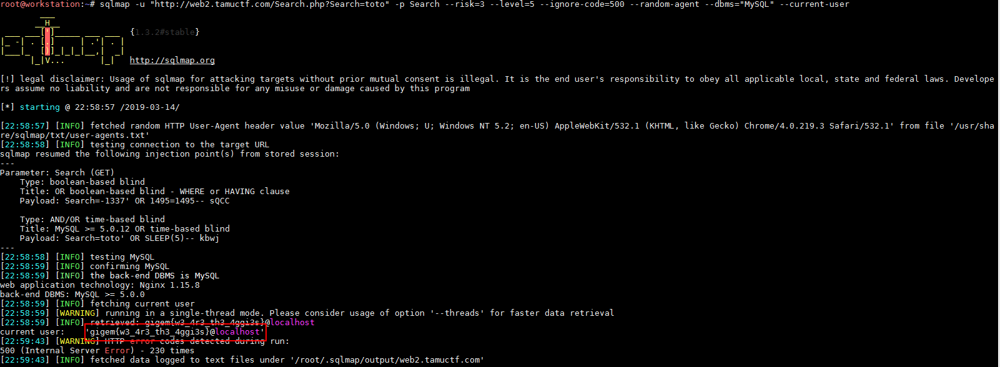

# Bird Box Challenge

## Détails du challenge

"Bird Box Challenge" est un challenge Web de niveau difficile (hard). Son accès se fait grâce à une URL indiquée dans une modale :

## Reconnaissance

La première page contient un champ permettant une recherche sans savoir à quoi cela va mener :

En renseignant une valeur aléatoire, ici "toto", le résultat semble indiquer que ma recherche n'est pas ce qui est attendu :

Je prends le soin de remarquer que le paramètre nommé "Search" est envoyé en `GET` et non en `POST` à la page "Search.php" :

Rien de particulier au niveau du code source que cela soit pour la page d'accueil ou pour la page de résultats de la recherche. Par contre une chose intéressante est que la réponse de ma recherche est un code d'erreur `HTTP 500` ("Internal Server Error") :

La première chose que je tente est de ne plus recevoir une erreur `500` mais un `200 OK` indiquant que la requête s'est déroulée sans encombre, tout en gardant en mémoire quelle vulnérabilité est la plus susceptible d'arriver sur ce genre de scénario (je pense notamment au SQLi). J'ajoute donc sans trop me poser de questions une apostrophe pour tenter de déclencher une erreur SQL. Mais en faisant cela la le traitement de la requête s'effectue correctement et le serveur répond un `200 OK` :

Comportement étrange. Mais cela peut ressembler à une erreur de développement (et surtout un manque flagrant de tests de la part du dév :yum: ). En effet, si dans le code PHP le développeur a oublié de fermer l'apostrophe cela peut sans doute engendrer une erreur `500`. En ajoutant moi même ce caractère je corrige ainsi son erreur. Si j'ajoute une seconde fois un apostrophe (soit `toto''`) alors j'obtiens à nouveau une erreur `500`, et si j'insère une troisième apostrophe (soit `toto'''`) alors le problème est à nouveau corrigé : l'injection SQL est plus que probable.

J'ai tout d'abord tenté une injection basée sur un `SLEEP()`, mais bien que la requête prenne plus de temps elle semble plutôt tomber en timeout (30 secondes de temps de réponse). Je me tourne alors vers une attaque de type boolean. Tout d'abord en tentant une condition vraie, en injectant la payload `%27%20OR%201=1%23` :

Le résultat est une erreur `500` mais le message du corps de la réponse est intéressant : "Nice try, nothing to see here."&#x20;

En injection maintenant une condition fausse, j'obtiens un autre message en réponse :

L'injection est donc une injection à l'aveugle. En fait le nom du challenge peut également être une piste puisque le "Bird Box Challenge" est un défi qui consiste à réaliser certaines tâches les yeux bandés ([https://www.20minutes.fr/high-tech/2420807-20190113-video-bird-box-challenge-defi-consiste-bander-yeux-deja-origine-accident](https://www.20minutes.fr/high-tech/2420807-20190113-video-bird-box-challenge-defi-consiste-bander-yeux-deja-origine-accident)). De plus la photo sur la modale d'une femme aux yeux bandés confirme bien un rapport avec la vision (ou plus exactement le manque de vision :slight\_smile:) .

## Exploitation

Je commence l'injection manuellement, par exemple en récupérant la version de la base de données :

Il s'agit donc d'un MySQL en version 5.7.25. Mais par manque de courage :p, je continue avec `sqlmap` :

Le flag est en fait le nom de l'utilisateur de la base de données, la commande permet donc de récupérer la bonne information grâce à l'option `--current-user`.
