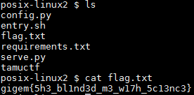

# Science!

## Détails du challenge

"Science!" est un challenge Web de niveau moyen \(medium\). Son accès se fait grâce à une URL indiquée dans une modale :


## Reconnaissance

La page d'accueil nous invite à renseigner le nom de deux produits chimiques et de connaitre le résultat de leur combinaison :


Le résultat est disponible sur la page "/science". Par exemple, pour deux données aléatoires, le résultat est un gif animé montrant une jolie réaction chimique :


Rien d'intéressant au niveau du code source des pages web, pas de champ caché, de commentaire, ... :


J'ai tout d'abord tenté toutes sortes d'injections au niveau des deux champs, nommés respectivement "chem1" et "chem2". Les deux champs sont vulnérables à des injections XSS, mais je n'ai rien trouvé de plus \(du moins dans un premier temps\) :


A force de tourner en rond, je me suis intéressé au titre de la page d'accueil du challenge : "FaaS - Flask As A Service". En fait "Flask" est un microframework développé en python qui permet de lancer un serveur web. Maintenant que je connais un peu mieux ma cible, j'ai vérifié si ce framework était vulnérable à certaines failles un peu plus spécifiques, et en effet, l'injection de template côté serveur \(SSTI pour Server Side Template Injection\) remontait dans les premiers résultats de l'ami Google.

Comment détecter une telle vulnérabilité ? Il suffit de demander au serveur d'effectuer un simple calcul pour nous. Si le résultat renvoyé est le résultat attendu, alors cela indique que le serveur a bien exécuté notre code. Par exemple, pour lui demander de calculer "7 \* 7" il suffit d'injecter dans un des deux \(ou les deux\) champs de la page d'accueil la payload `{{7*7}}` ce qui donne :


Le serveur nous retourne bien le résultat escompté, soit "49" \(j'avais injecté ici seulement le premier champ\).

## Exploitation

En cherchant comment exploiter cette vulnérabilité je suis tombé assez rapidement sur un outil disponible sur Github nommé "TplMap" \([https://github.com/epinna/tplmap](https://github.com/epinna/tplmap)\). Après un `git clone` et une rapide lecture du "README" on lance la première commande qui va confirmer la vulnérabilité :


Attention les paramètres ne sont pas en GET mais en POST, d'où l'option `--data`. L'option `--os-shell` va nous permettre de récupérer un shell distant :


Un `ls` puis un `cat` plus tard nous récupérons le sésame stocké dans le fichier "flag.txt" :



L'outil c'est bien, mais je voulais en savoir un peu plus sur cette vulnérabilité. Concernant les SSTI je suis tombé sur une cheat-sheet \([https://pequalsnp-team.github.io/cheatsheet/flask-jinja2-ssti](https://pequalsnp-team.github.io/cheatsheet/flask-jinja2-ssti)\) qui permet de connaitre les principales payload.

A ce stade, nous savons que le fichier contenant le sésame se nomme "flag.txt". Je me suis servi de cette information afin d'effectuer un file disclosure, mais je pense que même sans connaitre le nom on aurait pu le guesser. Via Burp on va donc injecter la payload suivante :

```text
{{ config.items()[4][1].__class__.__mro__[2].__subclasses__()[40]("flag.txt").read() }}
```

Il est possible que les index varient en fonction de la cible, mais cela peut être vérifié. Par exemple, le dernier indice \(40\) est celui de la classe "file". Pour s'en assurer on peut injecter ceci :

```text
{{ config.items()[4][1].__class__.__mro__[2].__subclasses__() }}
```

Cela a pour effet de nous remonter la liste des classes disponibles et donc la position de la classe "file" \(ligne 40 ici\) :


Grâce à la payload complète \(encodée ici en encodage URL\) nous récupérons directement le flag :


Ne pas hésiter à effectuer un encodage URL à vos payloads pour les faire passer plus simplement \(présence du caractère "&" ou encore des espaces par exemple\).


