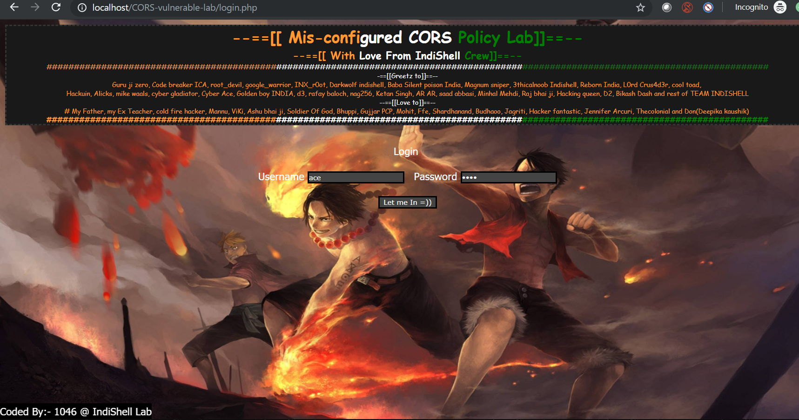

# CORS vulnerable Lab

[CORS vulnerable Lab](https://github.com/incredibleindishell/CORS-vulnerable-Lab) est une machine contenant des erreurs de configuration de sa politique Cross-Origin Resource Sharing.

Trois différents challenges, permettant d'exploiter ces mauvaises configurations sont proposés :

* Application Trust Arbritrary Origin
* Application has bad "regex" Implementation to check Trusted Origin
* Application Trust "null" Origin

L'objectif est de dérober des données sensibles \(représentées par le contenu de pages nécessitant une authentification\) de la victime.

