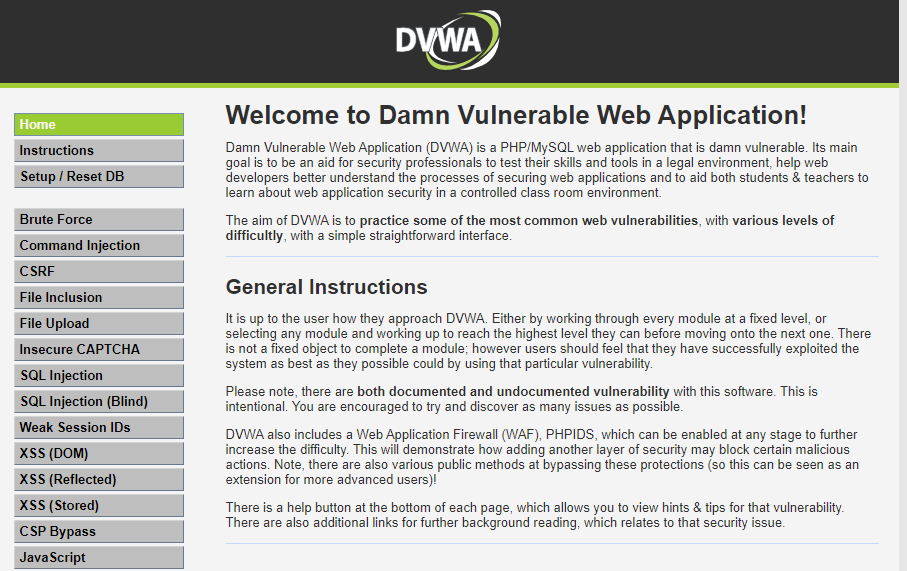

# Damn Vulnerable Web Application \(DVWA\)

[Damn Vulnerable Web Application](http://www.dvwa.co.uk/) \(DVWA\) est une application PHP/MySQL délibérément vulnérable. La version utilisée pour ce writeup est la version [docker](https://hub.docker.com/r/vulnerables/web-dvwa/) estampillée 1.10 \*Development\*.

Pour chacun des challenges proposés par DVWA, je me suis attribué un objectif afin de rendre plus réaliste mes attaques, mais libre à vous de les adapter.

Etant donné que certaines attaques se ressemblent beaucoup d'un niveau à un autre \("Low", "Medium" ou "High"\), n'hésitez pas à lire le \(ou les\) niveau\(x\) précédent\(s\), car j'omets volontairement certaines manipulations afin d'éviter les redites.

