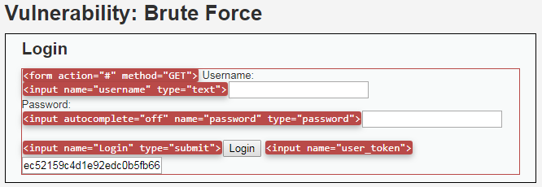
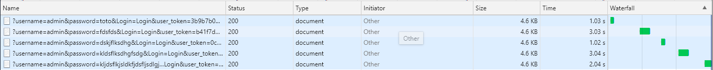
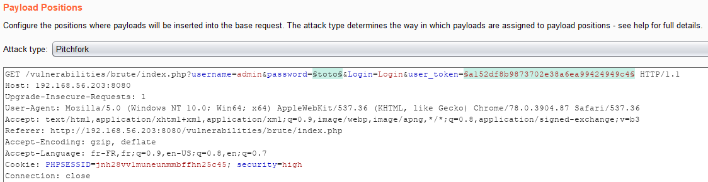
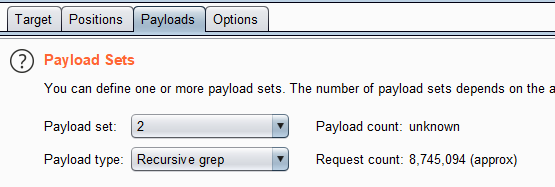
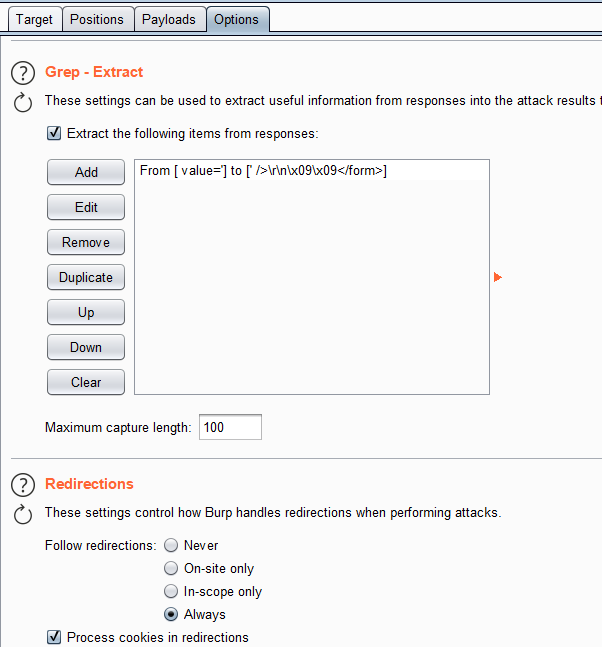
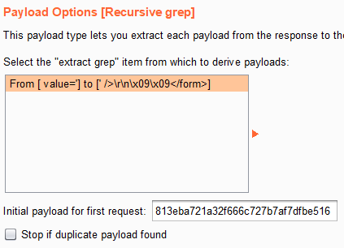
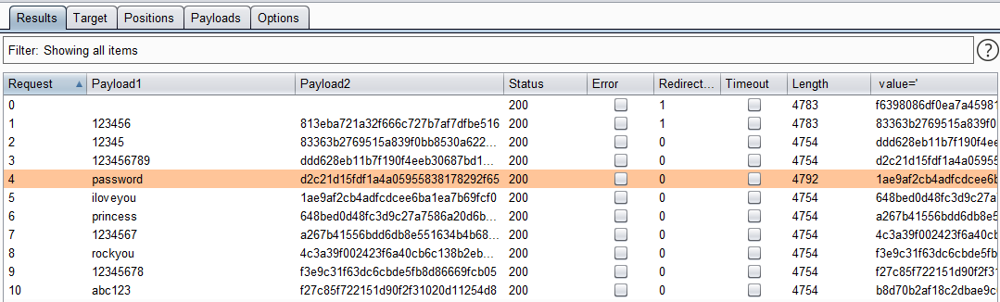

# Niveau "High"

Le formulaire du challenge se voit ajouter un champ contenant un jeton anti-CSRF de type per-request (c'est à dire qu'il s'agit d'un jeton différent pour chaque requête) :

De plus, le délai entre deux tentatives est devenu aléatoire pour une valeur comprise plus ou moins dans l'intervalle \[1 ; 3] secondes (en fait \[0 ; 3] d'après les sources):

Afin de contourner la cette nouvelle protection, il me faut dans un premier temps extraire le jeton de la réponse HTTP précédente (présent suite à la requête **`GET`** permettant d'afficher le formulaire) puis l'injecter dans la prochaine tentative de brute force. Cela se fait bien en utilisant Burp et son Intruder :

La payload 1 est le dictionnaire de mots de passe et la payload 2 représente le jeton anti-CSRF en mode recursive grep :

En plus de l'extract, il ne faut pas oublier de faire suivre les redirections à Burp (et de limiter le nombre de thread à 1) :

Puis j'inclue le premier jeton (celui présent dans la requête qui a permis de basculer en mode Intruder) :

Concernant le délai il n'y a pas de solution mis à part prendre son mal en patience, mais je retrouve tout de même assez rapidement le mot de passe de l'administrateur. La requête contenant le bon mot de passe est identifiée grâce à sa taille qui est différente des autres requêtes (mais il est possible de se baser sur d'autres informations si nécessaire) :

